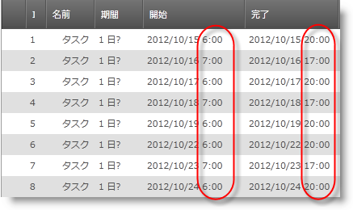

////

|metadata|
{
    "name": "xamgantt-configuring-custom-calendars-for-xamgantt",
    "controlName": ["xamGantt"],
    "tags": ["Data Binding","Data Presentation","Extending","Grids","Scheduling"],
    "guid": "5ca8fb2c-9d88-480a-bbaa-5b1c5769fb08",  
    "buildFlags": [],
    "createdOn": "2016-05-25T18:21:55.4801759Z"
}
|metadata|
////

= xamGantt のカスタム カレンダーの構成

== トピックの概要

=== 目的

このトピックは、カスタム カレンダー クラスを作成して  _xamGantt_   と使用する方法を紹介します _。_

=== 前提条件

このトピックを理解するためには、以下のトピックを理解しておく必要があります。

[options="header", cols="a,a"]
|====
|トピック|目的

| link:xamgantt-adding-xamgantt-to-a-page.html[ _xamGantt_ をページに追加]
|このトピックでは、 _xamGantt_ コントロールをページに追加する方法を説明します。

|====

=== 本トピックの内容

このトピックには次のセクションがあります。

* <<_Custom_Calendar_Introduction, カスタム カレンダーの概要 >>

** <<_Introduction,概要>>

** <<_Calendar_Property_Mapping,カレンダー プロパティ マッピング>>

** <<_Start,開始日>>

* <<_Code_Example_Creating_a_Custom_Calendar, コード例: カスタム カレンダーの作成 >>

** <<_Ref333763526,説明>>

** <<_Ref334102005,前提条件>>

** <<_Ref334102013,プレビュー>>

** <<_Ref334464995,コード>>

* <<_Related_Content, 関連コンテンツ >>

[[_Custom_Calendar_Introduction]]
== カスタム カレンダーの概要

[[_Introduction]]

=== 概要

xamGantt link:{ApiPlatform}controls.schedules.xamgantt{ApiVersion}~infragistics.controls.schedules.listbackedproject_members.html[ListBackedProject] とカスタム カレンダー クラスを使用できます。`ListBackedProject` は指定された link:{ApiPlatform}controls.schedules.xamgantt{ApiVersion}~infragistics.controls.schedules.listbackedproject~taskitemssource.html[TaskItemsSource] からタスク情報を取得するプロジェクトです。カスタム カレンダーを使用するためには、`ListBackedProject` の link:{ApiPlatform}controls.schedules.xamgantt{ApiVersion}~infragistics.controls.schedules.listbackedproject~calendaritemssource.html[CalendarItemsSource] プロパティと link:{ApiPlatform}controls.schedules.xamgantt{ApiVersion}~infragistics.controls.schedules.project~calendarid.html[CalendarId] プロパティを設定します。

以下の表にカスタム カレンダーと使用する時の ListBackedProject の主要プロパティをまとめます。

[options="header", cols="a,a"]
|====
|プロパティ|説明

| link:{ApiPlatform}controls.schedules.xamgantt{ApiVersion}~infragistics.controls.schedules.listbackedproject~calendarpropertymappings.html[CalendarPropertyMappings]
|このプロパティは、`CalendarItemsSource` の項目のプロパティから link:{ApiPlatform}controls.schedules.xamgantt{ApiVersion}~infragistics.controls.schedules.projectcalendar_members.html[ProjectCalendar] プロパティへマッピングを提供するために使用されるコレクションを取得または設定します。

|`CalendarItemsSource`
|このプロパティは、予定表情報を提供するコレクションを取得または設定します。

|`CalendarId`
|このプロパティは、カレンダーの一意の ID の文字列を取得または設定します。CalendarItemsSource コレクションに複数のカレンダーがある場合、どのカレンダーが使用されるかを指定するためにこのプロパティを使用できます。

| link:{ApiPlatform}controls.schedules.xamgantt{ApiVersion}~infragistics.controls.schedules.project~start.html[Start]
|このプロパティは、プロジェクトの UTC 開始日を返すか、設定します。このプロパティが設定されないと、プロジェクトはデフォルトの今日の 8:00 AM を使用します。 

Start は link:{ApiPlatform}controls.schedules.xamgantt{ApiVersion}~infragistics.controls.schedules.project~isscheduledfromstart.html[IsScheduledFromStart] が false に設定されると、プロジェクト スケジューリング エンジンによって設定されます。

| link:{ApiPlatform}controls.schedules.xamgantt{ApiVersion}~infragistics.controls.schedules.project~finish.html[Finish]
|このプロパティは、プロジェクトの UTC 終了日を返すか、設定します。 

IsScheduledFromStart がデフォルト値の true に設定されると、プロジェクトのために計算された終了日に Finish が設定されます。

|====

[[_Calendar_Property_Mapping]]

=== カレンダー プロパティ マッピング

`CalendarPropertyMapping` の使用は、 link:{ApiPlatform}controls.schedules.xamgantt{ApiVersion}~infragistics.controls.schedules.projectcalendarpropertymapping_members.html[ProjectCalendarPropertyMapping] オブジェクトの設定で構成されます。`ProjectCalendarPropertyMapping` は、CalendarItemsSource によって指定されるデータ ソース内の特定のフィールドに関する情報、および `ProjectCalendar` オブジェクトのどのプロパティにフィールドがマップされるかの情報を含みます。

`ProjectCalendar` オブジェクトのプロパティは、 link:{ApiPlatform}controls.schedules.xamgantt{ApiVersion}~infragistics.controls.schedules.projectcalendarpropertymapping~calendarproperty.html[CalendarProperty] によって識別され、データ ソース内のフィールドは、 link:{ApiPlatform}controls.schedules.xamgantt{ApiVersion}~infragistics.controls.schedules.projectcalendarpropertymapping~dataobjectproperty.html[DataObjectProperty] によって識別されます。

[options="header", cols="a,a"]
|====
|カレンダー プロパティ値|説明

| _BaseCalendarId_ 
|これは、Data Object Property で設定されたフィールドが `ProjectCalendar` の link:{ApiPlatform}controls.schedules.xamgantt{ApiVersion}~infragistics.controls.schedules.projectcalendar~basecalendarid.html[BaseCalendarId] プロパティにマップされることを示します。

| _DaysOfWeek_ 
|これは、Data Object Property で設定されたフィールドが `ProjectCalendar` の link:{ApiPlatform}controls.schedules.xamgantt{ApiVersion}~infragistics.controls.schedules.projectcalendar~daysofweek.html[DaysOfWeek] プロパティにマップされることを示します。

| _DisplayName_ 
|これは、Data Object Property で設定されたフィールドが `ProjectCalendar` の link:{ApiPlatform}controls.schedules.xamgantt{ApiVersion}~infragistics.controls.schedules.projectcalendar~displayname.html[DisplayName] プロパティにマップされることを示します。

| _Exceptions_ 
|これは、Data Object Property で設定されたフィールドが `ProjectCalendar` の link:{ApiPlatform}controls.schedules.xamgantt{ApiVersion}~infragistics.controls.schedules.projectcalendar~exceptions.html[Exceptions] プロパティにマップされることを示します。

| _IsBaseCalendar_ 
|これは、Data Object Property で設定されたフィールドが `ProjectCalendar` の link:{ApiPlatform}controls.schedules.xamgantt{ApiVersion}~infragistics.controls.schedules.projectcalendar~isbasecalendar.html[IsBaseCalendar] プロパティにマップされることを示します。

| _UniqueId_ 
|これは、Data Object Property で設定されたフィールドが `ProjectCalendar` の link:{ApiPlatform}controls.schedules.xamgantt{ApiVersion}~infragistics.controls.schedules.projectcalendar~uniqueid.html[UniqueId] プロパティにマップされることを示します。

| _WorkWeeks_ 
|これは、Data Object Property で設定されたフィールドが `ProjectCalendar` の link:{ApiPlatform}controls.schedules.xamgantt{ApiVersion}~infragistics.controls.schedules.projectcalendar~workweeks.html[WorkWeeks] プロパティにマップされることを示します。

|====

[[_Start]]

=== Start

カスタム カレンダーの使用はプロジェクトの開始日によって影響されます。開始時間を設定しない場合には、デフォルト設定の今日の 8:00 AM が使用されます。たとえば、カスタム カレンダーを作成し、稼働時間が 8:00 AM よりも早く始まる、たとえば 7:00 AM に始まり、自動スケジュール タスクを使用する場合は、最初のタスクは 7:00 AM からではなく 8:00 AMから開始します。

[[_Code_Example_Creating_a_Custom_Calendar]]
== コード例: カスタム カレンダーの作成

[[_Ref333763526]]

=== 説明

このコード例はカスタム カレンダー クラスの 2 つのインスタンスを作成し、ListBackedProject の CalendarItemSource として設定します。CalendarId プロパティを設定することによって、2 番目のカレンダーは現在のプロジェクト カレンダーになります。

コード例には、使用中のカレンダーをどのように説明するかを示すためにタスクのコレクションが含まれます。

[[_Ref334102005]]

=== 前提条件

コード例を完了するには xamGantt プロジェクトが必要です。サンプルの xamGantt プロジェクトを作成するためには、 link:xamgantt-adding-xamgantt-to-a-page.html[ _xamGantt_  をページに追加]の指示に従ってください。

次にプロジェクトを若干変更する必要があります。以下のクラスがなければなりません。

* `CustomCalendar`.このクラスの完全なコードを確認するには、 link:resources-xamgantt-custom-calendar-code-example.html[カスタム カレンダーのコード例]を参照してください。

* `CustomTask`このクラスの完全なコードを確認するには、 link:resources-xamgantt-custom-task-code-example.html[カスタム タスクのコード例]を参照してください。

* 次にマークアップと ViewModel をこのトピックで示されるもので置き換える必要があります。

[[_Ref334102013]]

=== プレビュー

以下は完全なサンプル プロジェクトのプレビューです。月曜日、水曜日、金曜日の場合、稼働時間は 7:00 AM から 4:00 PM で、休憩時間は 11:00 AM から 12:00 AM です。火曜日と木曜日は、稼働時間は 9:00 AM から 6:00 AM で休憩時間は 1:00 PM から 2:00 PM までです。

[[_Ref334464995]]

=== コード

*XAML の場合:*

[source,xaml]
----
<Grid>
        <Grid.Resources>
            <local:CustomCalendarViewModel x:Key="dc" />
        </Grid.Resources>
        <Grid.DataContext>
            <Binding Source="{StaticResource dc}" />
        </Grid.DataContext>
        <ig:XamGantt x:Name="xamGantt">
            <ig:XamGantt.Project>
                <ig:ListBackedProject TaskItemsSource="{Binding Tasks}" CalendarItemsSource="{Binding Calendars}" 
                                      CalendarId="C2" Start="{Binding Today}">
                    <ig:ListBackedProject.TaskPropertyMappings>
                        <ig:ProjectTaskPropertyMapping TaskProperty="DataItemId" DataObjectProperty="DataItemId" />
                        <ig:ProjectTaskPropertyMapping TaskProperty="TaskName" DataObjectProperty="TaskName" />
                        <ig:ProjectTaskPropertyMapping TaskProperty="Start" DataObjectProperty="Start" />
                        <ig:ProjectTaskPropertyMapping TaskProperty="Duration" DataObjectProperty="Duration" />
                        <ig:ProjectTaskPropertyMapping TaskProperty="Tasks" DataObjectProperty="Tasks" />
                        <ig:ProjectTaskPropertyMapping TaskProperty="Predecessors" DataObjectProperty="Predecessors" />
                        <ig:ProjectTaskPropertyMapping TaskProperty="ConstraintDate" DataObjectProperty="ConstraintDate" />
                        <ig:ProjectTaskPropertyMapping TaskProperty="ConstraintType" DataObjectProperty="ConstraintType" />
                        <ig:ProjectTaskPropertyMapping TaskProperty="DurationFormat" DataObjectProperty="DurationFormat" />
                    </ig:ListBackedProject.TaskPropertyMappings>
                    <ig:ListBackedProject.CalendarPropertyMappings>
                        <ig:ProjectCalendarPropertyMapping CalendarProperty="UniqueId" DataObjectProperty="Id" />
                        <ig:ProjectCalendarPropertyMapping CalendarProperty="DaysOfWeek" DataObjectProperty="DaysOfWeek" />
                        <ig:ProjectCalendarPropertyMapping CalendarProperty="DisplayName" DataObjectProperty="DisplayName" />
                    </ig:ListBackedProject.CalendarPropertyMappings>
                </ig:ListBackedProject>
            </ig:XamGantt.Project>
        </ig:XamGantt>
    </Grid>
----

*C# の場合:*

[source,csharp]
----
 public class CustomCalendarViewModel : INotifyPropertyChanged
    {
        private ObservableCollection<CustomCalendar> calendars;
        private ObservableCollection<CustomTask> tasks;
        public ObservableCollection<CustomCalendar> Calendars
        {
            get
            {
                if (calendars == null)
                {
                    calendars = GenerateCustomCalendars();
                }
                return calendars;
            }
            set { calendars = value; }
        }
        public ObservableCollection<CustomTask> Tasks
        {
            get
            {
                if (tasks == null)
                {
                    tasks = GenerateCustomTasks();
                }
                return tasks;
            }
            set { tasks = value; }
        }
        public DateTime Today
        {
            get { return DateTime.Today; }
        }
        private ObservableCollection<CustomTask> GenerateCustomTasks()
        {
            return new ObservableCollection<CustomTask>()
                  {
                        new CustomTask { DataItemId = "t1", TaskName = "Task 1", Duration = TimeSpan.FromHours(8), DurationFormat = "Days" },
                new CustomTask { DataItemId = "t2", TaskName = "Task 2", Duration = TimeSpan.FromHours(24), Predecessors = "t1", DurationFormat = "ElapsedDays" },
                        new CustomTask { DataItemId = "t3", TaskName = "Task 3", Duration = TimeSpan.FromHours(8), Predecessors = "t2", DurationFormat = "Days" },
                        new CustomTask { DataItemId = "t4", TaskName = "Task 4", Duration = TimeSpan.FromHours(48), Predecessors = "t3", DurationFormat = "ElapsedDays" },
                        new CustomTask { DataItemId = "t5", TaskName = "Task 5", Duration = TimeSpan.FromDays(1), Predecessors = "t4", DurationFormat = "Days" },
                new CustomTask { DataItemId = "t6", TaskName = "Task 6", Duration = TimeSpan.FromDays(1), Predecessors = "t5", DurationFormat = "ElapsedDays" },
                new CustomTask { DataItemId = "t7", TaskName = "Task 7", Duration = TimeSpan.FromHours(8), Predecessors = "t6", DurationFormat = "Days" },
                new CustomTask { DataItemId = "t8", TaskName = "Task 8", Duration = TimeSpan.FromHours(8), Predecessors = "t7", DurationFormat = "ElapsedDays" }
                  };
        }
        #region Private helper methods
        private ObservableCollection<CustomCalendar> GenerateCustomCalendars()
        {
            return new ObservableCollection<CustomCalendar>()
            {
                new CustomCalendar
                {
                    Id = "C1",
                    Name = "Calendar 1",
                    DaysOfWeek=@"
                                    <ScheduleDaysOfWeek>
                                          <Monday>
                                          <ScheduleDayOfWeek>
                                                <DaySettings>
                                                      <DaySettings IsWorkday=""false"" />
                                                </DaySettings>
                                          </ScheduleDayOfWeek>
                                          </Monday>
                                          <Saturday>
                                          <ScheduleDayOfWeek>
                                                <DaySettings>
                                                      <DaySettings IsWorkday=""true"">
                                                            <WorkingHours>
                                                                  <WorkingHoursCollection>
                                                                        <TimeRange Start=""PT8H"" End=""PT12H"" />
                                                                        <TimeRange Start=""PT13H"" End=""PT17H"" />
                                                                  </WorkingHoursCollection>
                                                            </WorkingHours>
                                                      </DaySettings>
                                                </DaySettings>
                                          </ScheduleDayOfWeek>
                                          </Saturday>
                                    </ScheduleDaysOfWeek>",
                    CustomDescription = "This custom calendar has a Monday as a nonworking day and Saturday as a working day"
                },
                new CustomCalendar
                {
                    Id = "C2",
                    Name = "Calendar 2",
                    DaysOfWeek = @"
                                    <ScheduleDaysOfWeek>
                                          <Monday>
                                          <ScheduleDayOfWeek>
                                                <DaySettings>
                                                      <DaySettings IsWorkday=""true"">
                                                            <WorkingHours>
                                                                  <WorkingHoursCollection>
                                                                        <TimeRange Start=""PT7H"" End=""PT11H"" />
                                                                        <TimeRange Start=""PT12H"" End=""PT16H"" />
                                                                  </WorkingHoursCollection>
                                                            </WorkingHours>
                                                      </DaySettings>
                                                </DaySettings>
                                          </ScheduleDayOfWeek>
                                          </Monday>
                                          <Tuesday>
                                          <ScheduleDayOfWeek>
                                                <DaySettings>
                                                      <DaySettings IsWorkday=""true"">
                                                            <WorkingHours>
                                                                  <WorkingHoursCollection>
                                                                        <TimeRange Start=""PT9H"" End=""PT13H"" />
                                                                        <TimeRange Start=""PT14H"" End=""PT18H"" />
                                                                  </WorkingHoursCollection>
                                                            </WorkingHours>
                                                      </DaySettings>
                                                </DaySettings>
                                          </ScheduleDayOfWeek>
                                          </Tuesday>
                                          <Wednesday>
                                          <ScheduleDayOfWeek>
                                                <DaySettings>
                                                      <DaySettings IsWorkday=""true"">
                                                            <WorkingHours>
                                                                  <WorkingHoursCollection>
                                                                        <TimeRange Start=""PT7H"" End=""PT11H"" />
                                                                        <TimeRange Start=""PT12H"" End=""PT16H"" />
                                                                  </WorkingHoursCollection>
                                                            </WorkingHours>
                                                      </DaySettings>
                                                </DaySettings>
                                          </ScheduleDayOfWeek>
                                          </Wednesday>
                                          <Thursday>
                                          <ScheduleDayOfWeek>
                                                <DaySettings>
                                                      <DaySettings IsWorkday=""true"">
                                                            <WorkingHours>
                                                                  <WorkingHoursCollection>
                                                                        <TimeRange Start=""PT9H"" End=""PT13H"" />
                                                                        <TimeRange Start=""PT14H"" End=""PT18H"" />
                                                                  </WorkingHoursCollection>
                                                            </WorkingHours>
                                                      </DaySettings>
                                                </DaySettings>
                                          </ScheduleDayOfWeek>
                                          </Thursday>
                                          <Friday>
                                          <ScheduleDayOfWeek>
                                                <DaySettings>
                                                      <DaySettings IsWorkday=""true"">
                                                            <WorkingHours>
                                                                  <WorkingHoursCollection>
                                                                        <TimeRange Start=""PT7H"" End=""PT11H"" />
                                                                        <TimeRange Start=""PT12H"" End=""PT16H"" />
                                                                  </WorkingHoursCollection>
                                                            </WorkingHours>
                                                      </DaySettings>
                                                </DaySettings>
                                          </ScheduleDayOfWeek>
                                          </Friday>
                                    </ScheduleDaysOfWeek>",
                CustomDescription = "This custom calendar sets the following working times: From 9:00to 13:00 and from 14:00 to 18:00"
                }
            };
        }
        #endregion // Private helper methods
        #region INotifyPropertyChanged
        public event PropertyChangedEventHandler PropertyChanged;
        public void OnPropertyChanged(string propertyName)
        {
            if (PropertyChanged != null)
            {
                PropertyChanged(this, new PropertyChangedEventArgs(propertyName));
            }
        }
        #endregion // INotifyPropertyChanged
    }
----

*Visual Basic の場合:*

[source,vb]
----
Public Class CustomCalendarViewModel
      Implements INotifyPropertyChanged
      Private m_calendars As ObservableCollection(Of CustomCalendar)
      Private m_tasks As ObservableCollection(Of CustomTask)
      Public Property Calendars() As ObservableCollection(Of CustomCalendar)
            Get
                  If m_calendars Is Nothing Then
                        m_calendars = GenerateCustomCalendars()
                  End If
                  Return m_calendars
            End Get
            Set
                  m_calendars = value
            End Set
      End Property
      Public Property Tasks() As ObservableCollection(Of CustomTask)
            Get
                  If m_tasks Is Nothing Then
                        m_tasks = GenerateCustomTasks()
                  End If
                  Return m_tasks
            End Get
            Set
                  m_tasks = value
            End Set
      End Property
      Public ReadOnly Property Today() As DateTime
            Get
                  Return DateTime.Today
            End Get
      End Property
      Private Function GenerateCustomTasks() As ObservableCollection(Of CustomTask)
            Return New ObservableCollection(Of CustomTask)() With { _
                  New CustomTask() With { _
                        .DataItemId = "t1", _
                        .TaskName = "Task 1", _
                        .Duration = TimeSpan.FromHours(8), _
                        .DurationFormat = "Days" _
                  }, _
                  New CustomTask() With { _
                        .DataItemId = "t2", _
                        .TaskName = "Task 2", _
                        .Duration = TimeSpan.FromHours(24), _
                        .Predecessors = "t1", _
                        .DurationFormat = "ElapsedDays" _
                  }, _
                  New CustomTask() With { _
                        .DataItemId = "t3", _
                        .TaskName = "Task 3", _
                        .Duration = TimeSpan.FromHours(8), _
                        .Predecessors = "t2", _
                        .DurationFormat = "Days" _
                  }, _
                  New CustomTask() With { _
                        .DataItemId = "t4", _
                        .TaskName = "Task 4", _
                        .Duration = TimeSpan.FromHours(48), _
                        .Predecessors = "t3", _
                        .DurationFormat = "ElapsedDays" _
                  }, _
                  New CustomTask() With { _
                        .DataItemId = "t5", _
                        .TaskName = "Task 5", _
                        .Duration = TimeSpan.FromDays(1), _
                        .Predecessors = "t4", _
                        .DurationFormat = "Days" _
                  }, _
                  New CustomTask() With { _
                        .DataItemId = "t6", _
                        .TaskName = "Task 6", _
                        .Duration = TimeSpan.FromDays(1), _
                        .Predecessors = "t5", _
                        .DurationFormat = "ElapsedDays" _
                  }, _
                  New CustomTask() With { _
                        .DataItemId = "t7", _
                        .TaskName = "Task 7", _
                        .Duration = TimeSpan.FromHours(8), _
                        .Predecessors = "t6", _
                        .DurationFormat = "Days" _
                  }, _
                  New CustomTask() With { _
                        .DataItemId = "t8", _
                        .TaskName = "Task 8", _
                        .Duration = TimeSpan.FromHours(8), _
                        .Predecessors = "t7", _
                        .DurationFormat = "ElapsedDays" _
                  } _
            }
      End Function
      #Region "Private helper methods"
      Private Function GenerateCustomCalendars() As ObservableCollection(Of CustomCalendar)
            Return New ObservableCollection(Of CustomCalendar)() With { _
                  New CustomCalendar() With { _
                        .Id = "C1", _
                        .Name = "Calendar 1", _
                        .DaysOfWeek = "<ScheduleDaysOfWeek><Monday><ScheduleDayOfWeek><DaySettings><DaySettings IsWorkday=""" /></DaySettings></ScheduleDayOfWeek></Monday><Saturday><ScheduleDayOfWeek><DaySettings><DaySettings IsWorkday=""true""><WorkingHours><WorkingHoursCollection><TimeRange Start=""PT8H"" End=""PT12H"" /><TimeRange Start=""PT13H"" End=""PT17H"" /></WorkingHoursCollection></WorkingHours></DaySettings></DaySettings></ScheduleDayOfWeek></Saturday></ScheduleDaysOfWeek>", _
                        .CustomDescription = "This custom calendar has a Monday as a nonworking day and Saturday as a working day" _
                  }, _
                  New CustomCalendar() With { _
                        .Id = "C2", _
                        .Name = "Calendar 2", _
                        .DaysOfWeek = "<ScheduleDaysOfWeek><Monday><ScheduleDayOfWeek><DaySettings><DaySettings IsWorkday=""true""><WorkingHours><WorkingHoursCollection><TimeRange Start=""PT7H"" End=""PT11H"" /><TimeRange Start=""PT12H"" End=""PT16H"" /></WorkingHoursCollection></WorkingHours></DaySettings></DaySettings></ScheduleDayOfWeek></Monday><Tuesday><ScheduleDayOfWeek><DaySettings><DaySettings IsWorkday=""true""><WorkingHours><WorkingHoursCollection><TimeRange Start=""PT9H"" End=""PT13H"" /><TimeRange Start=""PT14H"" End=""PT18H"" /></WorkingHoursCollection></WorkingHours></DaySettings></DaySettings></ScheduleDayOfWeek></Tuesday><Wednesday><ScheduleDayOfWeek><DaySettings><DaySettings IsWorkday=""true""><WorkingHours><WorkingHoursCollection><TimeRange Start=""PT7H"" End=""PT11H"" /><TimeRange Start=""PT12H"" End=""PT16H"" /></WorkingHoursCollection></WorkingHours></DaySettings></DaySettings></ScheduleDayOfWeek></Wednesday><Thursday><ScheduleDayOfWeek><DaySettings><DaySettings IsWorkday=""true""><WorkingHours><WorkingHoursCollection><TimeRange Start=""PT9H"" End=""PT13H"" /><TimeRange Start=""PT14H"" End=""PT18H"" /></WorkingHoursCollection></WorkingHours></DaySettings></DaySettings></ScheduleDayOfWeek></Thursday><Friday><ScheduleDayOfWeek><DaySettings><DaySettings IsWorkday=""true""><WorkingHours><WorkingHoursCollection><TimeRange Start=""PT7H"" End=""PT11H"" /><TimeRange Start=""PT12H"" End=""PT16H"" /></WorkingHoursCollection></WorkingHours></DaySettings></DaySettings></ScheduleDayOfWeek></Friday></ScheduleDaysOfWeek>", _
                        .CustomDescription = "This custom calendar sets the following working times: From 9:00to 13:00 and from 14:00 to 18:00" _
                  } _
            }
      End Function
      #End Region
      #Region "INotifyPropertyChanged"
      Public Event PropertyChanged As PropertyChangedEventHandler
      Public Sub OnPropertyChanged(propertyName As String)
            RaiseEvent PropertyChanged(Me, New PropertyChangedEventArgs(propertyName))
      End Sub
      #End Region
End Class
----

[[_Related_Content]]
== 関連コンテンツ

このトピックについては、以下のトピックもあわせてご参照ください。

[options="header", cols="a,a"]
|====
|トピック|目的

| link:xamgantt-configuring-the-xamgantt-calendars.html[xamGantt カレンダーの構成]
|このグループのトピックには、 _xamGantt_ カレンダーの情報が含まれています。

| link:xamgantt-calendars-configuration-overview.html[ _xamGantt_ カレンダー構成の概要]
|このトピックは、 _xamGantt_ カレンダーの主要な機能の概要を提供します。xamGantt はカレンダーを使用して時間計算を行います。

|====
