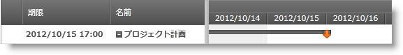

////

|metadata|
{
    "name": "xamgantt-configuring-deadlines",
    "controlName": ["xamGantt"],
    "tags": ["Data Presentation","How Do I","Scheduling"],
    "guid": "9ed6bd35-c0de-4ae0-bd73-e7644cdc0eaa",  
    "buildFlags": [],
    "createdOn": "2016-05-25T18:21:55.3801704Z"
}
|metadata|
////

= 期限の構成

== トピックの概要

=== 目的

このトピックでは、 _xamGantt™_   コントロールを使用してタスクの期限を構成する方法を説明します。

=== 前提条件

このトピックを理解するためには、以下のトピックを理解しておく必要があります。

[options="header", cols="a,a"]
|====
|トピック|目的

| link:xamgantt-binding-to-data-using-project.html[プロジェクトを使用してデータにバインド]
|このトピックでは、Project プロパティによって _xamGantt_ コントロールをデータにバインドする方法を説明します。

|====

=== 本トピックの内容

このトピックには次のセクションがあります。

* <<_Ref335060784, タスクの期限の構成 >>
* <<_Ref335060788, 関連コンテンツ >>

[[_Ref335060784]]
== タスクの期限の構成

=== 概要

期限日を任意のプロジェクト タスクに割り当てることができます。期限日はタスクが終了する時期を指定します。

期限は優先順位の低い遅い終了制約です。 *AsLateAsPossible*  制約タイプのタスクに影響するため、最も遅い終了日が期限日付になります。

注:

[NOTE]
====
タスクの総余裕期間の計算に影響する可能性があります。
====

期限は、 _xamGantt_   のグリッド セクションとチャート セクションの両方に表示されます。

* グリッド セクションでは、期限日は *期限* 列に表示します。タスクが期限日を経過すると、通知がインジケーター列に表示します。
* チャート セクションで、期限はタスクバーに矢印で表示します。

=== プロパティ設定

以下の表では、目的の構成をプロパティ設定にマップしています。

[options="header", cols="a,a,a"]
|====
|目的:|使用するプロパティ:|次に設定:

|タスクの期限の設定
| link:{ApiPlatform}controls.schedules.xamgantt{ApiVersion}~infragistics.controls.schedules.projecttask~deadline.html[Deadline]
|`Nullable<datetime></datetime>`

|====

=== 例

以下のスクリーンショットは、以下の設定を使用してタスク期限を設定する方法を示します。

[options="header", cols="a,a"]
|====
|プロパティ|値

|`Deadline`
|`DateTime.Today.ToUniversalTime().AddDays(2)`

|====

*C# の場合:*

[source,csharp]
----
XamGantt gantt = new XamGantt();
Project project = new Project();
ProjectTask task = new ProjectTask();
task.TaskName = "Task with deadline";
task.IsManual = false;
task.Deadline = DateTime.Today.ToUniversalTime().AddDays(2);
task.Duration = TimeSpan.FromHours(16);
task.Start = DateTime.Today.ToUniversalTime();
project.RootTask.Tasks.Add(task);
gantt.Project = project;
----

*Visual Basic の場合:*

[source,vb]
----
Dim gantt As New XamGantt()
Dim project As New Project()
Dim task As New ProjectTask()
task.TaskName = "Task with deadline"
task.IsManual = False
task.Deadline = DateTime.Today.ToUniversalTime().AddDays(2)
task.Duration = TimeSpan.FromHours(16)
task.Start = DateTime.Today.ToUniversalTime()
project.RootTask.Tasks.Add(task)
gantt.Project = project
----

[[_Ref335060788]]
== 関連コンテンツ

このトピックについては、以下のトピックも参照してください。

[options="header", cols="a,a"]
|====
|トピック|目的

| link:xamgantt-configuring-tasks.html[タスクの構成]
|このグループのトピックでは、 _xamGantt_ ProjectTask クラス、その構成可能な項目およびこのクラスが提供する主要機能を説明します。

|====
