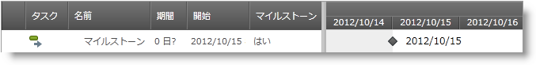

////

|metadata|
{
    "name": "xamgantt-configuring-milestones",
    "controlName": ["xamGantt"],
    "tags": [],
    "guid": "08183f9c-a9b4-4522-912a-3ee6ef4e3cb3",  
    "buildFlags": [],
    "createdOn": "2016-05-25T18:21:55.3851716Z"
}
|metadata|
////

= マイルストーンの構成

== トピックの概要

=== 目的

このトピックでは、 _xamGantt™_   コントロールを使用してマイルストーンを作成する方法を説明します。

=== 前提条件

このトピックを理解するためには、以下のトピックを理解しておく必要があります。

[options="header", cols="a,a"]
|====
|トピック|目的

| link:xamgantt-binding-to-data-using-project.html[プロジェクトを使用してデータにバインド]
|このトピックでは、Project プロパティによって _xamGantt_ コントロールをデータにバインドする方法を説明します。

|====

=== 本トピックの内容

このトピックには次のセクションがあります。

* <<_Ref335079036, マイルストーンを作成 >>

** <<_Ref335257386,概要>>
** <<_Ref335257399,プロパティ設定>>
** <<_Ref335257406,例>>

* <<_Ref335079042, 関連コンテンツ >>

[[_Ref335079036]]
== マイルストーンを作成

[[_Ref335257386]]

=== 概要

マイルストーンはゼロ日の期間を持つ特別なプロジェクト タスクです。

通常、マイルストーンはプロジェクト計画の大きなイベントまたは重要な成果物をマークします。

以下のいずれかで、マイルストーンとなるようにタスクを構成します。

* link:{ApiPlatform}controls.schedules.xamgantt{ApiVersion}~infragistics.controls.schedules.projecttask_members.html[ProjectTask] link:{ApiPlatform}controls.schedules.xamgantt{ApiVersion}~infragistics.controls.schedules.projecttask~ismilestone.html[IsMilestone] プロパティを `true` に設定することによって
* または link:{ApiPlatform}controls.schedules.xamgantt{ApiVersion}~infragistics.controls.schedules.projecttask_members.html[ProjectTask] link:{ApiPlatform}controls.schedules.xamgantt{ApiVersion}~infragistics.controls.schedules.projecttask~duration.html[Duration] プロパティをゼロに設定することによって

マイルストーンは、 _xamGantt_   のグリッド セクションとチャート セクションの両方に表示されます。

* グリッド セクションでは、 *マイルストーン* 列はタスクがマイルストーンかどうかを示します。
* チャート セクションでは、マイルストーンは菱形記号で表示します。

[[_Ref335257399]]

=== プロパティ設定

以下の表では、目的の構成をプロパティ設定にマップしています。

[options="header", cols="a,a,a"]
|====
|目的:|使用するプロパティ:|次に設定:

|マイルストーンを設定
|`IsMilestone`
|`true`

|
|`Duration`
|`TimeSpan.Zero`

|====

[[_Ref335257406]]

=== 例

以下の例は、マイルストーンを設定する方法を示しています。

*C# の場合:*

[source,csharp]
----
XamGantt gantt = new XamGantt();
Project project = new Project();
ProjectTask task = new ProjectTask();
task.TaskName = "Milestone";
task.IsManual = false;
// マイルストーンを設定する
task.IsMilestone = true;
task.Start = DateTime.Today.ToUniversalTime();
project.RootTask.Tasks.Add(task);
gantt.Project = project;
----

*Visual Basic の場合:*

[source,vb]
----
Dim gantt As New XamGantt()
Dim project As New Project()
Dim task As New ProjectTask()
task.TaskName = "Milestone"
task.IsManual = False
'マイルストーンを設定する
task.IsMilestone = True
task.Start = DateTime.Today.ToUniversalTime()
project.RootTask.Tasks.Add(task)
gantt.Project = project
----

[[_Ref335079042]]
== 関連コンテンツ

このトピックについては、以下のトピックも参照してください。

[options="header", cols="a,a"]
|====
|トピック|目的

| link:xamgantt-configuring-tasks.html[タスクの構成]
|このグループのトピックでは、 _xamGantt_ ProjectTask クラス、その構成可能な項目およびこのクラスが提供する主要機能を説明します。

|====
