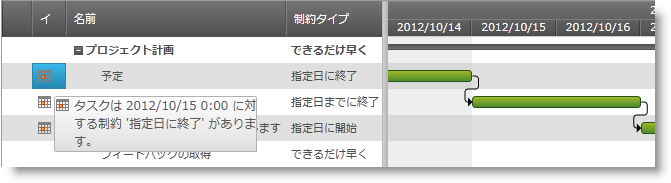

////

|metadata|
{
    "name": "xamgantt-configuring-task-constraint",
    "controlName": ["xamGantt"],
    "tags": ["Data Presentation","How Do I","Scheduling"],
    "guid": "263d5a61-fcba-4a19-8d8a-c8858063e1f7",  
    "buildFlags": [],
    "createdOn": "2016-05-25T18:21:55.4571753Z"
}
|metadata|
////

= タスクの制約の構成

== トピックの概要

=== 目的

このトピックでは、 _xamGantt™_   コントロールを使用してタスクの制約を構成する方法を説明します。

=== 前提条件

このトピックを理解するためには、以下のトピックを理解しておく必要があります。

[options="header", cols="a,a"]
|====
|トピック|目的

| link:xamgantt-binding-to-data-using-project.html[Project プロパティを使用してデータにバインド]
|このトピックでは、Project プロパティによって _xamGantt_ コントロールをデータにバインドする方法を説明します。

|====

=== 本トピックの内容

このトピックには次のセクションがあります。

* <<_Ref335486138, タスクの制約の構成の概要 >>
* <<_Ref335486144, タスクの制約を設定 >>
* <<_Ref335486148, 関連コンテンツ >>

[[_Ref335486138]]
== タスクの制約の構成の概要

=== タスクの制約の構成の概要表

以下の表は  _xamGantt_   コントロールのタスク制約を設定する時に構成可能な項目をリストします。追加の詳細情報はこのトピックの後で説明します。

[options="header", cols="a,a,a"]
|====
|構成可能な項目|説明|プロパティ

|タスクの制約タイプの構成
|タスクの制約タイプを返すか、設定します。
| link:{ApiPlatform}controls.schedules.xamgantt{ApiVersion}~infragistics.controls.schedules.projecttask~constrainttype.html[ConstraintType]

|タスクの制約日の構成
|タスクの制約日を返すか、設定します。 

制約タイプが「できるだけ遅く」または「できるだけ早く」に設定される時このプロパティは使用されません。
| link:{ApiPlatform}controls.schedules.xamgantt{ApiVersion}~infragistics.controls.schedules.projecttask~constraintdate.html[ConstraintDate]

|タスクの依存関係と制約間で競合する場合の優先順位を構成
|タスクの制約がタスクの依存関係よりも優先度が高いと見なされるかどうかを示すブール値を返すか、設定します。
| link:{ApiPlatform}controls.schedules.xamgantt{ApiVersion}~infragistics.controls.schedules.projectsettings~alwayshonortaskconstraintdates.html[AlwaysHonorTaskConstraintDates]

|====

[[_Ref335486144]]
== タスクの制約を設定

=== 概要

_xamGantt_   コントロールは、タスクの制約を構成する機能を提供し、Microsoft Project 2010 で使用可能な制約タイプをサポートします。

制約タイプは以下の通りです。 

*できるだけ早く* 

タスクはプロパティの開始日および手動でスケジュールされる先祖のサマリー タスクの開始日以降に開始します。 

*できるだけ遅く* 

タスクは、プロジェクトの終了日、タスクの期限 (指定されている場合)、手動でスケジュールされた先祖のサマリー タスクの終了日および自動的にスケジュールされた先祖のサマリー タスクの期限以前に終了します。

以下の半ば柔軟で強い制約は、依存関係に対する制約の優先順位を指定する link:{ApiPlatform}controls.schedules.xamgantt{ApiVersion}~infragistics.controls.schedules.projectsettings_members.html[ProjectSettings] link:{ApiPlatform}controls.schedules.xamgantt{ApiVersion}~infragistics.controls.schedules.projectsettings~alwayshonortaskconstraintdates.html[AlwaysHonorTaskConstraintDates] プロパティに依存します。

*指定日に開始*

タスクは指定された制約日に開始しなければならない/するはずです。

*指定日に終了*

タスクは指定された制約日に終了しなければならない/するはずです。

*指定日以後に開始*

タスクは指定された制約日以後に開始しなければならない/するはずです。

*指定日までに開始*

タスクは指定された制約日までに開始しなければならない/するはずです。

*指定日以後に終了*

タスクは指定された制約日以後に終了しなければならない/するはずです。

*指定日までに終了*

タスクは指定された制約日までに終了しなければならない/するはずです。

デフォルトで、開始日からスケジュールされたプロジェクトでは、タスクの制約タイプは「できるだけ早く」です。終了日からスケジュールされたプロジェクトでは、タスクの制約タイプは「できるだけ遅く」です。

手動でスケジュールされたタスクの制約タイプは編集できません。

=== プロパティ設定

以下の表は、タスクの制約の構成をプロパティ設定にマップしたものです。

[options="header", cols="a,a,a"]
|====
|目的:|使用するプロパティ:|次に設定:

|タスクの制約タイプの構成
| link:{ApiPlatform}controls.schedules.xamgantt{ApiVersion}~infragistics.controls.schedules.projecttask~constrainttype.html[ConstraintType]
| link:{ApiPlatform}controls.schedules.xamgantt{ApiVersion}~infragistics.controls.schedules.projecttaskconstrainttype.html[ProjectTaskConstraintType]

|タスクの制約日の構成
| link:{ApiPlatform}controls.schedules.xamgantt{ApiVersion}~infragistics.controls.schedules.projecttask~constraintdate.html[ConstraintDate]
|`Nullable<datetime></datetime>`

|====

=== 例

以下のコード例は、強い制約タイプ「指定日に終了」をタスクに設定する方法を示します。

*C# の場合:*

[source,csharp]
----
ProjectTask planniningTask = this.gantt.Project.RootTask.Tasks[0].Tasks[0];
planniningTask.ConstraintType = ProjectTaskConstraintType.MustFinishOn;
planniningTask.ConstraintDate = DateTime.Today.AddHours(8).ToUniversalTime();
----

*Visual Basic の場合:*

[source,vb]
----
Dim planniningTask As ProjectTask = Me.gantt.Project.RootTask.Tasks(0).Tasks(0)
planniningTask.ConstraintType = ProjectTaskConstraintType.MustFinishOn
planniningTask.ConstraintDate = DateTime.Today.AddHours(8).ToUniversalTime()
----

[[_Ref335486148]]
== 関連コンテンツ

このトピックについては、以下のトピックも参照してください。

[options="header", cols="a,a"]
|====
|トピック|目的

| link:xamgantt-configuring-tasks.html[タスクの構成]
|このグループのトピックでは、 _xamGantt_ ProjectTask クラス、その構成可能な項目およびこのクラスが提供する主要機能を説明します。

|====
