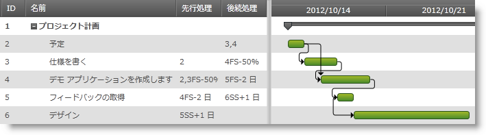

////

|metadata|
{
    "name": "xamgantt-configuring-task-dependencies",
    "controlName": ["xamGantt"],
    "tags": ["Data Presentation","Editing","How Do I","Scheduling"],
    "guid": "86cbd53b-79c0-4f0d-97a2-f19196efaa1a",  
    "buildFlags": [],
    "createdOn": "2016-05-25T18:21:55.433169Z"
}
|metadata|
////

= タスクの依存関係の構成

== トピックの概要

=== 目的

このトピックでは、 _xamGantt™_   コントロールを使用してタスクの依存関係を構成する方法を説明します。

=== 前提条件

このトピックを理解するためには、以下のトピックを理解しておく必要があります。

[options="header", cols="a,a"]
|====
|トピック|目的

| link:xamgantt-binding-to-data-using-project.html[プロジェクトを使用してデータにバインド]
|このトピックでは、Project プロパティによって _xamGantt_ コントロールをデータにバインドする方法を説明します。

|====

=== 本トピックの内容

このトピックには次のセクションがあります。

* <<_Ref335427291, タスクの依存関係の構成の概要 >>
* <<_Ref335723199, 先行処理および後続処理コレクションを使用してタスクの依存関係を指定 >>
* <<_Ref335723204, PredecessorsIdText および SuccessorsIdText プロパティを使用してタスクの依存関係を指定 >>
* <<_Ref335427310, 関連コンテンツ >>

[[_Ref335427291]]
== タスクの依存関係の構成の概要

=== タスクの依存関係の構成の概要表

以下の表に、 _xamGantt_   コントロール内でタスクの依存関係を構成するために可能なオプションをリストします。追加の詳細情報はこのトピックの後で説明します。

[options="header", cols="a,a,a"]
|====
|構成可能な項目|説明|プロパティ

|タスクの先行処理の指定
|タスクの先行処理 ID、リンク タイプ、リード タイム/ラグ タイムを表す文字列を返すか、設定します。
| link:{ApiPlatform}controls.schedules.xamgantt{ApiVersion}~infragistics.controls.schedules.projecttask~predecessorsidtext.html[PredecessorsIdText]

|タスクの先行処理の指定
|タスクの先行処理を表す link:{ApiPlatform}controls.schedules.xamgantt{ApiVersion}~infragistics.controls.schedules.projecttaskdependency.html[ProjectTaskDependency] オブジェクトのコレクションを返します。
| link:{ApiPlatform}controls.schedules.xamgantt{ApiVersion}~infragistics.controls.schedules.projecttask~predecessors.html[Predecessors]

|タスクの後続処理の指定
|タスクの後続処理 ID、リンク タイプ、リード タイム/ラグ タイムを表す文字列を返すか、設定します。
| link:{ApiPlatform}controls.schedules.xamgantt{ApiVersion}~infragistics.controls.schedules.projecttask~successorsidtext.html[SuccessorsIdText]

|タスクの後続処理の指定
|タスクの後続処理を表す link:{ApiPlatform}controls.schedules.xamgantt{ApiVersion}~infragistics.controls.schedules.projecttaskdependency_members.html[ProjectTaskDependency] オブジェクトのコレクションを返します。
| link:{ApiPlatform}controls.schedules.xamgantt{ApiVersion}~infragistics.controls.schedules.projecttask~successors.html[Successors]

|依存関係リンク タイプを指定する
|依存するタスクを結ぶ線のタイプを示すタイプ link:{ApiPlatform}controls.schedules.xamgantt{ApiVersion}~infragistics.controls.schedules.projecttaskdependencylinetype.html[ProjectTaskDependencyLineType] の値を返すか、設定します。
| link:{ApiPlatform}controls.schedules.xamgantt{ApiVersion}~infragistics.controls.schedules.xamgantt~taskdependencylinetype.html[TaskDependencyLineType]

|====

サポートされる依存関係リンク タイプ:

[options="header", cols="a,a,a"]
|====
|エディターのリンク タイプ表記|リンク タイプ|説明

|FS
|終了 - 開始リンク
|その他の方法で指定されない場合には、これがデフォルトのリンク タイプです。 

後続処理の開始日は先行処理の終了日に依存します。

|FF
|終了 - 終了リンク
|後続処理の終了日は先行処理の終了日に依存します。

|SF
|開始 - 終了リンク
|後続処理の終了日は先行処理の開始日に依存します。

|SS
|開始 - 開始リンク
|後続処理の開始日は先行処理の開始日に依存します。

|====

[[_Ref335723199]]
[[_Ref335427296]]
== 先行処理および後続処理コレクションを使用してタスクの依存関係を指定

=== 概要

_xamGantt_   コントロールは、プロジェクト内のタスク間の依存関係リンクを作成する機能を提供し、Microsoft Project 2010 で使用可能なリンク タイプをサポートします。依存関係のリード タイムとラグ タイムも指定できます。

タスクの先行処理と後続処理のコレクションを使用してプログラムによってタスクの依存関係を作成します。link:{ApiPlatform}controls.schedules.xamgantt{ApiVersion}~infragistics.controls.schedules.projecttask_members.html[ProjectTask] link:{ApiPlatform}controls.schedules.xamgantt{ApiVersion}~infragistics.controls.schedules.projecttask~predecessors.html[Predecessors] および link:{ApiPlatform}controls.schedules.xamgantt{ApiVersion}~infragistics.controls.schedules.projecttask~successors.html[Successors] プロパティを使用して、 link:{ApiPlatform}controls.schedules.xamgantt{ApiVersion}~infragistics.controls.schedules.projecttaskdependency_members.html[ProjectTaskDependency] オブジェクトのコレクションを作成します。

`Successors` および `Predecessors` コレクションは Add メソッドの 2 つのオーバーロード メソッドを公開します。

最初のオーバーロード メソッドは link:{ApiPlatform}controls.schedules.xamgantt{ApiVersion}~infragistics.controls.schedules.projecttask_members.html[ProjectTask] と link:{ApiPlatform}controls.schedules.xamgantt{ApiVersion}~infragistics.controls.schedules.projecttasklinktype.html[ProjectTaskLinkType] をパラメーターとして取得します。

2 つ目のオーバーロード メソッドは link:{ApiPlatform}controls.schedules.xamgantt{ApiVersion}~infragistics.controls.schedules.projecttask_members.html[ProjectTask]、 link:{ApiPlatform}controls.schedules.xamgantt{ApiVersion}~infragistics.controls.schedules.projecttasklinktype.html[ProjectTaskLinkType] および link:{ApiPlatform}controls.schedules.xamgantt{ApiVersion}~infragistics.controls.schedules.projectduration_members.html[ProjectDuration] をパラメーターとして取得します。

タスクの依存関係、文字列表現、許容可能な期間の書式に関する詳細については、 link:xamgantt-columns-editing.html[「xamGantt 列の編集」]トピックを参照してください。

=== プロパティ設定

以下の表は、タスクの依存関係の構成をプロパティ設定にマップしたものです。

[options="header", cols="a,a,a,a"]
|====
|目的:|使用するプロパティ:|メソッド:|次に設定:

|タスクの後続処理コレクションの設定
| link:{ApiPlatform}controls.schedules.xamgantt{ApiVersion}~infragistics.controls.schedules.projecttask~successors.html[Successors]
|`Add`
| link:{ApiPlatform}controls.schedules.xamgantt{ApiVersion}~infragistics.controls.schedules.projecttaskdependency_members.html[ProjectTaskDependency]

|タスクの先行処理コレクションの設定
| link:{ApiPlatform}controls.schedules.xamgantt{ApiVersion}~infragistics.controls.schedules.projecttask~predecessors.html[Predecessors]
|`Add`
| link:{ApiPlatform}controls.schedules.xamgantt{ApiVersion}~infragistics.controls.schedules.projecttaskdependency_members.html[ProjectTaskDependency]

|====

=== 例

以下のコード例では、`Predecessors` および `Successors` コレクションを使用してタスクの依存関係を作成する方法を示します:

*C# の場合:*

[source,csharp]
----
ProjectTask firstTask = this.gantt.Project.RootTask.Tasks[0];
// タスクの 2 つの依存関係を設定
// firstTask.Tasks[0].SuccessorsIdText = "3,4";
firstTask.Tasks[0].Successors.Add(firstTask.Tasks[1]);
firstTask.Tasks[0].Successors.Add(firstTask.Tasks[2]);
// Finish-to-Start 依存関係と 
// 依存するタスク間で 50% のリード タイムを設定 
// タスク間の重複は先行処理タスク期間の 50%
// firstTask.Tasks[1].SuccessorsIdText = "4FS-50%";
firstTask.Tasks[1].Successors.Add(firstTask.Tasks[2], ProjectTaskLinkType.FinishToStart, ProjectDuration.FromFormatUnits(-50, ProjectDurationFormat.Percent));
// 2 日のリードタイムを設定
// firstTask.Tasks[3].PredecessorsIdText = "4FS-2 days";
firstTask.Tasks[3].Predecessors.Add(firstTask.Tasks[2], ProjectTaskLinkType.FinishToStart, ProjectDuration.FromFormatUnits(-2, ProjectDurationFormat.Days));
// 依存するタスク間で 1 日の遅延 (ラグ タイム) を設定
// firstTask.Tasks[4].PredecessorsIdText = "5SS+1d";
firstTask.Tasks[4].Predecessors.Add(firstTask.Tasks[3], ProjectTaskLinkType.StartToStart, ProjectDuration.FromFormatUnits(1, ProjectDurationFormat.Days));
----

*Visual Basic の場合:*

[source,vb]
----
Dim firstTask As ProjectTask = Me.gantt.Project.RootTask.Tasks(0)
' タスクの 2 つの依存関係を設定
' firstTask.Tasks[0].SuccessorsIdText = "3,4";
firstTask.Tasks(0).Successors.Add(firstTask.Tasks(1))
firstTask.Tasks(0).Successors.Add(firstTask.Tasks(2))
' Finish-to-Start 依存関係と 
' 依存するタスク間で 50% のリード タイムを設定 
' タスク間の重複は先行処理タスク期間の 50%
' firstTask.Tasks[1].SuccessorsIdText = "4FS-50%";
firstTask.Tasks(1).Successors.Add(firstTask.Tasks(2), ProjectTaskLinkType.FinishToStart, ProjectDuration.FromFormatUnits(-50, ProjectDurationFormat.Percent))
' 2 日のリードタイムを設定
' firstTask.Tasks[3].PredecessorsIdText = "4FS-2 days";
firstTask.Tasks(3).Predecessors.Add(firstTask.Tasks(2), ProjectTaskLinkType.FinishToStart, ProjectDuration.FromFormatUnits(-2, ProjectDurationFormat.Days))
' 依存するタスク間で 1 日の遅延 (ラグ タイム) を設定
' firstTask.Tasks[4].PredecessorsIdText = "5SS+1d";
firstTask.Tasks(4).Predecessors.Add(firstTask.Tasks(3), ProjectTaskLinkType.StartToStart, ProjectDuration.FromFormatUnits(1, ProjectDurationFormat.Days))
----

[[_Ref335723204]]
== PredecessorsIdText および SuccessorsIdText プロパティを使用してタスクの依存関係を指定

=== 概要

タスクの依存関係を設定するには、 link:{ApiPlatform}controls.schedules.xamgantt{ApiVersion}~infragistics.controls.schedules.projecttask_members.html[ProjectTask] link:{ApiPlatform}controls.schedules.xamgantt{ApiVersion}~infragistics.controls.schedules.projecttask~successorsidtext.html[SuccessorsIdText] および link:{ApiPlatform}controls.schedules.xamgantt{ApiVersion}~infragistics.controls.schedules.projecttask~successorsidtext.html[SuccessorsIdText] プロパティを使用します。これらのプロパティは、依存するタスク ID、リンク タイプ、ラグ タイムおよびリード タイムを含む依存関係の文字列表現を受け入れます。

タスクの依存関係と文字列表現に関する詳細については、 link:xamgantt-columns-editing.html[「xamGantt 列の編集」]トピックを参照してください。

=== プロパティ設定

以下の表は、タスクの依存関係の構成をプロパティ設定にマップしたものです。

[options="header", cols="a,a,a"]
|====
|目的:|使用するプロパティ:|次に設定:

|タスクの後続処理の設定
| link:{ApiPlatform}controls.schedules.xamgantt{ApiVersion}~infragistics.controls.schedules.projecttask~successorsidtext.html[SuccessorsIdText]
|`string`

|タスクの先行処理の設定
| link:{ApiPlatform}controls.schedules.xamgantt{ApiVersion}~infragistics.controls.schedules.projecttask~predecessorsidtext.html[PredecessorsIdText]
|`string`

|====

=== 例

以下のスクリーンショットは、以下のコード例を使用してタスクの依存関係を構築する方法を示します。_xamGantt_   チャート領域をよく見て、定義された依存関係を表すために依存関係リンクを使用します。

*C# の場合:*

[source,csharp]
----
ProjectTask firstTask = this.gantt.Project.RootTask.Tasks[0];
// タスクの 2 つの依存関係を設定
firstTask.Tasks[0].SuccessorsIdText = "3,4";
// Finish-to-Start 依存関係と 
// 依存するタスク間で 50% のリード タイムを設定 
// タスク間の重複は先行処理タスク期間の 50%
firstTask.Tasks[1].SuccessorsIdText = "4FS-50%";
// 2 日のリードタイムを設定
firstTask.Tasks[3].PredecessorsIdText = "4FS-2 days";
// 依存するタスク間で 1 日の遅延 (ラグ タイム) を設定
firstTask.Tasks[4].PredecessorsIdText = "5SS+1d";
----

*Visual Basic の場合:*

[source,vb]
----
Dim firstTask As ProjectTask = Me.gantt.Project.RootTask.Tasks(0)
' タスクの 2 つの依存関係を設定
firstTask.Tasks(0).SuccessorsIdText = "3,4"
' Finish-to-Start 依存関係と 
' 依存するタスク間で 50% のリード タイムを設定 
' タスク間の重複は先行処理タスク期間の 50%
firstTask.Tasks(1).SuccessorsIdText = "4FS-50%"
' 2 日のリードタイムを設定
firstTask.Tasks(3).PredecessorsIdText = "4FS-2 days"
' 依存するタスク間で 1 日の遅延 (ラグ タイム) を設定
firstTask.Tasks(4).PredecessorsIdText = "5SS+1d"
----

[[_Ref335427310]]
== 関連コンテンツ

このトピックについては、以下のトピックも参照してください。

[options="header", cols="a,a"]
|====
|トピック|目的

| link:xamgantt-configuring-tasks.html[タスクの構成]
|このグループのトピックでは、 _xamGantt_ ProjectTask クラス、その構成可能な項目およびこのクラスが提供する主要機能を説明します。

|====
