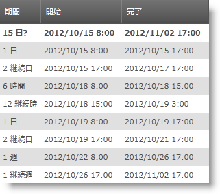

////
|metadata|
{
    "name": "xamgantt-configuring-task-duration-duration-format",
    "controlName": ["xamGantt"],
    "tags": ["Data Binding","Data Presentation","Grids","Patterns and Practices","Scheduling"],
    "guid": "a313ad7f-ff32-4f52-95b4-fd5625dc6401",
    "buildFlags": [],
    "createdOn": "2016-05-25T18:21:55.4271386Z"
}
|metadata|
////

= タスク期間と期間の形式の構成

== トピックの概要

=== 目的

このトピックでは  _xamGantt™_   を使用してタスク期間とタスク期間単位を設定する方法を説明します。

=== 本トピックの内容

このトピックには次のセクションがあります。

* <<_Task_Duration_And_Format, タスク期間および形式 >>

** <<_Introduction,概要>>

** <<_Duration_Unit_Types,期間単位のタイプ>>

** <<_Estimated_Duration_Value,見積もり期間値>>

* <<_Code_Example_Setting_Task_Durations, コード例: タスク期間の設定 >>

** <<_Ref333763526,説明>>

** <<_Ref333763533,コード>>

* <<_Related_Content, 関連コンテンツ >>

[[_Task_Duration_And_Format]]
== タスク期間および形式

[[_Introduction]]

=== 概要

タスクの期間はタスクが必要とする時間です。タスク期間の値は固定された稼働時間の量を表します。

タスク期間はさまざまな単位で表すことができます。タスク期間に使用可能な単位は、 link:{ApiPlatform}controls.schedules.xamgantt{ApiVersion}~infragistics.controls.schedules.projectdurationformat.html[ProjectDurationFormat] 列挙体で定義されます。サポートされる単位のタイプは Microsoft Project 2010 がサポートするタイプと同じです。

link:{ApiPlatform}controls.schedules.xamgantt{ApiVersion}~infragistics.controls.schedules.xamgantt_members.html[XamGantt] アセンブリはタスク期間をプログラムで設定するために link:{ApiPlatform}controls.schedules.xamgantt{ApiVersion}~infragistics.controls.schedules.projectduration_members.html[ProjectDuration] と link:{ApiPlatform}controls.schedules.xamgantt{ApiVersion}~infragistics.controls.schedules.manualprojectduration_members.html[ManualProjectDuration] の 2 つのカスタム タイプを定義します。プロジェクト期間の設定で便利な方法は、`ProjectDuration` 構造の静的な link:{ApiPlatform}controls.schedules.xamgantt{ApiVersion}~infragistics.controls.schedules.projectduration~fromformatunits.html[FromFormatUnits] メソッドを使用することです。

[[_Duration_Unit_Types]]

=== 期間単位のタイプ

タスク期間の単位は標準の期間単位と継続期間単位に分類できます。標準の期間単位は 1 日あたりの稼働時間数を基準に計算します。継続時間単位は 24 時間時計と週 7 日を基準に計算します。つまり、標準の期間単位を使用して 24 時間タスクの期間を計算すると (8 時間労働を前提とする) 3 日になりますが、継続時間単位を使用して同じ計算をすると 1 日になります。

[[_Estimated_Duration_Value]]

=== 見積もり期間値

見積もり期間はタスクの期間値で現在最も信頼できる見積もりです。期間値を見積もりとして設定できますが、これはこのタスクの期間に関する情報がまだあることを示します。

注:

[NOTE]
====
グリッド セルに表示される疑問符で見積もり期間値を識別できます。
====

=== プロジェクト期間

`ProjectDuration` はタスクの期間の時間 (TimeSpan として分で保管される)、期間単位 (`ProjectDurationFormat` として保管される) およびオプションで値が見積もられるかどうかを表します。

プロジェクト期間は link:{ApiPlatform}controls.schedules.xamgantt{ApiVersion}~infragistics.controls.schedules.projectsettings_members.html[ProjectSettings] クラスのいくつかのプロパティによって異なります。これらのプロパティは期間が表す分数を計算するために使用されます。これらは、以下の表にまとめられています。

[options="header", cols="a,a"]
|====
|プロパティ|説明

| link:{ApiPlatform}controls.schedules.xamgantt{ApiVersion}~infragistics.controls.schedules.projectsettings~dayspermonth.html[DaysPerMonth]
|日の単位を計算する時に使用される日数を示す値を取得または設定します。

| link:{ApiPlatform}controls.schedules.xamgantt{ApiVersion}~infragistics.controls.schedules.projectsettings~minutesperday.html[MinutesPerDay]
|日の単位を計算する時に使用される分数を示す値を取得または設定します。

| link:{ApiPlatform}controls.schedules.xamgantt{ApiVersion}~infragistics.controls.schedules.projectsettings~minutesperweek.html[MinutesPerWeek]
|週の単位を計算する時に使用される分数を示す値を取得または設定します。

|====

注:

[NOTE]
====

これらのプロパティの値を変更してもすでに作成されたタスクの期間は変更されません。これらのプロパティはタスクを作成する前に設定する必要があります。

これらのプロパティは期間が表示される方法に影響します。
====

[[_Code_Example_Setting_Task_Durations]]
== コード例: タスク期間の設定

[[_Ref333763526]]

=== 説明

このコード例は、`ProjectDuration` `FromFormatUnits` 静的メソッドを使用してタスクの期間をプログラムによって設定する方法を示します。異なる期間の単位と値を設定する方法を示します。

=== 前提条件

この手順を実行するには、以下が必要です。

* 以下の NuGet パッケージへの参照を含むプロジェクト:

** Infragistics.WPF.Gantt

NuGet フィードのセットアップと NuGet パッケージの追加の詳細については、link:nuget-feeds.html[NuGet フィード] ドキュメントを参照してください。

=== プレビュー

コンパイルおよびランのサンプル プロジェクトの両方のプレビューを確認できます。これらのタスクごとに期間と期間単位の値を指定することによって作成されたサンプル タスクとともに  _xamGantt_   を表示します。

=== コードの説明

`FromFormatUnits` メソッドを使用してプロジェクト タスク期間を設定できます。以下のコード スニペットはプロジェクト タスクを作成して期間を設定する方法を示します。

*C# の場合:*

[source,csharp]
----
…
new ProjectTask {
    TaskName = "Task 01",
    IsManual = false,
    ManualDuration = ProjectDuration.FromFormatUnits(16, ProjectDurationFormat.Hours)
}…
----

*Visual Basic の場合:*

[source,vb]
----
…
New ProjectTask() With { _
    .TaskName = "Task 01", _
    .IsManual = False, _
    .ManualDuration = ProjectDuration.FromFormatUnits(16, ProjectDurationFormat.Hours) _
}
…
----

[[_Ref333763533]]

=== コード

*XAML の場合:*

[source,xaml]
----
<Grid>
    <ig:XamGantt x:Name="xamGantt" Project="{Binding}" />
</Grid>
----

*C# の場合:*

[source,csharp]
----
public Main()
{
    InitializeComponent();
    Loaded += OnMainLoaded;
}

void OnMainLoaded(object sender, RoutedEventArgs rea)
{
    DataContext = GenerateProject();
}

private static Project GenerateProject()
{
    Project project = new Project();
    ProjectTask root = new ProjectTask { TaskName = "Summary", IsManual = false };
    project.RootTask.Tasks.Add(root);
    root.Tasks.Add(new ProjectTask 
    { TaskName = "Task 01", IsManual=false, ManualDuration = 
        ProjectDuration.FromFormatUnits(16, ProjectDurationFormat.Hours) } );
    root.Tasks.Add(new ProjectTask 
    { TaskName = "Task 02", IsManual=false, ManualDuration = 
        ProjectDuration.FromFormatUnits(2, ProjectDurationFormat.Days) } );
    root.Tasks.Add(new ProjectTask 
    { TaskName = "Task 03", IsManual = false, ManualDuration = 
        ProjectDuration.FromFormatUnits(48, ProjectDurationFormat.ElapsedHours) } );
    root.Tasks.Add(new ProjectTask 
    { TaskName = "Task 04", IsManual=false, ManualDuration = 
        ProjectDuration.FromFormatUnits(2, ProjectDurationFormat.ElapsedDays) } );
    return project;
}
----

*Visual Basic の場合:*

[source,vb]
----
Public Sub New()
      InitializeComponent()
      Loaded = AddressOf OnMainLoaded
End Sub

Private Sub OnMainLoaded(sender As Object, rea As RoutedEventArgs)
      DataContext = GenerateProject()
End Sub

Private Shared Function GenerateProject() As Project
    Dim project As New Project()
    Dim root As New ProjectTask() With { 
        .TaskName = "Summary", 
        .IsManual = False 
    }
    project.RootTask.Tasks.Add(root)
    root.Tasks.Add(New ProjectTask() With { 
        .TaskName = "Task 01", 
        .IsManual = False, 
        .ManualDuration = ProjectDuration.FromFormatUnits(16, ProjectDurationFormat.Hours) 
    })
    root.Tasks.Add(New ProjectTask() With { 
        .TaskName = "Task 02", 
        .IsManual = False, 
        .ManualDuration = ProjectDuration.FromFormatUnits(2, ProjectDurationFormat.Days) 
    })
    root.Tasks.Add(New ProjectTask() With { 
        .TaskName = "Task 03", 
        .IsManual = False, 
        .ManualDuration = ProjectDuration.FromFormatUnits(48, ProjectDurationFormat.ElapsedHours) 
    })
    root.Tasks.Add(New ProjectTask() With { 
        .TaskName = "Task 04", 
        .IsManual = False, 
        .ManualDuration = ProjectDuration.FromFormatUnits(2, ProjectDurationFormat.ElapsedDays) 
    })
    Return project
End Function
----

[[_Related_Content]]
== 関連コンテンツ

このトピックについては、以下のトピックも参照してください。

[options="header", cols="a,a"]
|====
|トピック|目的

| link:xamgantt-configuring-tasks.html[タスクの構成]
|このグループのトピックでは、 _xamGantt_ ProjectTask クラス、その構成可能な項目およびこのクラスが提供する主要機能を説明します。

| link:xamgantt-xamgantt-user-interactions-in-the-grid-section.html[グリッド セクションにおける xamGantt ユーザー インタラクション]
|このトピックでは、 _xamGantt_ コントロールのグリッド セクションで実行できるユーザー インタラクションについて解説します。

|====