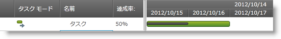

////

|metadata|
{
    "name": "xamgantt-configuring-task-progress",
    "controlName": ["xamGantt"],
    "tags": ["Data Presentation","How Do I","Scheduling"],
    "guid": "166a02cf-0d80-40c0-be53-810f14c8416e",  
    "buildFlags": [],
    "createdOn": "2016-05-25T18:21:55.3921315Z"
}
|metadata|
////

= タスクの進行状況の構成

== トピックの概要

=== 目的

このトピックでは、 _xamGantt™_   コントロールを使用してタスクの進行状況を設定する方法を説明します。

=== 前提条件

このトピックを理解するためには、以下のトピックを理解しておく必要があります。

[options="header", cols="a,a"]
|====
|トピック|目的

| link:xamgantt-binding-to-data-using-project.html[プロジェクトを使用してデータにバインド]
|このトピックでは、Project プロパティによって _xamGantt_ コントロールをデータにバインドする方法を説明します。

|====

=== 本トピックの内容

このトピックには次のセクションがあります。

* <<_Ref335085121, タスクの進行状況の設定 >>

** <<_Ref335259255,概要>>
** <<_Ref335259262,プロパティ設定>>
** <<_Ref335259273,例>>

* <<_Ref335085126, 関連コンテンツ >>

[[_Ref335085121]]
== タスクの進行状況の設定

[[_Ref335259255]]

=== 概要

プロジェクト タスクの進捗状況を完了した作業のパーセンテージで指定します。

進行状況を指定するには、 link:{ApiPlatform}controls.schedules.xamgantt{ApiVersion}~infragistics.controls.schedules.projecttask_members.html[ProjectTask] link:{ApiPlatform}controls.schedules.xamgantt{ApiVersion}~infragistics.controls.schedules.projecttask~percentcomplete.html[PercentComplete] プロパティを使用して、0 から 100 の範囲で decimal 型に設定します。

このコントロールは  _xamGantt_   のグリッド セクションとチャート セクションの両方にタスクの進行状況を表示します。

* グリッド セクションでは、タスクの進行状況は *達成率* 列に表示します。タスク作業が 100% 完了した場合、チェック マークの通知アイコンがグリッド インジケーター列に表示します。
* チャート セクションでは、進捗状況はタスク バーに進捗線として表示されます。ここでバーの終わりはタスクの達成点の日を表します。

[[_Ref335259262]]

=== プロパティ設定

以下の表では、目的の構成をプロパティ設定にマップしています。

[options="header", cols="a,a,a"]
|====
|目的:|使用するプロパティ:|次に設定:

|タスクの進行状況を設定
| link:{ApiPlatform}controls.schedules.xamgantt{ApiVersion}~infragistics.controls.schedules.projecttask~percentcomplete.html[PercentComplete]
|`decimal`

|====

[[_Ref335259273]]

=== 例

以下の例はタスクの進行状況を 50% に設定する方法を示します。

[options="header", cols="a,a"]
|====
|プロパティ|値

|`PercentComplete`
|`50`

|====

*C# の場合:*

[source,csharp]
----
XamGantt gantt = new XamGantt();
Project project = new Project();
ProjectTask task = new ProjectTask();
task.TaskName = "Task in progress";
task.IsManual = false;
// タスクの進行状況を設定
task.PercentComplete = 50;
task.Duration = TimeSpan.FromHours(16);
task.Start = DateTime.Today.ToUniversalTime();
project.RootTask.Tasks.Add(task);
gantt.Project = project;
----

*Visual Basic の場合:*

[source,vb]
----
Dim gantt As New XamGantt()
Dim project As New Project()
Dim task As New ProjectTask()
task.TaskName = "Task in progress"
task.IsManual = False
' タスクの進行状況を設定
task.PercentComplete = 50
task.Duration = TimeSpan.FromHours(16)
task.Start = DateTime.Today.ToUniversalTime()
project.RootTask.Tasks.Add(task)
gantt.Project = project
----

[[_Ref335085126]]
== 関連コンテンツ

このトピックについては、以下のトピックも参照してください。

[options="header", cols="a,a"]
|====
|トピック|目的

| link:xamgantt-configuring-tasks.html[タスクの構成]
|このグループのトピックでは、 _xamGantt_ ProjectTask クラス、その構成可能な項目およびこのクラスが提供する主要機能を説明します。

|====
