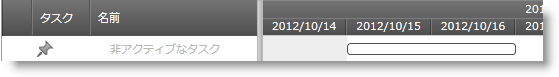

////

|metadata|
{
    "name": "xamgantt-configuring-tasks-active-inactive",
    "controlName": ["xamGantt"],
    "tags": ["Data Presentation","How Do I","Scheduling"],
    "guid": "ce90c13c-d4c1-4fad-950f-8407991fd328",  
    "buildFlags": [],
    "createdOn": "2016-05-25T18:21:55.4211325Z"
}
|metadata|
////

= タスクをアクティブ/非アクティブで構成

== トピックの概要

=== 目的

このトピックでは、 _xamGantt_™ コントロールを使用してタスクをアクティブ/非アクティブのいずれかに構成する方法を説明します。

=== 前提条件

このトピックを理解するためには、以下のトピックを理解しておく必要があります。

[options="header", cols="a,a"]
|====
|トピック|目的

| link:xamgantt-binding-to-data-using-project.html[プロジェクトを使用してデータにバインド]
|このトピックでは、 _xamGantt_ コントロールを使用してタスクを手動または自動スケジュールに構成する方法を説明します。

|====

=== 本トピックの内容

このトピックには次のセクションがあります。

* <<_Ref335053332, アクティブ/非アクティブ タスク構成の概要 >>
* <<_Ref335053337, IsActive プロパティを使用してタスクの状態をアクティブ/非アクティブに構成 >>

** <<_Ref335260702,概要>>
** <<_Ref335260708,プロパティ設定>>
** <<_Ref335260713,例>>

* <<_Ref335053342, 関連コンテンツ >>

[[_Ref335053332]]
== アクティブ/非アクティブ タスク構成の概要

=== アクティブ/非アクティブ タスク構成の概要表

以下の表は、 link:{ApiPlatform}controls.schedules.xamgantt{ApiVersion}~infragistics.controls.schedules.projecttask_members.html[ProjectTask] の状態 (アクティブ/非アクティブ) の構成可能な項目を示しています。表の後に、その他の詳細が紹介されています。

[options="header", cols="a,a,a,a"]
|====
|構成可能な項目|説明|プロパティ|コマンド

|タスクをアクティブに設定
|`ProjectTask` `IsActive` プロパティまたはコマンドのいずれかを使用してタスクの状態をプログラムで変更します。
| link:{ApiPlatform}controls.schedules.xamgantt{ApiVersion}~infragistics.controls.schedules.projecttask~isactive.html[IsActive]
|
* link:{ApiPlatform}controls.schedules.xamgantt{ApiVersion}~infragistics.controls.schedules.ganttcommandid.html[ChangeTaskToActive] 

* link:{ApiPlatform}controls.schedules.xamgantt{ApiVersion}~infragistics.controls.schedules.ganttcommandid.html[ToggleTaskActive] 

|タスクを非アクティブに設定
|`ProjectTask` `IsActive` プロパティまたはコマンドを使用してタスクの状態をプログラムで変更します。
| link:{ApiPlatform}controls.schedules.xamgantt{ApiVersion}~infragistics.controls.schedules.projecttask~isactive.html[IsActive]
|
* link:{ApiPlatform}controls.schedules.xamgantt{ApiVersion}~infragistics.controls.schedules.ganttcommandid.html[ChangeTaskToInactive] 

* link:{ApiPlatform}controls.schedules.xamgantt{ApiVersion}~infragistics.controls.schedules.ganttcommandid.html[ToggleTaskActive] 

|====

[[_Ref335053337]]
== IsActive プロパティを使用してタスクの状態をアクティブ/非アクティブに構成

[[_Ref335260702]]

=== 概要

`ProjectTask` には以下の 2 種類の状態があります:

* アクティブ
* 非アクティブ

デフォルトで、プロジェクト タスクの状態はアクティブです。

非アクティブ タスクがその他のアクティブ タスクに依存しない限り、スケジューリング エンジンはこれらのタスクを無視します。

親タスクが非アクティブにマークされる場合、すべての子も非アクティブ化されます。

このコントロールは  _xamGantt_   のグリッド セクションとチャート セクションの両方にタスクを表示します。

* グリッド セクションでは、タスクの状態は  *Active*  列に表示します。
* チャート セクションでは、非アクティブのタスクバーはぼやけて表示されます。

注:

[NOTE]
====
実際値 (実際の期間、実際の終了日、実際の開始日または達成率フィールドに値がある) が指定されたプロジェクト タスクは非アクティブに設定できません。
====

[[_Ref335260708]]

=== プロパティ設定

以下の表では、目的の構成をプロパティ設定にマップしています。

[options="header", cols="a,a,a"]
|====
|目的:|使用するプロパティ:|次に設定:

|アクティブ化/非アクティブ化
|`IsActive`
|`bool`

|====

[[_Ref335260713]]

=== 例

以下のスクリーンショットは、以下の設定を使用してタスクの状態を非アクティブに設定する方法を示します。

[options="header", cols="a,a"]
|====
|プロパティ|値

|`IsActive`
|`False`

|====

*C# の場合:*

[source,csharp]
----
XamGantt gantt = new XamGantt();
Project project = new Project();
ProjectTask task = new ProjectTask();
task.TaskName = "Inactive Task";
task.IsActive = false;
task.Duration = TimeSpan.FromHours(16);
task.Start = DateTime.Today.ToUniversalTime();
project.RootTask.Tasks.Add(task);
gantt.Project = project;
----

*Visual Basic の場合:*

[source,vb]
----
Dim gantt As New XamGantt()
Dim project As New Project()
Dim task As New ProjectTask()
task.TaskName = "Inactive Task"
task.IsActive = False
task.Duration = TimeSpan.FromHours(16)
task.Start = DateTime.Today.ToUniversalTime()
project.RootTask.Tasks.Add(task)
gantt.Project = project
----

[[_Ref335053342]]
== 関連コンテンツ

このトピックについては、以下のトピックも参照してください。

[options="header", cols="a,a"]
|====
|トピック|目的

| link:xamgantt-configuring-tasks.html[タスクの構成]
|このグループのトピックでは、 _xamGantt_ ProjectTask クラス、その構成可能な項目およびこのクラスが提供する主要機能を説明します。

| link:xamgantt-using-xamgantt-commands.html[コマンドの使用]
|このトピックでは、 _xamGantt_ コントロールでよく使用できる主なコマンドと､その使用方法を説明します。

|====
