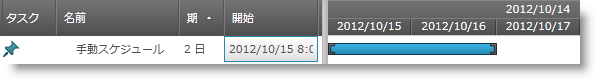
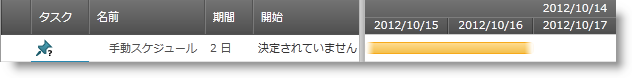

////

|metadata|
{
    "name": "xamgantt-configuring-tasks-manual-automatic",
    "controlName": ["xamGantt"],
    "tags": ["Data Presentation","Getting Started","How Do I","Scheduling"],
    "guid": "02cfa65a-bd39-4264-a49d-4ee74e951f5a",  
    "buildFlags": [],
    "createdOn": "2016-05-25T18:21:55.4161325Z"
}
|metadata|
////

= タスクを手動/自動で構成

== トピックの概要

=== 目的

このトピックでは、 _xamGantt™_   コントロールを使用してタスクを手動スケジュールまたは自動スケジュールに構成する方法を説明します。

=== 前提条件

このトピックを理解するためには、以下のトピックを理解しておく必要があります。

[options="header", cols="a,a"]
|====
|トピック|目的

| link:xamgantt-binding-to-data-using-project.html[プロジェクトを使用してデータにバインド]
|このトピックでは、Project プロパティによって _xamGantt_ コントロールをデータにバインドする方法を説明します。

|====

=== 本トピックの内容

このトピックには次のセクションがあります。

* <<_Ref335045186, 手動/自動タスク構成の概要 >>
* <<_Ref335045209, IsManual プロパティを使用してタスク モードを自動/手動スケジュールに構成 >>

** <<_Ref335262164,概要>>
** <<_Ref335262172,プロパティ設定>>
** <<_Ref335262185,例>>

* <<_Ref335045248, 関連コンテンツ >>

[[_Ref335045186]]
== 手動/自動タスク構成の概要

=== 手動/自動タスク構成の概要表

以下の表は link:{ApiPlatform}controls.schedules.xamgantt{ApiVersion}~infragistics.controls.schedules.projecttask_members.html[ProjectTask] モード (自動または手動スケジュール) の構成可能な項目を示しています。追加の詳細は以下のとおりです。

[options="header", cols="a,a,a,a"]
|====
|構成可能な項目|説明|プロパティ|コマンド

|タスク モードを自動スケジュールに切り替える
|`ProjectTask` `IsManual` プロパティまたはコマンドのいずれかを使用してタスクのモードをプログラムで変更します。
| link:{ApiPlatform}controls.schedules.xamgantt{ApiVersion}~infragistics.controls.schedules.projecttask~ismanual.html[IsManual]
| link:{ApiPlatform}controls.schedules.xamgantt{ApiVersion}~infragistics.controls.schedules.ganttcommandid.html[ChangeTaskToAutomatic]

|タスク モードを手動スケジュールに切り替える
|`ProjectTask` `IsManual` プロパティまたはコマンドのいずれかを使用してタスクのモードをプログラムで変更します。
| link:{ApiPlatform}controls.schedules.xamgantt{ApiVersion}~infragistics.controls.schedules.projecttask~ismanual.html[IsManual]
| link:{ApiPlatform}controls.schedules.xamgantt{ApiVersion}~infragistics.controls.schedules.ganttcommandid.html[ChangeTaskToManual]

|_xamGantt_ ユーザー インターフェイスによって作成されたタスクのスケジュール モードを構成する
| link:{ApiPlatform}controls.schedules.xamgantt{ApiVersion}~infragistics.controls.schedules.projectsettings_members.html[ProjectSettings] link:{ApiPlatform}controls.schedules.xamgantt{ApiVersion}~infragistics.controls.schedules.projectsettings~newtasksaremanual.html[NewTasksAreManual] プロパティを使用して新たに作成したタスク モードを構成します。
| link:{ApiPlatform}controls.schedules.xamgantt{ApiVersion}~infragistics.controls.schedules.projectsettings~newtasksaremanual.html[NewTasksAreManual]
|-

|====

[[_Ref335045209]]
== IsManual プロパティを使用してタスク モードを自動/手動スケジュールに構成

[[_Ref335262164]]

=== 概要

`ProjectTask` タスク モードは、その他の変更がプロジェクト内で発生した時にタスクのスケジューリングにどのような影響が及ぶかを示します。

可能なタスク モード値は以下の通りです。

* 自動スケジュール
* 手動スケジュール

プロジェクトまたはタスクの 1 つに変更を行うと、自動スケジュール タスクの再スケジュールが行われます。

手動スケジュール タスクは、変更がそのタスクに行われた時、または先行処理または後続処理のいずれかが変わった時に限り再スケジュールされます。

注:

[NOTE]
====
デフォルトのスケジュール メカニズムを変更できます。自動再計算を中断するには ProjectSettings *ShouldCalculateAfterEachEdit* プロパティを使用し、依存関係を編集した後で手動タスクが更新されないようにするには *ShouldUpdateManualTasksWhenEditingLinks* プロパティを使用します。
====

タスク モードは、 _xamGantt_   のグリッド セクションとチャート セクションの両方に表示されます。

* グリッド セクションでは、タスク モードは *タスク モード* 列に表示します。
* チャート セクションでは、手動および自動スケジュール タスクは異なる色が付いたタスク バーで区別されます。

[[_Ref335262172]]

=== プロパティ設定

以下の表では、目的の構成をプロパティ設定にマップしています。

[options="header", cols="a,a,a"]
|====
|目的:|使用するプロパティ:|次に設定:

|タスク モードを自動/手動スケジュールに切り替える
|`IsManual`
|`bool`

|====

[[_Ref335262185]]

=== 例

以下のスクリーンショットは、以下の設定を使用して手動スケジュール タスク モードを構成する方法を示します。

[start=1]
. タスク開始日と期間が指定されます：

[options="header", cols="a,a"]
|====
|プロパティ|値

|`IsManual`
|`true`

|`Duration`
|`TimeSpan.FromHours(16)`

|`Start`
|`DateTime.Today.ToUniversalTime();`

|====

*C# の場合:*

[source,csharp]
----
XamGantt gantt = new XamGantt();
Project project = new Project();
ProjectTask manualTask = new ProjectTask();
manualTask.TaskName = "Manual Task";
manualTask.IsManual = true;
manualTask.Duration = TimeSpan.FromHours(16);
manualTask.Start = DateTime.Today.ToUniversalTime();
project.RootTask.Tasks.Add(manualTask);
gantt.Project = project;
----

*Visual Basic の場合:*

[source,vb]
----
Dim gantt As New XamGantt()
Dim project As New Project()
Dim manualTask As New ProjectTask()
manualTask.TaskName = "Manual Task"
manualTask.IsManual = True
manualTask.Duration = TimeSpan.FromHours(16)
manualTask.Start = DateTime.Today.ToUniversalTime()
project.RootTask.Tasks.Add(manualTask)
gantt.Project = project
----

[start=2]
. タスクの期間を指定しますが、タスクの開始日と終了日は定義されておらず、好きなテキストを入力できます：

[options="header", cols="a,a"]
|====
|プロパティ|値

|`IsManual`
|`true`

|`Duration`
|`TimeSpan.FromHours(16)`

|`ManualStart`
|`new ManualDateTime("Still In Discussion")`

|`ManualFinish`
|`new ManualDateTime("Not Defined Yet")`

|====

*C# の場合:*

[source,csharp]
----
XamGantt gantt = new XamGantt();
Project project = new Project();
ProjectTask manualTask = new ProjectTask();
manualTask.TaskName = "Manual Task";
manualTask.IsManual = true;
manualTask.Duration = TimeSpan.FromHours(16);
manualTask.ManualStart = new ManualDateTime("Still In Discussion");
manualTask.ManualFinish = new ManualDateTime("Not Defined Yet");
project.RootTask.Tasks.Add(manualTask);
gantt.Project = project;
----

*Visual Basic の場合:*

[source,vb]
----
Dim gantt As New XamGantt()
Dim project As New Project()
Dim manualTask As New ProjectTask()
manualTask.TaskName = "Manual Task"
manualTask.IsManual = True
manualTask.Duration = TimeSpan.FromHours(16)
manualTask.ManualStart = New ManualDateTime("Still In Discussion")
manualTask.ManualFinish = New ManualDateTime("Not Defined Yet")
project.RootTask.Tasks.Add(manualTask)
gantt.Project = project
----

[[_Ref335045248]]
== 関連コンテンツ

このトピックについては、以下のトピックも参照してください。

[options="header", cols="a,a"]
|====
|トピック|目的

| link:xamgantt-configuring-tasks.html[タスクの構成]
|このグループのトピックは、 _xamGantt_ ProjectTask クラス、その構成可能な項目およびこのクラスが提供する主要機能を説明します。

| link:xamgantt-using-xamgantt-commands.html[コマンドの使用]
|このトピックでは、 _xamGantt_ コントロールでよく使用できる主なコマンドと､その使用方法を説明します。

|====
