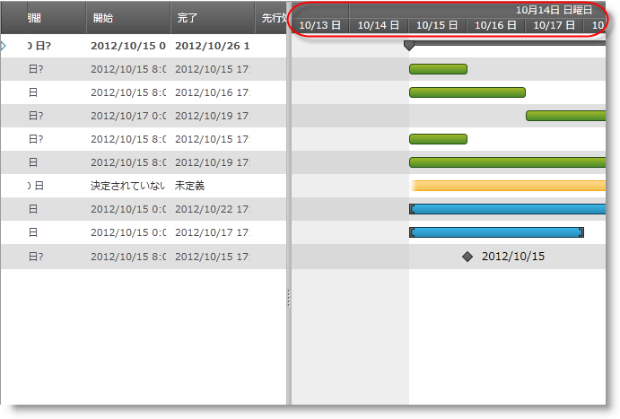

////

|metadata|
{
    "name": "xamgantt-configuring-the-xamgantt-timescale-display-formats",
    "controlName": ["xamGantt"],
    "tags": ["Data Presentation","Formatting","Grids","Scheduling"],
    "guid": "d4c80ea7-de3f-491b-81d9-c57d0ae5369e",  
    "buildFlags": [],
    "createdOn": "2016-05-25T18:21:55.5151369Z"
}
|metadata|
////

= xamGantt タイムスケール表示形式の構成

== トピックの概要

=== 目的

このトピックは、タイムスケール表示形式を構成する方法を説明します。タイムスケール表示形式は、タイムスケール バンド コレクションからのバンドごとに表示形式を設定することによって構成されます。

=== 前提条件

このトピックを理解するためには、以下のトピックを理解しておく必要があります。

[options="header", cols="a,a"]
|====
|トピック|目的

| link:xamgantt-adding-xamgantt-to-a-page.html[xamGantt をページに追加]
|このトピックでは、 _xamGantt™_ コントロールをページに追加する方法を説明します。

|====

=== 本トピックの内容

このトピックには次のセクションがあります。

* <<_Ref334119870, タイムスケール表示形式の概要 >>

** <<_Ref334119876,概要>>

** <<_Ref334119882,表示形式>>

** <<_Ref334119887,表示形式代用タグ>>

* <<_Ref334119893, コード例: タイムスケール表示形式の設定 >>

** <<_Ref333763526,説明>>

** <<_Ref334102005,前提条件>>

** <<_Ref334102013,プレビュー>>

** <<_Ref334102056,コード>>

* <<_Ref333763543, 関連コンテンツ >>

[[_Ref334101919]]
== タイムスケール表示形式の概要

[[_Ref334119876]]

=== 概要

_XamGantt_  は Bands と呼ばれる TimescaleBand オブジェクトの読み取り専用コレクションを保持します。このコレクションの TimescaleBand ごとに link:{ApiPlatform}controls.schedules.xamgantt{ApiVersion}~infragistics.controls.schedules.timescaleband~displayformat.html[DisplayFormat] を指定できます。

[[_Ref334119882]]

=== 表示形式

表示形式プロパティは日付/時刻書式文字列を受け入れます。この文字列は、タイムスケール バンドの時間の間隔にテキストが表示されるように指定するために使用されます。`DisplayFormat` はすべての .NET 日付/時刻書式文字列をサポートします。

`DisplayFormat` も追加のカスタムの代用タグをサポートします。これらのタグによって、デフォルトの.NET 書式文字列を使用することによって実行できない方法でユーザーに表示される文字列をカスタマイズできます。

[[_Ref334119887]]

=== 表示形式代用タグ

以下の表は TimescaleBand.DisplayFormat と使用できる代用タグをリストします。表の値は使用できる置き換え可能なトークンを表します。

[options="header", cols="a,a"]
|====
|代用タグ|説明

|{d:n} 

{day:n}
|日付の完全な曜日名の部分文字列を挿入します。n は表示される文字数を示します。たとえば、日曜日の '{d:2}' は "Su" になります。

|{m:n} 

{mon:n}
|日付の完全な月名の部分文字列を挿入します。n は表示される文字数を示します。たとえば、9 月の '{m:2}' は "Se" になります。

|{doyn} 

{DOYn}
|日付の年の日を挿入します。n はオプションで、結果の文字列の最小桁数を示します。たとえば、1 月 2 日の '{doy3}' は "002" になります。

|{wn} 

{Wn}
|日付の年の週番号を挿入します。n はオプションで、結果の文字列の最小桁数を示します。たとえば、年の最初の週の '{w2}' は "01" になりますが、'{w}' は "1" になります。

|{tom} 

{TOM}
|日付を含む月の 3 分の 1 を識別する文字列を挿入します。大文字 '{TOM}' は完全版の "Beginning"、"Middle" または "End" が使用されることを示します。小文字は短縮版の "B"、"M" または "E" が使用されることを示します。たとえば、 '{tom}' January 15 は "M" になりますが、'{TOM}' は "Middle" になります。

|{q} 

{Q}
|日付を含む年の四半期を識別する文字列を挿入します。大文字 '{Q}' は完全版 "1st"、"2nd"、"3rd" または "4th" が使用されることを示します。小文字は短縮版の "1"、"2"、"3" または "4" が使用されることを示します。たとえば、'{q}' January 15 は "1" になりますが、'{Q}' は "1st" になります。

|{hy} 

{HY}
|日付を含む年の半分を識別する文字列を挿入します。大文字 '{HY}' は完全版の "1st" または "2nd" が使用されることを示します。小文字は短縮版の "1" または "2" が使用されることを示します。たとえば、'{hy}' January 15 は "1" になりますが、'{HY}' は "1st" になります。

|{start:un} 

{finish:un}
|開始日または終了日と指定された単位の間隔の間の日付の差を挿入します。u は差が表される単位を示します。これには、m、h、d、w、tom、M、q、hy および y が含まれ、それぞれ分、時、日、週、月の 3 分の 1、月、四半期、半年および年を表します。n はオプションで表示される文字数を示します。たとえば、'{start:d}' は間隔と開始日 (プロジェクトの開始日) の間の日数を含む文字列を表示します。

|====

[[_Ref333763503]]
== コード例: タイムスケール表示形式の設定

[[_Ref333763526]]

=== 説明

このコード例は、タイムスケール表示形式の設定方法を示します。タイムスケールのバンドそれぞれに表示形式を設定することによってタイムスケール表示形式を設定します。これらは XAML またはコード ビハインドから設定できます。

[[_Ref334102005]]

=== 前提条件

コード例を完了するには  _xamGantt_   プロジェクトが必要です。サンプルの xamGantt プロジェクトを作成するためには、 link:xamgantt-adding-xamgantt-to-a-page.html[ _xamGantt_  をページに追加]の指示に従ってください。マークアップをこのトピックに示されているマークアップと置き換えるか、コード ビハインドのコード スニペットを使用する必要があります。

[[_Ref334102013]]

=== プレビュー

以下は完全なサンプル プロジェクトのプレビューです。トップ バンドは表示形式文字列が “`{day``:2``} {m:3}` `yy`” に設定され、真ん中のバンドは表示形式文字列が “`{day:1} {m:1}` dd” に設定されます。

[[_Ref334102056]]

=== コード

*XAML の場合:*

[source,xaml]
----
…
    <Grid>
        <ig:XamGantt x:Name="gantt" Project="{Binding Project}">
            <ig:XamGantt.ViewSettings>
                <ig:ProjectViewSettings>
                    <ig:ProjectViewSettings.Timescale>
                        <ig:Timescale>
                            <ig:TimescaleBand DisplayFormat="{}{day:2} {m:3} yy" Unit="Weeks" />
                            <ig:TimescaleBand DisplayFormat="{}{day:1} {m:1} dd" Unit="Days" />
                        </ig:Timescale>
                    </ig:ProjectViewSettings.Timescale>
                </ig:ProjectViewSettings>
            </ig:XamGantt.ViewSettings>
        </ig:XamGantt>
    </Grid>
…
----

*C# の場合:*

[source,csharp]
----
…
            Timescale timescale = new Timescale();
            timescale.Bands.Add(new TimescaleBand { DisplayFormat = "{day:2} {m:3} 
yy", Unit = TimescaleUnit.Weeks });
            timescale.Bands.Add(new TimescaleBand { DisplayFormat = "{day:1} {m:1} 
dd", Unit = TimescaleUnit.Days });
            gantt.ViewSettings = new ProjectViewSettings();
            gantt.ViewSettings.Timescale = timescale;
…
----

*Visual Basic の場合:*

[source,vb]
----
…
Dim timescale As New Timescale()
timescale.Bands.Add(New TimescaleBand() With { 
      Key .DisplayFormat = "{day:2} {m:3} yy", 
      Key .Unit = TimescaleUnit.Weeks 
})
timescale.Bands.Add(New TimescaleBand() With { 
      Key .DisplayFormat = "{day:1} {m:1} dd", 
      Key .Unit = TimescaleUnit.Days 
})
gantt.ViewSettings = New ProjectViewSettings()
gantt.ViewSettings.Timescale = timescale
…
----

[[_Ref333763543]]
== 関連コンテンツ

このトピックについては、以下のトピックもあわせてご参照ください。

[options="header", cols="a,a"]
|====
|トピック|目的

| link:xamgantt-configuring-the-xamgantt-timescale.html[タイムスケールの構成]
|このグループのトピックには、xamGantt™ タイムスケールの情報が含まれています。

| link:xamgantt-timescale-configuration-overview.html[xamGantt タイムスケール構成の概要]
|このトピックは、xamGantt™ タイムスケールの主要な機能の概要です。

|====
