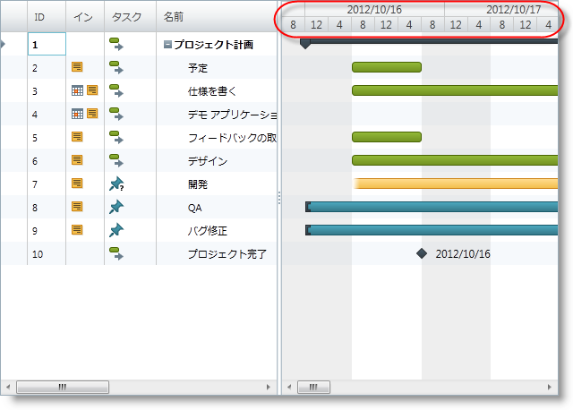

////

|metadata|
{
    "name": "xamgantt-configuring-the-xamgantt-timescale-units",
    "controlName": ["xamGantt"],
    "tags": ["Data Presentation","Filtering","Formatting","Grids","Scheduling"],
    "guid": "8cacf84a-d786-4099-a04b-30686e9416b0",  
    "buildFlags": [],
    "createdOn": "2016-05-25T18:21:55.5101381Z"
}
|metadata|
////

= xamGantt タイムスケール単位の構成

== トピックの概要

=== 目的

このトピックでは、タイムスケール単位を構成する方法を説明します。タイムスケール単位および単位数は、タイムスケール バンド コレクションからのタイムスケール バンドごとに単位と単位数を設定することによって構成されます。

=== 前提条件

このトピックを理解するためには、以下のトピックを理解しておく必要があります。

[options="header", cols="a,a"]
|====
|トピック|目的

| link:xamgantt-adding-xamgantt-to-a-page.html[ _xamGantt_ をページに追加]
|このトピックでは、 _xamGantt™_ コントロールをページに追加する方法を説明します。

|====

=== 本トピックの内容

このトピックには次のセクションがあります。

* <<_Timescale_Units_Overview, タイムスケール単位の概要 >>

** <<_Ref334101937,概要>>

** <<_Ref334104615,単位>>

** <<_Ref334104620,単位数>>

* <<_Code_Example_Setting_The_Timescale_Units_And_Unit_Count, コード例:タイムスケール単位と単位数の設定 >>

** <<_Ref333763526,説明>>

** <<_Ref334102005,前提条件>>

** <<_Ref334102013,プレビュー>>

** <<_Ref334102056,コード>>

* <<_Related_Content, 関連コンテンツ >>

[[_Timescale_Units_Overview]]
== タイムスケール単位の概要

[[_Ref334101937]]

=== 概要

XamGantt タイムスケールは link:{ApiPlatform}controls.schedules.xamgantt{ApiVersion}~infragistics.controls.schedules.timescale~bands.html[Bands] と呼ばれる `TimescaleBand` オブジェクトのコレクションを保持しています。このコレクションは get アクセサーのみを持っています。このコレクションは変更可能で、たとえば項目を追加または削除できます。このコレクション の TimescaleBand ごとに link:{ApiPlatform}controls.schedules.xamgantt{ApiVersion}~infragistics.controls.schedules.timescaleband~unit.html[Unit] と link:{ApiPlatform}controls.schedules.xamgantt{ApiVersion}~infragistics.controls.schedules.timescaleband~unitcount.html[UnitCount] を指定できます。

[[_Ref334104615]]

=== Unit

`Unit` プロパティは間隔の単位のタイプを設定するために使用されます。単位として link:{ApiPlatform}controls.schedules.xamgantt{ApiVersion}~infragistics.controls.schedules.timescaleunit.html[TimescaleUnit] 列挙体に属する任意の項目を設定できます。

[[_Ref334104620]]

=== UnitCount

`UnitCount` プロパティは 1 つの間隔の単位数を設定するために使用されます。

[[_Code_Example_Setting_The_Timescale_Units_And_Unit_Count]]
== コード例:タイムスケール単位と単位数の設定

[[_Ref333763526]]

=== 説明

このコード例は、タイムスケール単位とタイムスケール単位数の設定方法を示します。タイムスケールのバンドごとに単位および単位数を設定することによってタイムスケール単位と単位数を設定します。これらは XAML またはコード ビハインドから設定できます。

[[_Ref334102005]]

=== 前提条件

コード例を完了するには xamGantt プロジェクトが必要です。サンプルの xamGantt プロジェクトを作成するためには、 link:xamgantt-adding-xamgantt-to-a-page.html[ _xamGantt_  をページに追加]の指示に従ってください。マークアップをこのトピックに示されているマークアップと置き換えるか、コード ビハインドのコード スニペットを使用する必要があります。

[[_Ref334102013]]

=== プレビュー

以下は完全なサンプル プロジェクトのプレビューです。最初のバンドでは、`Unit` は `TimescaleUnit.Days` に設定され、`UnitCount` は 1 に設定されます。2 番目のバンドでは、`Unit` は TimescaleUnit.Hours に設定され、`UnitCount` は 8 に設定されます。

[[_Ref334102056]]

=== コード

*XAML の場合:*

[source,xaml]
----
…
    <Grid>
        <ig:XamGantt x:Name="gantt" Project="{Binding Project}">
            <ig:XamGantt.ViewSettings>
                <ig:ProjectViewSettings>
                    <ig:ProjectViewSettings.Timescale>
                        <ig:Timescale>
                            <ig:TimescaleBand Unit="Days" UnitCount="1" />
                            <ig:TimescaleBand Unit="Hours" UnitCount="4" />
                        </ig:Timescale>
                    </ig:ProjectViewSettings.Timescale>
                </ig:ProjectViewSettings>
            </ig:XamGantt.ViewSettings>
        </ig:XamGantt>
    </Grid>
…
----

*C# の場合:*

[source,csharp]
----
…
            Timescale timescale = new Timescale();
            timescale.Bands.Add(new TimescaleBand { Unit = TimescaleUnit.Days, UnitCount = 1 });
            timescale.Bands.Add(new TimescaleBand { Unit = TimescaleUnit.Hours, UnitCount = 8 });
            gantt.ViewSettings = new ProjectViewSettings();
            gantt.ViewSettings.Timescale = timescale;
…
----

*Visual Basic の場合:*

[source,vb]
----
…
Dim timescale As New Timescale()
timescale.Bands.Add(New TimescaleBand() With { _
      .Unit = TimescaleUnit.Days, _
      .UnitCount = 1 _
})
timescale.Bands.Add(New TimescaleBand() With { _
      .Unit = TimescaleUnit.Hours, _
      .UnitCount = 8 _
})
gantt.ViewSettings = New ProjectViewSettings()
gantt.ViewSettings.Timescale = timescale
…
----

[[_Related_Content]]
== 関連コンテンツ

このトピックについては、以下のトピックも参照してください。

[options="header", cols="a,a"]
|====
|トピック|目的

| link:xamgantt-configuring-the-xamgantt-timescale.html[タイムスケールの構成]
|このグループのトピックには、xamGantt™ タイムスケールの情報が含まれています。

| link:xamgantt-timescale-configuration-overview.html[xamGantt タイムスケール構成の概要]
|このトピックは、xamGantt™ タイムスケールの主要な機能の概要です。

|====
