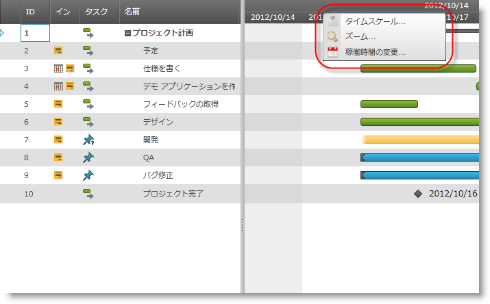

////

|metadata|
{
    "name": "xamgantt-configuring-xamgantt-additional-context-menus",
    "controlName": ["xamGantt"],
    "tags": ["Data Presentation","Extending","Scheduling","Styling","Templating"],
    "guid": "df52c1e7-dc44-4dcf-8734-29de8a7dad35",  
    "buildFlags": [],
    "createdOn": "2016-05-25T18:21:55.5561405Z"
}
|metadata|
////

= xamGantt 追加のコンテキスト メニューの構成

== トピックの概要

=== 目的

このトピックでは、 _xamGantt™_   のコンテキスト メニューを構成し、 _xamGantt_   コントロールの定義済みの領域のために追加のコンテキスト メニューを追加する方法を説明します。

=== 前提条件

このトピックを理解するためには、以下のトピックを理解しておく必要があります。

[options="header", cols="a,a"]
|====
|トピック|目的

| link:xamgantt-adding-xamgantt-to-a-page.html[xamGantt をページに追加]
|このトピックでは、 _xamGantt_ コントロールをページに追加する方法を説明します。

| link:xamcontextmenu-getting-started-with-xamcontextmenu.html[xamContextMenu をページに追加]
| link:xamcontextmenu.html[xamContexMenu] コントロールを使ってすばやく起動して実行するためのコントロールの使用方法を提供します。

|====

=== 本トピックの内容

このトピックには次のセクションがあります。

* <<_Context_Menus_Overview,  _xamGantt_  コンテキスト メニューの概要 >>

** <<_Introduction,概要>>

** <<_Gantt_Context_Menu_Provider,Gantt コンテキスト メニュー プロバイダー>>

** <<_Gantt_Context_Menu_Area,Gantt コンテキスト メニュー領域>>

* <<_Code_Example_Creating_Additional_Context_Menus, コード例: xamGantt チャート セクションの追加のコンテキスト メニューを作成 >>

** <<_Description,説明>>

** <<_Prerequisites,前提条件>>

** <<_Preview,プレビュー>>

** <<_Code,コード>>

* <<_Related_Content, 関連コンテンツ >>

[[_Context_Menus_Overview]]
== xamGantt コンテキスト メニューの概要

[[_Introduction]]

=== 概要

_xamGantt_  コントロールには定義済みのコンテキスト メニューのセットが提供されています。さらに、xamGantt 領域の定義済みのセットのために固有のカスタムのコンテキスト メニューを追加することもできます。または希望する場合、既存のコンテキスト メニューをオーバーライドできます。

XamGantt は link:{ApiPlatform}controls.schedules.xamgantt{ApiVersion}~infragistics.controls.schedules.ganttcontextmenuprovider_members.html[GanttContextMenuProvider] クラスのインスタンスを使用して、デフォルトのコンテキスト メニューを定義します。コンテキスト メニューは link:{ApiPlatform}controls.schedules.xamgantt{ApiVersion}~infragistics.controls.schedules.ganttcontextmenuarea.html[GanttContextMenuArea] 列挙体によって識別されます。

[[_Gantt_Context_Menu_Provider]]

=== Gantt コンテキスト メニュー プロバイダー

`GanttContextMenuProvider` の link:{ApiPlatform}controls.schedules.xamgantt{ApiVersion}~infragistics.controls.schedules.ganttcontextmenuprovider~resourceoverrides.html[ResourceOverrides] プロパティを使用してカスタムの ResourceDictionary を追加できます。ResourceDictionary で追加のコンテキスト メニューを指定できます。

[[_Gantt_Context_Menu_Area]]

=== Gantt コンテキスト メニュー領域

`GanttContextMenuArea` 列挙体はコンテキスト メニューを識別するために使用されます。_XamGantt_  はこの列挙体のメンバーのデフォルトのメニューが提供されており、列挙体のその他のメンバーのコンテキスト メニューを追加する、または既存のコンテキスト メニューをオーバーライドする機能が提供されています。

[options="header", cols="a,a,a"]
|====
|メンバー|説明|組み込みメニュー

|Cell
|グリッド セクションのデータ セルのコンテキスト メニュー
|image::images/xamGantt_Configuring_xamGantt_Additional_Context_menus_1.png[]

|ColumnHeader
|グリッド セクションの列ヘッダーのコンテキスト メニュー
|image::images/xamGantt_Configuring_xamGantt_Additional_Context_menus_1.png[]

|Grid
|グリッド セクションの空の部分のコンテキスト メニュー
|image::images/xamGantt_Configuring_xamGantt_Additional_Context_menus_1.png[]

|Row
|グリッド セクションの行のコンテキスト メニュー
|image::images/xamGantt_Configuring_xamGantt_Additional_Context_menus_1.png[]

|RowSelectorHeader
|グリッド セクションの行セレクターのヘッダー セルのコンテキスト メニュー
|image::images/xamGantt_Configuring_xamGantt_Additional_Context_menus_1.png[]

|Task
|チャート セクションのタスクのコンテキスト メニュー
|image::images/xamGantt_Configuring_xamGantt_Additional_Context_menus_1.png[]

|TaskDependency
|チャート セクションのタスクの依存関係のコンテキスト メニュー
|image::images/xamGantt_Configuring_xamGantt_Additional_Context_menus_1.png[]

|TimescaleArea
|チャート セクションのタイムスケール領域のコンテキスト メニュー
|image::images/xamGantt_Configuring_xamGantt_Additional_Context_menus_8.png[]

|TimescaleBandHeader
|チャート セクションのタイムスケール バンド ヘッダーのコンテキスト メニュー
|image::images/xamGantt_Configuring_xamGantt_Additional_Context_menus_8.png[]

|TimescaleHeader
|チャート セクションのタイムスケール ヘッダー プレゼンターのコンテキスト メニュー
|image::images/xamGantt_Configuring_xamGantt_Additional_Context_menus_8.png[]

|====

[[_Code_Example_Creating_Additional_Context_Menus]]
== コード例: xamGantt チャート セクションの追加のコンテキスト メニューを作成

[[_Description]]

=== 説明

このコード例は、xamGantt の TimescaleArea および TimescaleBandHeader の追加のコンテキスト メニューを作成する方法を示します。GanttContexMenuProvider.ResourceOverrides にリソース ディクショナリを追加します。リソース ディクショナリに 2 つの xamContextMenu があり、1 つは TimescaleArea のためのもので、もう 1 つは TimescaleBandHeader 領域のためのものです。

注:

[NOTE]
====
コンテキスト メニューをこの領域と関連づけるためにコンテキスト メニューのキーとして `GanttContexMenuArea` メンバーの名前を指定する必要があります。
====

[[_Prerequisites]]

=== 前提条件

** コード例を完了するには  _xamGantt_   プロジェクトが必要です。サンプルの xamGantt プロジェクトを作成するためには、 link:xamgantt-adding-xamgantt-to-a-page.html[ _xamGantt_  をページに追加]の指示に従ってください。

** このトピックのコード セクションに示した例と一致するために `xamGantt` のマークアップを変更することも必要です。

[[_Preview]]

=== プレビュー

以下は完全なサンプル プロジェクトのプレビューです。タイムスケール バンド ヘッダー領域のための追加のコンテキスト メニューを確認できます。

[[_Code]]

=== コード

*XAML の場合:*

[source,xaml]
----
<ig:XamGantt x:Name="xamGantt" Project="{Binding Project}">
    <ig:XamGantt.ContextMenuProvider>
        <ig:GanttContextMenuProvider>
            <ig:GanttContextMenuProvider.ResourceOverrides>
                <ResourceDictionary>
                    <ig:XamContextMenu x:Key="TimescaleArea">
                        <ig:XamMenuItem Header="Show timescale..." />
                        <ig:XamMenuItem Header="Show split..." />
                    </ig:XamContextMenu>
                    <ig:XamContextMenu x:Key="TimescaleBandHeader">
                        <ig:XamMenuItem Header="Timescale ..." />
                        <ig:XamMenuItem Header="Zoom..." />
                        <ig:XamMenuItem Header="Change working time..." />
                        <ig:XamMenuItem Header="More..." />
                    </ig:XamContextMenu>
                </ResourceDictionary>
            </ig:GanttContextMenuProvider.ResourceOverrides>
        </ig:GanttContextMenuProvider>
    </ig:XamGantt.ContextMenuProvider>
</ig:XamGantt>
----

[[_Related_Content]]
== 関連コンテンツ

このトピックについては、以下のトピックもあわせてご参照ください。

[options="header", cols="a,a"]
|====
|トピック|目的

|link:xamgantt-configuring-xamgantt.html[xamGantt の構成]
|このグループのトピックには、コントロールが行うことや、アプリケーションでのコントロールの使用手順など、 _xamGantt_ コントロールに関する情報が含まれています。

|====
