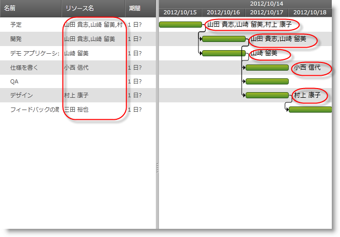

////

|metadata|
{
    "name": "xamgantt-creating-custom-resources-for-xamgantt",
    "controlName": ["xamGantt"],
    "tags": ["Data Binding","Data Presentation","Extending","Grids","Scheduling"],
    "guid": "35badc3a-70d5-4fa4-9cfb-e28434fca136",  
    "buildFlags": [],
    "createdOn": "2016-05-25T18:21:55.5501398Z"
}
|metadata|
////

= xamGantt のカスタム リソースの作成

== トピックの概要

=== 目的

このトピックでは、カスタム リソース クラスを作成して  _xamGantt_   と使用する方法を紹介します。

=== 前提条件

このトピックを理解するためには、以下のトピックを理解しておく必要があります。

[options="header", cols="a,a"]
|====
|トピック|目的

| link:xamgantt-adding-xamgantt-to-a-page.html[ _xamGantt_ をページに追加]
|このトピックでは、 _xamGantt_ コントロールをページに追加する方法を説明します。

|====

=== 本トピックの内容

このトピックには次のセクションがあります。

* <<_Custom_Resources_Introduction, カスタム リソースの概要 >>

** <<_Introduction,概要>>

** <<_Resource_Property_Mappings,リソース プロパティ マッピング>>

* <<_Code_Example_Creting_a_Custom_Resource, コード例: カスタム リソースの作成 >>

** <<_Ref333763526,説明>>

** <<_Ref334102005,前提条件>>

** <<_Ref334102013,プレビュー>>

** <<_Ref335317538,カスタム リソース コード>>

** <<_Ref334464995,コード>>

* <<_Related_Content, 関連コンテンツ >>

[[_Custom_Resources_Introduction]]
== カスタム リソースの概要

[[_Introduction]]

=== 概要

_xamGantt_  link:{ApiPlatform}controls.schedules.xamgantt{ApiVersion}~infragistics.controls.schedules.listbackedproject_members.html[ListBackedProject] とカスタム リソース クラスを使用できます。`ListBackedProject` は指定された link:{ApiPlatform}controls.schedules.xamgantt{ApiVersion}~infragistics.controls.schedules.listbackedproject~taskitemssource.html[TaskItemsSource] からタスク情報を取得するプロジェクトです。カスタム リソースを使用するためには、`ListBackedProject` の link:{ApiPlatform}controls.schedules.xamgantt{ApiVersion}~infragistics.controls.schedules.listbackedproject~resourceitemssource.html[ResourceItemsSource] プロパティを設定する必要があります。

以下の表にカスタム リソースと使用する時の ListBackedProject の主要プロパティをまとめます。

[options="header", cols="a,a"]
|====
|プロパティ|説明

| link:{ApiPlatform}controls.schedules.xamgantt{ApiVersion}~infragistics.controls.schedules.listbackedproject~resourcepropertymappings.html[ResourcePropertyMappings]
|このプロパティは、`ResourceItemsSource` の項目のプロパティから link:{ApiPlatform}controls.schedules.xamgantt{ApiVersion}~infragistics.controls.schedules.projectresource_members.html[ProjectResource] プロパティへマッピングを提供するために使用されるコレクションを取得または設定します。

|`ResourceItemsSource`
|このプロパティは、リソース情報を提供するコレクションを取得または設定します。

|====

[[_Resource_Property_Mappings]]

=== リソース プロパティ マッピング

`ResourcePropertyMappings` の使用は、 link:{ApiPlatform}controls.schedules.xamgantt{ApiVersion}~infragistics.controls.schedules.projectresourcepropertymapping_members.html[ProjectResourcePropertyMapping] オブジェクトの設定で構成されます。`ProjectResourcePropertyMapping` には、`ResourceItemsSource` によって指定されるデータ ソースの特定のフィールドに関する情報が含まれます。このデータ フィールドは `ProjectResource` オブジェクトのプロパティによってマップされます。

`ProjectResource` オブジェクトのプロパティは、 link:{ApiPlatform}controls.schedules.xamgantt{ApiVersion}~infragistics.controls.schedules.projectresourcepropertymapping~resourceproperty.html[ResourceProperty] によって識別され、データ ソース内のフィールドは、 link:{ApiPlatform}controls.schedules.xamgantt{ApiVersion}~infragistics.controls.schedules.projectresourcepropertymapping~dataobjectproperty.html[DataObjectProperty] によって識別されます。XAML で `ResourceProperty` のために次の値を設定できます:

[options="header", cols="a,a"]
|====
|リソース プロパティ値|説明

| _UniqueId_ 
|これは `ProjectResource` の link:{ApiPlatform}controls.schedules.xamgantt{ApiVersion}~infragistics.controls.schedules.projectresource~uniqueid.html[UniqueId] にマップされるリソースの一意の識別子です。

| _DisplayName_ 
|これは `ProjectResource` クラスの link:{ApiPlatform}controls.schedules.xamgantt{ApiVersion}~infragistics.controls.schedules.projectresource~displayname.html[DisplayName] にマップされるリソースの名前です。DisplayName 値は xamGantt グリッド セクションに表示します。

|====

[[_Code_Example_Creting_a_Custom_Resource]]
== コード例: カスタム リソースの作成

[[_Ref333763526]]

=== 説明

このコードはカスタム リソース クラスの 3 つのインスタンスを含む Observable コレクションを作成します。このコレクションは元となる ViewModel のプロパティに設定され、`ListBackedProject` の `ResourceItemsSource` プロパティにバインドされます。

例のマークアップで、必要な Resource プロパティ マッピングが設定されます。これでタスクに追加できるのはバインドされたソースからのリソースのみであることが保証されます。

このコード例には、各タスクの近くに表示されたリソース名を表示するためにタスクのコレクションが含まれます。

[[_Ref334102005]]

=== 前提条件

コード例を完了するには xamGantt プロジェクトが必要です。サンプルの xamGantt プロジェクトを作成するためには、 link:xamgantt-adding-xamgantt-to-a-page.html[ _xamGantt_  をページに追加]の指示を復習してください。

次のクラスが存在するようにプロジェクトを変更する必要があります。

* `CustomResource`このクラスの完全なコードを確認するには、以下のカスタム リソース コード セクションを参照してください。

* `CustomTask`このクラスの完全なコードを確認するには、 link:resources-xamgantt-custom-task-code-example.html[CustomTask CodeExample] を参照してください。

最後に、マークアップと ViewModel をこのトピックで示されるもので置き換える必要があります。

[[_Ref334102013]]

=== プレビュー

以下は完全なサンプル プロジェクトのプレビューです。グリッド セクションで、チャート セクションのタスクごとにリソースの名前が表示されることが確認できます。コード例のビュー モデルで、各タスクはリソース ID によってリソースに関連付けられています。

[[_Ref335317538]]

=== カスタム リソース コード

*C# の場合:*

[source,csharp]
----
 public class CustomResource : INotifyPropertyChanged
    {
        #region Private variables
        private string id;
        private string name;
        #endregion // private variables
        #region Public properties
        public string Id
        {
            get { return id; }
            set
            {
                if (value != id)
                {
                    id = value;
                    OnPropertyChanged("Id");
                }
            }
        }
        public string Name
        {
            get { return name; }
            set
            {
                if (value != name)
                {
                    name = value;
                    OnPropertyChanged("Name");
                }
            }
        }
        #endregion // パブリック プロパティ
        #region INotifyPropertyChanged
        public event PropertyChangedEventHandler PropertyChanged;
        public void OnPropertyChanged(string propertyName)
        {
            if (PropertyChanged != null)
            {
                PropertyChanged(this, new PropertyChangedEventArgs(propertyName));
            }
        }
        #endregion // INotifyPropertyChanged
    }
----

*Visual Basic の場合:*

[source,vb]
----
Public Class CustomResource
      Implements INotifyPropertyChanged
      #Region "Private variables"
      Private m_id As String
      Private m_name As String
      #End Region
      #Region "Public properties"
      Public Property Id() As String
            Get
                  Return m_id
            End Get
            Set
                  If value <> m_id Then
                        m_id = value
                        OnPropertyChanged("Id")
                  End If
            End Set
      End Property
      Public Property Name() As String
            Get
                  Return m_name
            End Get
            Set
                  If value <> m_name Then
                        m_name = value
                        OnPropertyChanged("Name")
                  End If
            End Set
      End Property
      #End Region
      #Region "INotifyPropertyChanged"
      Public Event PropertyChanged As PropertyChangedEventHandler
      Public Sub OnPropertyChanged(propertyName As String)
            RaiseEvent PropertyChanged(Me, New PropertyChangedEventArgs(propertyName))
      End Sub
      #End Region
End Class
----

[[_Ref334464995]]

=== コード

*XAML の場合:*

[source,xaml]
----
 <Grid>
        <Grid.Resources>
            <local:CustomResourceViewModel x:Key="dc" />
        </Grid.Resources>
        <Grid.DataContext>
            <Binding Source="{StaticResource dc}" />
        </Grid.DataContext>
        <ig:XamGantt x:Name="xamGantt">
            <ig:XamGantt.Project>
                <ig:ListBackedProject TaskItemsSource="{Binding Tasks}" ResourceItemsSource="{Binding Resources}">
                    <ig:ListBackedProject.TaskPropertyMappings>
                        <ig:ProjectTaskPropertyMapping TaskProperty="DataItemId" DataObjectProperty="DataItemId" />
                        <ig:ProjectTaskPropertyMapping TaskProperty="TaskName" DataObjectProperty="TaskName" />
                        <ig:ProjectTaskPropertyMapping TaskProperty="Start" DataObjectProperty="Start" />
                        <ig:ProjectTaskPropertyMapping TaskProperty="Duration" DataObjectProperty="Duration" />
                        <ig:ProjectTaskPropertyMapping TaskProperty="Tasks" DataObjectProperty="Tasks" />
                        <ig:ProjectTaskPropertyMapping TaskProperty="Predecessors" DataObjectProperty="Predecessors" />
                        <ig:ProjectTaskPropertyMapping TaskProperty="ConstraintDate" DataObjectProperty="ConstraintDate" />
                        <ig:ProjectTaskPropertyMapping TaskProperty="ConstraintType" DataObjectProperty="ConstraintType" />
                        <ig:ProjectTaskPropertyMapping TaskProperty="DurationFormat" DataObjectProperty="DurationFormat" />
                        <ig:ProjectTaskPropertyMapping TaskProperty="Resources" DataObjectProperty="Resources" />
                    </ig:ListBackedProject.TaskPropertyMappings>
                    <ig:ListBackedProject.ResourcePropertyMappings>
                        <ig:ProjectResourcePropertyMappingCollection UseDefaultMappings="True">
                            <ig:ProjectResourcePropertyMapping ResourceProperty="UniqueId" DataObjectProperty="Id" />
                            <ig:ProjectResourcePropertyMapping ResourceProperty="DisplayName" DataObjectProperty="Name" />
                        </ig:ProjectResourcePropertyMappingCollection>
                    </ig:ListBackedProject.ResourcePropertyMappings>
                </ig:ListBackedProject>
            </ig:XamGantt.Project>
        </ig:XamGantt>
    </Grid>
----

*C# の場合:*

[source,csharp]
----
public class CustomResourceViewModel  : INotifyPropertyChanged
    {
        #region Private variables
        private ObservableCollection<CustomTask> taskAndResources;
        private ObservableCollection<CustomResource> resources;
        #endregion Private variables
        #region Public Properties
        public ObservableCollection<CustomTask> Tasks
        {
            get 
            {
                if (taskAndResources == null)
                {
                    taskAndResources = GenerateTasks();
                }
                return taskAndResources; 
            }
            set
            {
                if (value != taskAndResources)
                {
                    taskAndResources = value;
                    OnPropertyChanged("Tasks");
                }
            }
        }
        public ObservableCollection<CustomResource> Resources
        {
            get
            {
                if (resources == null)
                {
                    resources = GenerateResources();
                }
                return resources;
            }
            set
            {
                if (value != resources)
                {
                    resources = value;
                    OnPropertyChanged("Resources");
                }
            }
        }
        #endregion Public Properties
        #region Private helpers
        private ObservableCollection<CustomResource> GenerateResources()
        {
            return new ObservableCollection<CustomResource>()
            {
                new CustomResource { Id = "res01", Name = "Josh Smith Dev"},
                new CustomResource { Id = "res02", Name = "Mary Smith QE"},
                new CustomResource { Id = "res03", Name = "Richard Brown PM"}
            };
        }
        private ObservableCollection<CustomTask> GenerateTasks()
        {
            return new ObservableCollection<CustomTask>()
                  {
                        new CustomTask
                        {
                              DataItemId = "t1",
                              TaskName = "Task 1",
                              Start = DateTime.Now,
                              Duration = TimeSpan.FromHours(8),
                    DurationFormat = "Days",
                    Resources = "res01"
                        },
                new CustomTask
                        {
                              DataItemId = "t2",
                              TaskName = "Task 2",
                              Duration = TimeSpan.FromHours(24),
                    DurationFormat = "ElapsedDays",
                    Predecessors = "t1",
                    Resources = "res02"
                        },
                        new CustomTask
                        {
                              DataItemId = "t3",
                              TaskName = "Task 3",
                              Duration = TimeSpan.FromHours(16),
                    DurationFormat = "Days",
                    Predecessors = "t1",
                    Resources = "res03"
                        },
                        new CustomTask
                        {
                              DataItemId = "t4",
                              TaskName = "Task 4",
                              Duration = TimeSpan.FromHours(8),
                    DurationFormat = "Days",
                    Predecessors = "t3",
                    Resources = "res02"
                        },
                        new CustomTask
                        {
                              DataItemId = "t5",
                              TaskName = "Task 5",
                              Duration = TimeSpan.FromHours(8),
                    DurationFormat = "Hours",
                    Predecessors = "t4",
                    Resources = "res01"
                        }
                  };
        }
        #endregion // プライベート ヘルパー
        #region INotifyPropertyChanged
        public event PropertyChangedEventHandler PropertyChanged;
        public void OnPropertyChanged(string propertyName)
        {
            if (PropertyChanged != null)
            {
                PropertyChanged(this, new PropertyChangedEventArgs(propertyName));
            }
        }
        #endregion // INotifyPropertyChanged
    }
----

*Visual Basic の場合:*

[source,vb]
----
Public Class CustomResourceViewModel
      Implements INotifyPropertyChanged
      #Region "Private variables"
      Private taskAndResources As ObservableCollection(Of CustomTask)
      Private m_resources As ObservableCollection(Of CustomResource)
      #End Region
      #Region "Public Properties"
      Public Property Tasks() As ObservableCollection(Of CustomTask)
            Get
                  If taskAndResources Is Nothing Then
                        taskAndResources = GenerateTasks()
                  End If
                  Return taskAndResources
            End Get
            Set
                  If value <> taskAndResources Then
                        taskAndResources = value
                        OnPropertyChanged("Tasks")
                  End If
            End Set
      End Property
      Public Property Resources() As ObservableCollection(Of CustomResource)
            Get
                  If m_resources Is Nothing Then
                        m_resources = GenerateResources()
                  End If
                  Return m_resources
            End Get
            Set
                  If value <> m_resources Then
                        m_resources = value
                        OnPropertyChanged("Resources")
                  End If
            End Set
      End Property
      #End Region
      #Region "Private helpers"
      Private Function GenerateResources() As ObservableCollection(Of CustomResource)
            Return New ObservableCollection(Of CustomResource)() From { _
                  New CustomResource() With { _
                        Key .Id = "res01", _
                        Key .Name = "Josh Smith Dev" _
                  }, _
                  New CustomResource() With { _
                        Key .Id = "res02", _
                        Key .Name = "Mary Smith QE" _
                  }, _
                  New CustomResource() With { _
                        Key .Id = "res03", _
                        Key .Name = "Richard Brown PM" _
                  } _
            }
      End Function
      Private Function GenerateTasks() As ObservableCollection(Of CustomTask)
            Return New ObservableCollection(Of CustomTask)() From { _
                  New CustomTask() With { _
                        Key .DataItemId = "t1", _
                        Key .TaskName = "Task 1", _
                        Key .Start = DateTime.Now, _
                        Key .Duration = TimeSpan.FromHours(8), _
                        Key .DurationFormat = "Days", _
                        Key .Resources = "res01" _
                  }, _
                  New CustomTask() With { _
                        Key .DataItemId = "t2", _
                        Key .TaskName = "Task 2", _
                        Key .Duration = TimeSpan.FromHours(24), _
                        Key .DurationFormat = "ElapsedDays", _
                        Key .Predecessors = "t1", _
                        Key .Resources = "res02" _
                  }, _
                  New CustomTask() With { _
                        Key .DataItemId = "t3", _
                        Key .TaskName = "Task 3", _
                        Key .Duration = TimeSpan.FromHours(16), _
                        Key .DurationFormat = "Days", _
                        Key .Predecessors = "t1", _
                        Key .Resources = "res03" _
                  }, _
                  New CustomTask() With { _
                        Key .DataItemId = "t4", _
                        Key .TaskName = "Task 4", _
                        Key .Duration = TimeSpan.FromHours(8), _
                        Key .DurationFormat = "Days", _
                        Key .Predecessors = "t3", _
                        Key .Resources = "res02" _
                  }, _
                  New CustomTask() With { _
                        Key .DataItemId = "t5", _
                        Key .TaskName = "Task 5", _
                        Key .Duration = TimeSpan.FromHours(8), _
                        Key .DurationFormat = "Hours", _
                        Key .Predecessors = "t4", _
                        Key .Resources = "res01" _
                  } _
            }
      End Function
      #End Region
      #Region "INotifyPropertyChanged"
      Public Event PropertyChanged As PropertyChangedEventHandler
      Public Sub OnPropertyChanged(propertyName As String)
            RaiseEvent PropertyChanged(Me, New PropertyChangedEventArgs(propertyName))
      End Sub
      #End Region
End Class
----

[[_Related_Content]]
== 関連コンテンツ

このトピックについては、以下のトピックもあわせてご参照ください。

[options="header", cols="a,a"]
|====
|トピック|目的

| link:xamgantt-managing-project-resources.html[プロジェクト リソースの管理]
|このトピックは、プロジェクトに使用可能なリソースを作成し、xamGantt コントロールを使用してプロジェクトのタスクに割り当てる方法を説明します。

|====
