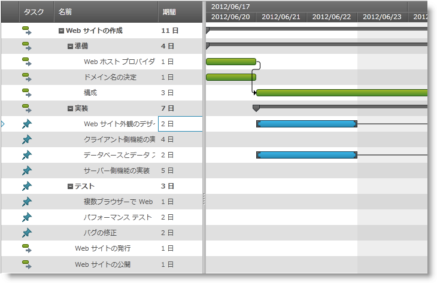

////

|metadata|
{
    "name": "xamgantt-loading-project-plan-from-ms-project-xml-file",
    "controlName": ["xamGantt"],
    "tags": ["Data Binding","How Do I"],
    "guid": "9cbc408b-a3e5-4439-a608-a6bbfe5da884",  
    "buildFlags": [],
    "createdOn": "2016-05-25T18:21:55.2221595Z"
}
|metadata|
////

= MS プロジェクト XML ファイルからプロジェクト プランを読み込み

== トピックの概要

=== 目的

このトピックでは、Microsoft Project™ 2010 XML ファイルに保存された、すでに作成済みのプロジェクト計画を  _xamGantt™_   コントロールで読み込む方法について説明します。

=== 前提条件

このトピックの本題に入る前に、以下のトピックをお読みください。

[options="header", cols="a,a"]
|====
|トピック|目的

| link:xamgantt-adding-xamgantt-to-a-page.html[xamGantt をページに追加]
|このトピックでは、 _xamGantt_ コントロールをページに追加する方法を説明します。

|====

=== このトピックの内容

このトピックは以下のセクションからなります。

* <<_Ref333840050, MS プロジェクト XML ファイルからプロジェクト プランを読み込み >>

** <<_Ref333840057,はじめに>>
** <<preview,プレビュー>>
** <<Overview,概要>>
** <<_Ref333840069,手順>>

* <<CodeExamples, コード例 >>

** <<_Ref333840095,コード例: XML ファイルを参照するためのボタンクリック イベントの処理>>
** <<_Ref333840105,コード例: Project を  _xamGantt_  コントロールに読み込む>>

* <<_Ref333840111, 関連コンテンツ >>

[[_Ref333840050]]
== MS プロジェクト XML ファイルからプロジェクト プランを読み込み

[[_Ref333840057]]

=== はじめに

この手順では、 _xamGantt_   コントロールで MS Project 2010 XML ファイルを読み込む方法を説明します。

=== プレビュー

以下のスクリーンショットはその結果のプレビューです。

=== 概要

以下はプロセスの概念的概要です。

[start=1]
. link:xamgantt-loading-project-plan-from-ms-project-xml-file.html#_Ref333840069[*XAML での xamGantt コントロールの追加* ]
[start=2]
. link:xamgantt-loading-project-plan-from-ms-project-xml-file.html#_Ref333840069[*ボタンを追加して、プロジェクトの XML ファイルを参照するためのダイアログを開きます* ]
[start=3]
. link:xamgantt-loading-project-plan-from-ms-project-xml-file.html#_Ref333840069[*コードビハインドでの必要な参照の追加* ]
[start=4]
. link:xamgantt-loading-project-plan-from-ms-project-xml-file.html#_Ref333840069[*ボタン クリック イベントの処理* ]
[start=5]
. link:xamgantt-loading-project-plan-from-ms-project-xml-file.html#_Ref333840069[*xamGantt でのプロジェクトの読み込み* ]

[[_Ref333840069]]

=== 手順

以下の手順では、 _xamGantt_  で XML プロジェクトを読み込む方法を説明します。

[[step1]]
[start=1]
1. XAML での xamGantt コントロールの追加

_xamGantt_   コントロールを Grid コンテナーの最初の行に追加します。

*XAML の場合:*

[source,xaml]
----
<Grid>
    <Grid.RowDefinitions>
        <RowDefinition Height="*" />
        <RowDefinition Height="22" />
    </Grid.RowDefinitions>
    <ig:XamGantt x:Name="gantt" />
    <!-- Add other controls here -->
</Grid>
----

[[step2]]
[start=2]
2. ボタンを追加して、プロジェクトの XML ファイルを参照するためのダイアログを開きます

Button コントロールを Grid コンテナーの 2 番目の行に追加します。

*XAML の場合:*

[source,xaml]
----
<Button x:Name="Btn_LoadProject" 
        Grid.Row="1"
        Content="Load XML Project File"
        Click="Btn_LoadProject_Click"/>
----

[[step3]]
[start=3]
3. コードビハインドでの必要な参照の追加

コード ビハインドで次の using および Imports 宣言を追加します。

*C# の場合:*

[source,csharp]
----
using System;
using System.IO;
using System.Windows;
using Infragistics;
using Infragistics.Controls.Schedules;
----

*Visual Basic の場合:*

[source,vb]
----
Imports System.IO
Imports Infragistics
Imports Infragistics.Controls.Schedules
Imports Microsoft.Win32
----

[[step4]]
[start=4]
4. ボタン クリック イベントの処理

XML プロジェクト ファイルを開くためのボタンクリック イベントを処理します。

詳細については、<<_Ref333840095,コード例: XML ファイルを参照するためのボタン クリック イベントの処理>>を参照してください。

[[step5]]
[start=5]
5. xamGantt でのプロジェクトの読み込み

link:{ApiPlatform}controls.schedules.xamgantt{ApiVersion}~infragistics.controls.schedules.project_members.html[Project] link:{ApiPlatform}controls.schedules.xamgantt{ApiVersion}~infragistics.controls.schedules.project~loadfromprojectxml.html[LoadFromProjectXml] メソッドを使用して、ストリームからプロジェクトを読み込みます。

詳細については、<<_Ref333840105,コード例:  _xamGantt_  コントロールへのプロジェクトの読み込み>>を参照してください。

[[CodeExamples]]

== コード例

=== コード例の概要

以下の表は、このトピックで使用したコード例をまとめたものです。

[options="header", cols="a,a"]
|====
|例|解説

|<<_Ref333840095,コード例: XML ファイルを参照するためのボタンクリック イベントの処理>>
|コード例では、OpenFileDialog クラスを使用して XML ファイルを開き、Stream オブジェクトを取得しています。

|<<_Ref333840105,コード例: Project を _xamGantt_ コントロールに読み込む>>
|コード例では、Stream オブジェクトからプロジェクトを読み込んでいます。

|====

[[_Ref333840095]]
== コード例: XML ファイルを参照するためのボタンクリック イベントの処理

=== 解説

以下のコード例は、XML プロジェクト ファイルを検索して開き、Stream オブジェクトに変換する方法を示しています。

=== コード

*C# の場合:*

[source,csharp]
----
using Microsoft.Win32;
private void Btn_LoadProject_Click(object sender, RoutedEventArgs e)
{
    OpenFileDialog dialog = new OpenFileDialog();
    dialog.Multiselect = false;
    dialog.InitialDirectory = "c:\\";
    dialog.Filter = "MS Project XML (.xml)|*.xml|All Files (*.*)|*.* ";
    bool? isOpened = dialog.ShowDialog();
    if (isOpened == true)
    {
        try
        {
            using (Stream stream = dialog.OpenFile())
            {
                LoadProjectFromStream(stream);
                stream.Close();
            }
        }
        catch (Exception ex)
        {
            MessageBox.Show(ex.Message);
        }
    }
}
----

*Visual Basic の場合:*

[source,vb]
----
Imports Microsoft.Win32
Private Sub Btn_LoadProject_Click(sender As Object, e As RoutedEventArgs)
    Dim dialog As New OpenFileDialog()
    dialog.Multiselect = False
    dialog.InitialDirectory = "c:\"
    dialog.Filter = "MS Project XML (.xml)|*.xml|All Files (*.*)|*.* "
    Dim isOpened As System.Nullable(Of Boolean) = dialog.ShowDialog()
    If isOpened = True Then
        Try
            Using stream As Stream = dialog.OpenFile()
                LoadProjectFromStream(stream)
                stream.Close()
            End Using
        Catch ex As Exception
            MessageBox.Show(ex.Message)
        End Try
    End If
End Sub
----

[[_Ref333840105]]
== コード例: Project を  _xamGantt_   コントロールに読み込む

=== 解説

以下のコード例は、前のコード例で作成された Stream オブジェクトからプロジェクトを読み込む方法を示しています。

Project link:{ApiPlatform}controls.schedules.xamgantt{ApiVersion}~infragistics.controls.schedules.project~loadfromprojectxml.html[LoadFromProjectXml] メソッドは、Stream をパラメーターとして使用します。

=== コード

*C# の場合:*

[source,csharp]
----
private void LoadProjectFromStream(Stream stream)
{
    // Create a xamGantt Project and load project data from the resulting Stream
    var project = new Project();
    // Load a project from stream
    project.LoadFromProjectXml(stream);
    this.gantt.VisibleDateRange = new DateRange(project.Start, project.Finish);
    this.gantt.Project = project;
}
----

*Visual Basic の場合:*

[source,vb]
----
Private Sub LoadProjectFromStream(stream As Stream)
    ' Create a xamGantt Project and load project data from a Stream
    Dim project = New Project()
    ' Load a project from stream
    project.LoadFromProjectXml(stream)
    Me.gantt.VisibleDateRange = New DateRange(project.Start, project.Finish)
    Me.gantt.Project = project
End Sub
----

[[_Ref333840111]]
== 関連コンテンツ

このトピックについては、以下のトピックも参照してください。

[options="header", cols="a,a"]
|====
|トピック|目的

| link:xamgantt-data-binding-overview.html[データ バインディングの概要]
|このトピックは、 _xamGantt_ コントロールのデータ バインディングの概要を説明します。

| link:xamgantt-binding-to-data-using-project.html[プロジェクトでデータにバインド]
|このトピックでは、Project プロパティによって _xamGantt_  コントロールをデータにバインドする方法を説明します。

| link:xamgantt-binding-arbitrary-tasks-collection-listbackedproject.html[ListBackedProject を使用した、任意のタスク コレクションへのバインディング]
|このトピックでは、ListBackedProject で _xamGantt_ コントロールを任意のタスク コレクションにバインドする方法を説明します。

|====
