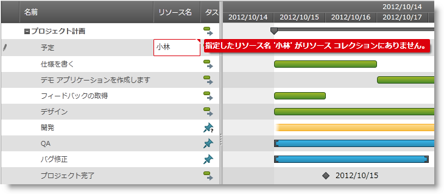
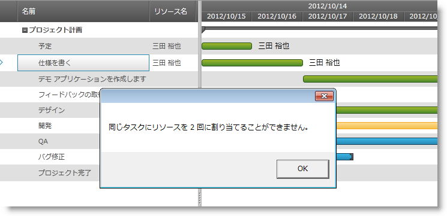

////

|metadata|
{
    "name": "xamgantt-managing-project-resources",
    "controlName": ["xamGantt"],
    "tags": ["Data Presentation","Getting Started","How Do I","Scheduling"],
    "guid": "c21e5be3-8251-40d0-a362-bb606e31a76e",  
    "buildFlags": [],
    "createdOn": "2016-05-25T18:21:55.598181Z"
}
|metadata|
////

= プロジェクト リソースの管理

== トピックの概要

=== 目的

このトピックでは、プロジェクトに使用可能なリソースを作成し、 _xamGantt™_   コントロールを使用してプロジェクトのタスクに割り当てる方法を説明します。

=== 前提条件

このトピックを理解するためには、以下のトピックを理解しておく必要があります。

[options="header", cols="a,a"]
|====
|トピック|目的

| link:xamgantt-adding-xamgantt-to-a-page.html[xamGantt をページに追加]
|このトピックでは、 _xamGantt_ コントロールをページに追加する方法について説明します。

|====

=== 本トピックの内容

このトピックには次のセクションがあります。

* <<_Ref335601194, リソース構成の概要 >>
* <<_Ref335601202, プロジェクトのリソース コレクションを作成 >>
* <<_Ref335601207, プロジェクトのリソースをタスクに割り当て >>
* <<_Ref335749688, 見つからないリソース イベントの処理 >>
* <<_Ref335902141, 関連コンテンツ >>

[[_Ref335601194]]
== リソース構成の概要

=== リソース構成の概要表

以下の表は  _xamGantt_   コントロールのリソースに関係する構成可能な項目をリストします。追加の詳細情報はこのトピックの後で説明します。

[options="header", cols="a,a,a"]
|====
|構成可能な項目|説明|プロパティ

|リソースを作成してプロジェクトに追加する
| link:{ApiPlatform}controls.schedules.xamgantt{ApiVersion}~infragistics.controls.schedules.projectresource_members.html[ProjectResource] オブジェクトを初期化して link:{ApiPlatform}controls.schedules.xamgantt{ApiVersion}~infragistics.controls.schedules.project_members.html[Project] link:{ApiPlatform}controls.schedules.xamgantt{ApiVersion}~infragistics.controls.schedules.project~resourceitems.html[ResourceItems] コレクションに`追加`します。
| link:{ApiPlatform}controls.schedules.xamgantt{ApiVersion}~infragistics.controls.schedules.project~resourceitems.html[ResourceItems]

|リソースをタスクに割り当てる
|必須パラメーターとしてリソース一意の ID を持つ link:{ApiPlatform}controls.schedules.xamgantt{ApiVersion}~infragistics.controls.schedules.projecttaskresource_members.html[ProjectTaskResource] オブジェクトを初期化して link:{ApiPlatform}controls.schedules.xamgantt{ApiVersion}~infragistics.controls.schedules.projecttask_members.html[ProjectTask] link:{ApiPlatform}controls.schedules.xamgantt{ApiVersion}~infragistics.controls.schedules.projecttask~resources.html[Resources] コレクションに`追加`します。 

`Add` メソッドで、必要とされるリソース単位を指定します。
| link:{ApiPlatform}controls.schedules.xamgantt{ApiVersion}~infragistics.controls.schedules.projecttask~resources.html[Resources]

|_xamGantt_ コントロールのユーザー インターフェイスによってリソースを追加するかどうかを構成すると、プロジェクトに新しいリソースを自動的に作成します。
|非認識リソース名を `ProjectTask` link:{ApiPlatform}controls.schedules.xamgantt{ApiVersion}~infragistics.controls.schedules.projecttask~resourcestext.html[ResourcesText] に入力した場合に、新しい `ProjectResource` が `Project` `ResourceItems` コレクションに追加されるかどうかを示すブール値を返すか、設定します。 

Enabled がこの操作のデフォルトの設定です。
| link:{ApiPlatform}controls.schedules.xamgantt{ApiVersion}~infragistics.controls.schedules.projectsettings~autoaddnewresources.html[AutoAddNewResources]

|====

[[_Ref335601202]]
== プロジェクトのリソース コレクションを作成

=== 概要

_xamGantt_   コントロールでリソースを作成してプロジェクトのリソース コレクションに追加できます。その後でリソースを使用可能なプロジェクトのリソースからタスクに割り当てる、またはユーザー インターフェイスを介して新しいリソースを作成できます。

=== プロパティ設定

以下の表では、例の構成をプロパティ設定にマップしています。

[options="header", cols="a,a,a"]
|====
|目的:|使用するプロパティ:|次に設定:

|_xamGantt_ UI を介して新しいリソースの追加を有効/無効にする
| link:{ApiPlatform}controls.schedules.xamgantt{ApiVersion}~infragistics.controls.schedules.projectsettings~autoaddnewresources.html[AutoAddNewResources]
|`bool`

|リソースの表示名を設定する
| link:{ApiPlatform}controls.schedules.xamgantt{ApiVersion}~infragistics.controls.schedules.projectresource~displayname.html[DisplayName]
|`string`

|リソースの一意の ID を設定する
| link:{ApiPlatform}controls.schedules.xamgantt{ApiVersion}~infragistics.controls.schedules.projectresource~uniqueid.html[UniqueId]
|`string`

|プロジェクトのリソース コレクションを作成
| link:{ApiPlatform}controls.schedules.xamgantt{ApiVersion}~infragistics.controls.schedules.project~resourceitems.html[ResourceItems]
| link:{ApiPlatform}controls.schedules.xamgantt{ApiVersion}~infragistics.controls.schedules.projectresourcecollection_members.html[ProjectResourceCollection]

|====

=== 例

以下の例のコードは、 _xamGantt_   UI を介してリソースを作成して、プロジェクトの使用可能なリソース コレクションに追加し、新しいリソースの追加を無効にする方法を示します。

スクリーンショットは、ユーザーが新しい非認識リソースをタスクに割り当てようとする時に表示するエラーのヒントを示します。

*C# の場合:*

[source,csharp]
----
ProjectSettings settings = new ProjectSettings();
// xamGantt UI と 
// ProjectTask ResourcesText プロパティによってリソースの追加を無効にする
settings.AutoAddNewResources = false;
this.gantt.Project.Settings = settings;
// 表示名と一意の ID を使用して ProjectResource を作成する
ProjectResource projectResource = new ProjectResource();
projectResource.DisplayName = "John Smith";
projectResource.UniqueId = "dev-jsmith-45673";
// 作成されたリソースをプロジェクト ResourceItems コレクションに追加する
this.gantt.Project.ResourceItems.Add(projectResource);
----

*Visual Basic の場合:*

[source,vb]
----
Dim settings As New ProjectSettings()
' xamGantt UI と ProjectTask ResourcesText プロパティによってリソースの追加を無効にする
settings.AutoAddNewResources = False
Me.gantt.Project.Settings = settings
' 表示名と一意の ID を使用して ProjectResource を作成する
Dim projectResource As New ProjectResource()
projectResource.DisplayName = "John Smith"
projectResource.UniqueId = "dev-jsmith-45673"
' 作成されたリソースをプロジェクト ResourceItems コレクションに追加する
Me.gantt.Project.ResourceItems.Add(projectResource)
----

[[_Ref335601207]]
== プロジェクトのリソースをタスクに割り当て

=== 概要

_xamGantt_   コントロールを使用してリソースを作成し、それらのリソースをタスクに割り当てることができます。必要な数だけリソースを追加できますが、同じタスクに複数回同じリソースを追加できません。

=== プロパティ設定

以下の表では、目的の構成をプロパティ設定にマップしています。

[options="header", cols="a,a,a"]
|====
|目的:|使用するプロパティ:|次に設定:

|ProjectTaskResource をタスクに割り当てる
| link:{ApiPlatform}controls.schedules.xamgantt{ApiVersion}~infragistics.controls.schedules.projecttask~resources.html[Resources]
| link:{ApiPlatform}controls.schedules.xamgantt{ApiVersion}~infragistics.controls.schedules.projecttaskresourcecollection_members.html[ProjectTaskResourceCollection]

|====

=== 例

以下の例は、Button Click イベントでリソースを現在アクティブなタスクに割り当てる方法を示します。さらに、リソースを複数回タスクに割り当てようとした結果表示するエラー ダイアログ ボックスを示します。

*C# の場合:*

[source,csharp]
----
private void Btn_AddResource_Click(object sender, RoutedEventArgs e)
{
  // 指定した一意の ID で使用可能なプロジェクト リソースの ProjectTaskResource を作成する 
    ProjectTaskResource taskResource = new ProjectTaskResource("dev-jsmith-45673");
    try
    {
        // リソースをタスクに割り当てる
        this.gantt.ActiveRow.Value.Task.Resources.Add(taskResource);
    }
    catch (Exception exc)
    {
        // 例外が発生する場合にメッセージを表示する
        MessageBox.Show(exc.Message);
    }
}
----

*Visual Basic の場合:*

[source,vb]
----
Private Sub Btn_AddResource_Click(sender As Object, e As RoutedEventArgs)
      ' 指定した一意の ID で使用可能なプロジェクト リソースの ProjectTaskResource を作成する 
      Dim taskResource As New ProjectTaskResource("dev-jsmith-45673")
      Try
            ' リソースをタスクに割り当てる
            Me.gantt.ActiveRow.Value.Task.Resources.Add(taskResource)
      Catch exc As Exception
            ' 例外が発生する場合にメッセージを表示する
            MessageBox.Show(exc.Message)
      End Try
End Sub
----

[[_Ref335749688]]
[[_Ref335601214]]
== 見つからないリソース イベントの処理

=== 概要

この例は、プロジェクトの使用可能なリソースの一部として含まれない非認識リソースをユーザーが入力しようとするイベントでエラー処理を示します。

link:{ApiPlatform}controls.schedules.xamgantt{ApiVersion}~infragistics.controls.schedules.project_members.html[Project] link:{ApiPlatform}controls.schedules.xamgantt{ApiVersion}~infragistics.controls.schedules.project~missingresourcewarning_ev.html[MissingResourceWarning] イベントを使用してこのエラーを処理するために処理します。

=== イベントの設定

[options="header", cols="a,a"]
|====
|目的:|このイベントの使用:

|構成によって禁止されている時 (`AutoAddNewResources` プロパティが `False` に設定されている) 場合、 _xamGantt_ UI で非認識リソース文字列の入力を処理します。
| link:{ApiPlatform}controls.schedules.xamgantt{ApiVersion}~infragistics.controls.schedules.project~missingresourcewarning_ev.html[MissingResourceWarning]

|====

=== 例

以下の例は非認識リソース エラー イベントの追加を処理する方法を示します:

*C# の場合:*

[source,csharp]
----
…
this.gantt.Project.MissingResourceWarning += 
new EventHandler<MissingResourceWarningEventArgs>(Project_MissingResourceWarning);
…
----

*C# の場合:*

[source,csharp]
----
private void Project_MissingResourceWarning(object sender, MissingResourceWarningEventArgs e)
{
    // 例外が発生する場合にメッセージを表示する
    MessageBox.Show(string.Format("The {0} resource is an unrecognized resource.", e.ResourceName));
}
----

*Visual Basic の場合:*

[source,vb]
----
…
Me.gantt.Project.MissingResourceWarning = New EventHandler(Of MissingResourceWarningEventArgs)(Project_MissingResourceWarning)
…
----

*Visual Basic の場合:*

[source,vb]
----
Private Sub Project_MissingResourceWarning(sender As Object, e As MissingResourceWarningEventArgs)
      ' 例外が発生する場合にメッセージを表示する
      MessageBox.Show(String.Format("The {0} resource is an unrecognized resource.", e.ResourceName))
End Sub
----

[[_Ref335902141]]
== 関連コンテンツ

このトピックについては、以下のトピックも参照してください。

[options="header", cols="a,a"]
|====
|トピック|目的

| link:xamgantt-creating-custom-resources-for-xamgantt.html[xamGantt のカスタム リソースの作成]
|このトピックでは、カスタム リソース クラスを作成して _xamGantt_ と使用する方法を紹介します。

|====
