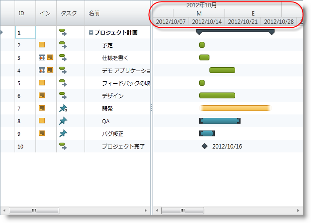

////

|metadata|
{
    "name": "xamgantt-setting-the-xamgantt-timescale-bands",
    "controlName": ["xamGantt"],
    "tags": ["Formatting","Grids","How Do I","Layouts","Scheduling"],
    "guid": "74670f86-b5bd-4d5c-914c-7686253c9cf1",  
    "buildFlags": [],
    "createdOn": "2016-05-25T18:21:55.5211388Z"
}
|metadata|
////

= xamGantt タイムスケール バンドの設定

== トピックの概要

=== 目的

このトピックでは、 _xamGantt™_   タイムスケールのタイムスケール バンドの設定方法について説明します。

=== 前提条件

このトピックを理解するためには、以下のトピックを理解しておく必要があります。

[options="header", cols="a,a"]
|====
|トピック|目的

| link:xamgantt-adding-xamgantt-to-a-page.html[ _xamGantt_ をページに追加]
|このトピックでは、 _xamGantt™_ コントロールをページに追加する方法を説明します。

|====

=== 本トピックの内容

このトピックには次のセクションがあります。

* <<_Timescale_Bands_Introduction, タイムスケール バンドの概要 >>

** <<_Ref334101937,概要>>

** <<_Ref334101951,バンド>>

* <<_Code_Example_Setting_the_Timescale_Bands, コード例: タイムスケール バンドの設定 >>

** <<_Ref333763526,説明>>

** <<_Ref334102005,前提条件>>

** <<_Ref334102013,プレビュー>>

** <<_Ref334102056,コード>>

* <<_Related_Content, 関連コンテンツ >>

[[_Timescale_Bands_Introduction]]
== タイムスケール バンドの概要

[[_Ref334101937]]

=== 概要

link:{ApiPlatform}controls.schedules.xamgantt{ApiVersion}~infragistics.controls.schedules.timescaleband_members.html[TimescaleBand] クラスは link:{ApiPlatform}controls.schedules.xamgantt{ApiVersion}~infragistics.controls.schedules.timescalebandbase_members.html[TimescaleBandBase] クラスを継承します。TimescaleBandBase は、タイムスケールの時間の間隔を表す日付/時刻の範囲のセットを提供するために使用されます。

XamGantt タイムスケールは link:{ApiPlatform}controls.schedules.xamgantt{ApiVersion}~infragistics.controls.schedules.timescale~bands.html[Bands] と呼ばれる `TimescaleBand` オブジェクトと link:{ApiPlatform}controls.schedules.xamgantt{ApiVersion}~infragistics.controls.schedules.timescalebase~visiblebands.html[VisibleBands] と呼ばれる TimescaleBandBase オブジェクトを保持します。

=== Bands

Bands コレクションはタイムスケールの層を提供します。Bands コレクションを使用してタイムスケール バンドを設定します。このコレクションにはタイムスケール バンドの複数のインスタンスを持つことができ、それぞれに link:{ApiPlatform}controls.schedules.xamgantt{ApiVersion}~infragistics.controls.schedules.timescaleband~isvisible.html[IsVisible] プロパティを設定することによってチャート セクションに表示されるものを制御できます。

[[_Ref334101951]]

=== Visible Bands

タイムスケール VisibleBands プロパティはその IsVisible プロパティが true に設定されるバンドで生成されます。最大の間隔が一番上に来るように、このコレクションのバンドはバンドの見積もり期間に基づいて並べ替えられます。

[[_Code_Example_Setting_the_Timescale_Bands]]
== コード例: タイムスケール バンドの設定

[[_Ref333763526]]

=== 説明

このコード例は、タイムスケール バンドの設定方法を示します。これらは XAML またはコード ビハインドから設定できます。

[[_Ref334102005]]

=== 前提条件

** コード例を完了するには xamGantt プロジェクトが必要です。サンプルの xamGantt プロジェクトを作成するためには、 link:xamgantt-adding-xamgantt-to-a-page.html[ _xamGantt_  をページに追加]の指示に従ってください。

[[_Ref334102013]]

=== プレビュー

以下は完全なサンプル プロジェクトのプレビューです。それぞれが異なる単位タイプで 3 つの TimescaleBands が設定されます。

[[_Ref334102056]]

=== コード

*XAML の場合:*

[source,xaml]
----
…
    <Grid>
        <ig:XamGantt x:Name="gantt" Project="{Binding}">
            <ig:XamGantt.ViewSettings>
                <ig:ProjectViewSettings>
                    <ig:ProjectViewSettings.Timescale>
                        <ig:Timescale>
                            <ig:TimescaleBand Unit="Months" IsVisible="True" HorizontalAlignment="Center" />
                            <ig:TimescaleBand Unit="ThirdsOfMonths" IsVisible="True" />
                            <ig:TimescaleBand Unit="Weeks" IsVisible="True" />
                        </ig:Timescale>
                    </ig:ProjectViewSettings.Timescale>
                </ig:ProjectViewSettings>
            </ig:XamGantt.ViewSettings>
        </ig:XamGantt>
    </Grid>
…
----

*C# の場合:*

[source,csharp]
----
…
            Timescale timescale = new Timescale();
            timescale.Bands.Add(new TimescaleBand { Unit = TimescaleUnit.Months, IsVisible = true });
            timescale.Bands.Add(new TimescaleBand { Unit = TimescaleUnit.ThirdsOfMonths, IsVisible = 
true });
            timescale.Bands.Add(new TimescaleBand { Unit = TimescaleUnit.Weeks, IsVisible = true });
            gantt.ViewSettings = new ProjectViewSettings();
            gantt.ViewSettings.Timescale = timescale;
…
----

*Visual Basic の場合:*

[source,vb]
----
Dim timescale As New Timescale()
timescale.Bands.Add(New TimescaleBand() With { 
      Key .Unit = TimescaleUnit.Months, 
      Key .IsVisible = True 
})
timescale.Bands.Add(New TimescaleBand() With { 
      Key .Unit = TimescaleUnit.ThirdsOfMonths, 
      Key .IsVisible = True 
})
timescale.Bands.Add(New TimescaleBand() With { 
      Key .Unit = TimescaleUnit.Weeks, 
      Key .IsVisible = True 
})
gantt.ViewSettings = New ProjectViewSettings()
gantt.ViewSettings.Timescale = timescale
----

[[_Related_Content]]
== 関連コンテンツ

このトピックについては、以下のトピックも参照してください。

[options="header", cols="a,a"]
|====
|トピック|目的

| link:xamgantt-configuring-the-xamgantt-timescale.html[タイムスケールの構成]
|このグループのトピックには、xamGantt™ タイムスケールの情報が含まれています。

| link:xamgantt-timescale-configuration-overview.html[xamGantt タイムスケール構成の概要]
|このトピックは、xamGantt™ タイムスケールの主要な機能の概要です。

|====
