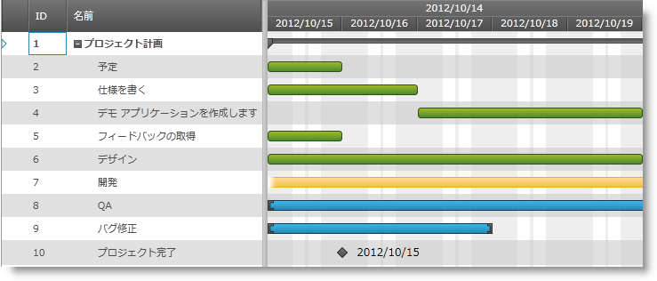

////

|metadata|
{
    "name": "xamgantt-showing-hiding-non-work-days-hours-background",
    "controlName": ["xamGantt"],
    "tags": ["Data Presentation","How Do I","Scheduling"],
    "guid": "73df1f59-efbc-4f82-9275-d6a021e4ca5a",  
    "buildFlags": [],
    "createdOn": "2016-05-25T18:21:55.3681675Z"
}
|metadata|
////

= 非作業日/非作業時間バックグラウンドの表示/非表示

== トピックの概要

=== 目的

このトピックでは、 _xamGantt™_   コントロールを使用して非作業日/非作業時間の強調表示を構成する方法を説明します。

=== 前提条件

このトピックを理解するためには、以下のトピックを理解しておく必要があります。

[options="header", cols="a,a"]
|====
|トピック|目的

| link:xamgantt-adding-xamgantt-to-a-page.html[xamGantt をページに追加]
|このトピックでは、 _xamGantt_ コントロールをページに追加する方法について説明します。

|====

=== 本トピックの内容

このトピックには次のセクションがあります。

* <<_Ref335069331, 非作業日/非作業時間バックグラウンドの表示/非表示 >>

** <<_Ref335271494,概要>>
** <<_Ref335271506,プロパティ設定>>
** <<_Ref335271513,例>>

* <<_Ref335069336, 関連コンテンツ >>

[[_Ref335069331]]
== 非作業日/非作業時間バックグラウンドの表示/非表示

[[_Ref335271494]]

=== 概要

デフォルトで、非作業日は  _xamGantt_   コントロールのチャート セクションに強調表示して表示されます。

非作業日の強調表示には 3 つの構成可能なオプションがあります。

* 強調表示を無効にした非作業日
* その間隔と交差する作業時間がないことを前提としてタイムスケール間隔全体の強調表示
* タイムスケール間隔と交差するかしないかにかかわらずすべての非作業時間を強調表示

[[_Ref335271506]]

=== プロパティ設定

以下の表では、目的の構成をプロパティ設定にマップしています。

[options="header", cols="a,a,a"]
|====
|目的:|使用するプロパティ:|次に設定:

|非作業時間および非作業日の強調表示を構成
| link:{ApiPlatform}controls.schedules.xamgantt{ApiVersion}~infragistics.controls.schedules.projectviewsettings~nonworkingtimehighlightstyle.html[NonWorkingTimeHighlightStyle]
|`Nullable`< link:{ApiPlatform}controls.schedules.xamgantt{ApiVersion}~infragistics.controls.schedules.nonworkingtimehighlightstyle.html[NonWorkingTimeHighlightStyle]>

|====

[[_Ref335271513]]

=== 例

以下のスクリーンショットは、次のような設定の結果、非作業日と非作業時間に提供された強調表示を示します。

[options="header", cols="a,a"]
|====
|プロパティ|値

|`NonWorkingTimeHighlightStyle`
| link:{ApiPlatform}controls.schedules.xamgantt{ApiVersion}~infragistics.controls.schedules.nonworkingtimehighlightstyle.html[ActualNonWorkingHours]

|====

*XAML の場合:*

[source,xaml]
----
<ig:XamGantt x:Name="gantt" 
             Project="{Binding Project}">
    <ig:XamGantt.ViewSettings>
        <ig:ProjectViewSettings NonWorkingTimeHighlightStyle="ActualNonWorkingHours" />
    </ig:XamGantt.ViewSettings>
</ig:XamGantt>
----

[[_Ref335069336]]
== 関連コンテンツ

このトピックについては、以下のトピックも参照してください。

[options="header", cols="a,a"]
|====
|トピック|目的

| link:xamgantt-project-view-settings-configuration-overview.html[プロジェクト ビュー設定の構成概要]
|このトピックでは、 _xamGantt_ ProjectViewSettings クラスとその構成可能な項目の概要を提供します。

|====
