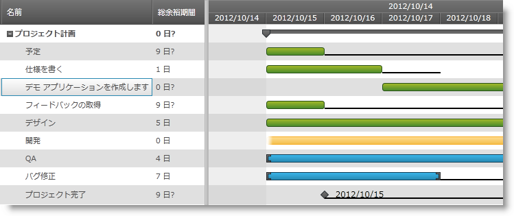

////

|metadata|
{
    "name": "xamgantt-showing-hiding-tasks-slack",
    "controlName": ["xamGantt"],
    "tags": ["Data Presentation","How Do I","Scheduling"],
    "guid": "5f62952f-1c0c-4698-b020-8b684299a78a",  
    "buildFlags": [],
    "createdOn": "2016-05-25T18:21:55.3621671Z"
}
|metadata|
////

= タスク スラックの表示/非表示

== トピックの概要

=== 目的

このトピックでは、 _xamGantt™_   コントロールのチャート セクションでスラックの表示状態を構成する方法について紹介します。

=== 前提条件

このトピックを理解するためには、以下のトピックを理解しておく必要があります。

[options="header", cols="a,a"]
|====
|トピック|目的

| link:xamgantt-adding-xamgantt-to-a-page.html[xamGantt をページに追加]
|このトピックでは、 _xamGantt_ コントロールをページに追加する方法について説明します。

|====

=== 本トピックの内容

このトピックには次のセクションがあります。

* <<_Ref334979090, タスク スラックの表示/非表示 >>

** <<_Ref335272877,概要>>
** <<_Ref335272884,プロパティ設定>>
** <<_Ref335272891,例>>

* <<_Ref334979096, 関連コンテンツ >>

[[_Ref334979090]]
== タスク スラックの表示/非表示

[[_Ref335272877]]

=== 概要

_xamGantt_   コントロールのスケジューリング エンジンはあらゆるイベントのスラックの量を計算します。スラックは、依存するタスクに影響を及ぼすことなくタスクを遅延させることができる時間のことです。

タスク スラック情報を公開する読み取り専用プロパティがいくつかあります。これらは、 _xamGantt_   のグリッド セクションの開始余裕期間、終了余裕期間、余裕期間および総余裕期間です。

デフォルトで、 _xamGantt_   のチャート セクションはスラックを表示しません。ただし、 link:{ApiPlatform}controls.schedules.xamgantt{ApiVersion}~infragistics.controls.schedules.projectviewsettings_members.html[ProjectViewSettings] link:{ApiPlatform}controls.schedules.xamgantt{ApiVersion}~infragistics.controls.schedules.projectviewsettings~isslackvisible.html[IsSlackVisible] プロパティによってスラックの表示状態を構成できます。

[[_Ref335272884]]

=== プロパティ設定

以下の表では、目的の構成をプロパティ設定にマップしています。

[options="header", cols="a,a,a"]
|====
|目的:|使用するプロパティ:|次に設定:

|_xamGantt_ のチャート セクションでタスク スラックを表示/非表示にする
|`IsSlackVisible`
|`Bool`

|====

[[_Ref335272891]]

=== 例

以下のスクリーンショットは、次のような設定により、 _xamGantt_   のチャート セクションがスラックをどのように表示するかを示しています。

[options="header", cols="a,a"]
|====
|プロパティ|値

|`IsSlackVisible`
|`True`

|====

*XAML の場合:*

[source,xaml]
----
<ig:XamGantt x:Name="gantt" 
             Project="{Binding Project}">
    <ig:XamGantt.ViewSettings>
        <ig:ProjectViewSettings IsSlackVisible="True" />
    </ig:XamGantt.ViewSettings>
</ig:XamGantt>
----

[[_Ref334979096]]
== 関連コンテンツ

このトピックについては、以下のトピックも参照してください。

[options="header", cols="a,a"]
|====
|トピック|目的

| link:xamgantt-project-view-settings-configuration-overview.html[プロジェクト ビュー設定の構成概要]
|このトピックでは、 _xamGantt_ ProjectViewSettings クラスとその構成可能な項目の概要を提供します。

|====
