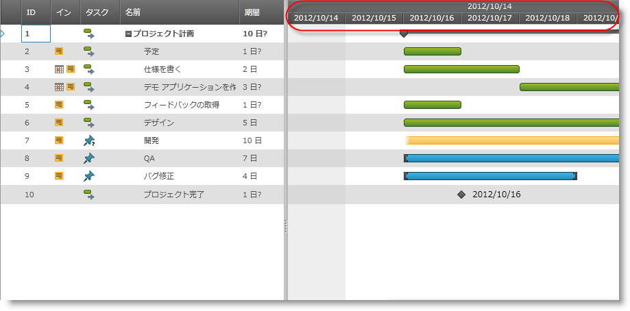

////

|metadata|
{
    "name": "xamgantt-timescale-configuration-overview",
    "controlName": ["xamGantt"],
    "tags": ["Charting","Data Presentation","Drilldown","Layouts","Scheduling"],
    "guid": "510b40c7-32df-4281-b96f-83067f883ee8",  
    "buildFlags": [],
    "createdOn": "2016-05-25T18:21:55.5621405Z"
}
|metadata|
////

= タイムスケール構成の概要 (xamGantt)

== トピックの概要

=== 目的

このトピックは、xamGantt™ タイムスケールの主要な機能の概要です。

=== 本トピックの内容

このトピックには次のセクションがあります。

* <<_xamGantt_Timescale_Overview, xamGantt タイムスケールの概要 >>

** <<_Timescale_features_overview,タイムスケール機能の概要>>

** <<_Timescale_bands,タイムスケール バンド>>

** <<_Timescale_band_units,タイムスケール バンドの単位>>

** <<_Timescale_band_formatting,タイムスケール バンドの形式>>

* <<_Related_Content, 関連コンテンツ >>

[[_xamGantt_Timescale_Overview]]
== xamGantt タイムスケールの概要

[[_Timescale_features_overview]]

=== タイムスケール機能の概要

link:{ApiPlatform}controls.schedules.xamgantt{ApiVersion}~infragistics.controls.schedules.timescale_members.html[Timescale] クラスは link:{ApiPlatform}controls.schedules.xamgantt{ApiVersion}~infragistics.controls.schedules.timescalebase_members.html[TimescaleBase] 抽象クラスの具体的な実装です。

以下の表に、xamGantt タイムスケールの主な機能についてまとめています。

[options="header", cols="a,a"]
|====
|機能|説明

|タイムスケール バンド
|`タイムスケール`は link:{ApiPlatform}controls.schedules.xamgantt{ApiVersion}~infragistics.controls.schedules.timescaleband_members.html[TimescaleBand] オブジェクトを公開します。タイムスケールは複数のバンドを持つことができます。各タイムスケールは時間の間隔のセットを表します。

|タイムスケール バンドの単位
|タイムスケール バンドはさまざまなタイプの単位で時間の間隔を表示できます (分、時、日、週、月の 3 分の 1、月、四半期、半年、年)

| link:{ApiPlatform}controls.schedules.xamgantt{ApiVersion}~infragistics.controls.schedules.timescalebase~scale.html[Scale]
|タイムスケールの Scale プロパティは、間隔の最適サイズがスケールされるパーセンテージを制御します。

|タイムスケール バンドの形式
|タイムスケールに表示される時間の日付/時刻形式を変更できます。日付/時刻文字列の配置を変更することも可能です。

|====

[[_Timescale_bands]]

=== タイムスケール バンド

タイムスケール バンドは、xamGantt チャート セクションの詳細レベルを制御するために使用されます。デフォルトでタイムスケールにはバンドが 2 つあります。

==== 関連トピック

link:xamgantt-setting-the-xamgantt-timescale-bands.html[xamGantt タイムスケール バンドの設定]

[[_Timescale_band_units]]

=== タイムスケール バンドの単位

単位のタイプを設定でき、タイムスケール バンドの各間隔で表される単位数を設定できます。

==== 関連トピック

link:xamgantt-configuring-the-xamgantt-timescale-units.html[xamGantt タイムスケール単位と単位数の構成]

[[_Timescale_band_formatting]]

=== タイムスケール バンドの形式

タイムスケール バンドの表示形式文字列を設定することによって、希望の日付/時刻形式が設定されます。タイムスケールは .NET の標準およびカスタムの日付/時刻形式文字列、およびタイムスケール形式の代用タグのセットをサポートしており、タイムスケール日付/時刻文字列の表示を微調整できます。

==== 関連トピック

link:xamgantt-configuring-the-xamgantt-timescale-display-formats.html[xamGantt タイムスケール表示形式の構成]

[[_Related_Content]]
== 関連コンテンツ

このトピックについては、以下のトピックも参照してください。

[options="header", cols="a,a"]
|====
|トピック|目的

| link:xamgantt-configuring-the-xamgantt-timescale.html[xamGantt タイムスケールの構成]
|このグループのトピックには、xamGantt™ タイムスケールの情報が含まれています。

|====
