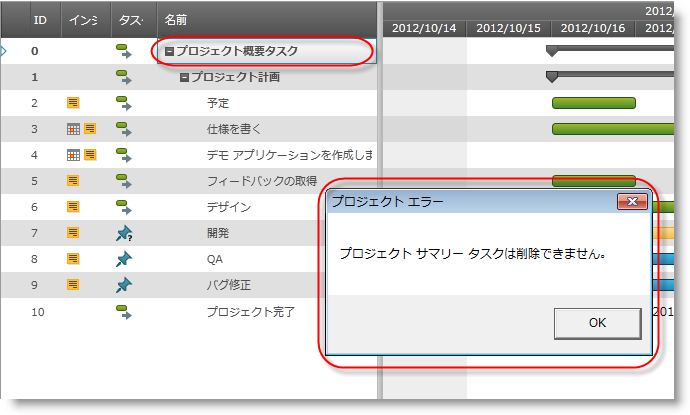
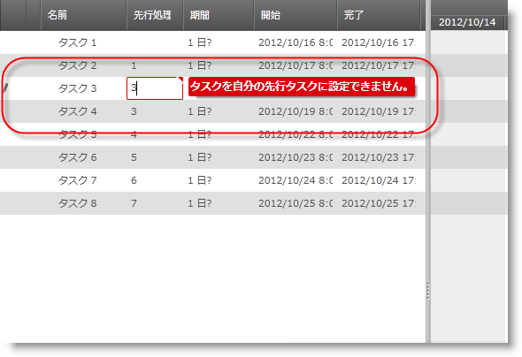
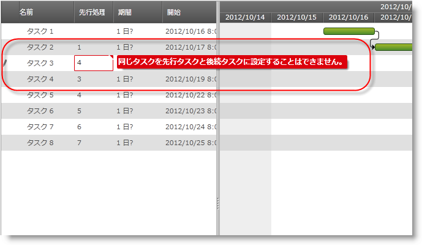
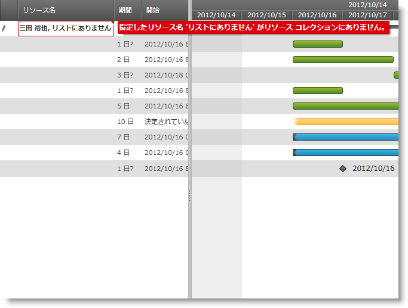

////

|metadata|
{
    "name": "xamgantt-user-notifications-shown-at-conflict-resolution",
    "controlName": ["xamGantt"],
    "tags": ["Error Handling","Events","Grids","Scheduling","Validation"],
    "guid": "f6e8f7d4-ccb5-48ec-af18-2baef4921a3c",  
    "buildFlags": [],
    "createdOn": "2016-05-25T18:21:55.6031806Z"
}
|metadata|
////

= 競合の解決で表示されるユーザー通知 (xamGantt)

== トピックの概要

=== 目的

特定の無効なタスク値、プロジェクト設定または再スケジュール操作は競合の原因となる可能性があります。_xamGantt™_   はこれらの競合を解決して適切な通知をユーザーに表示します。このトピックは、競合の解決で生じるユーザー通知を説明します。

=== 前提条件

このトピックを理解するためには、以下のトピックを理解しておく必要があります。

[options="header", cols="a,a"]
|====
|トピック|目的

| link:xamgantt-xamgantt-visual-elements.html[ _xamGantt_ のビジュアル要素]
|このトピックでは、 _xamGantt_ コントロールのグリッド セクションとチャート セクションのビジュアル要素について紹介します。

|====

=== 本トピックの内容

このトピックには次のセクションがあります。

* <<_Overview_of_User_Notifications_shown_at_Conflict_Resolution, 競合の解決で表示されるユーザー通知の概要 >>

** <<_Overview,概要>>

** <<_Project_Summary_task_cannot_be_deleted,プロジェクトのサマリー タスクは削除できない>>

** <<_Dependency_Circularities,依存関係循環>>

** <<_Resouce_not_in_resource_collection,リソースがリソース コレクションにない>>

* <<_Related_Content, 関連コンテンツ >>

[[_Overview_of_User_Notifications_shown_at_Conflict_Resolution]]
== 競合の解決で表示されるユーザー通知の概要

[[_Overview]]

=== 概要

以下の表に  _xamGantt_   競合解決のユーザー通知をまとめます。追加の詳細は以下の通りです:

[options="header", cols="a,a"]
|====
|通知|説明

|プロジェクトのサマリー タスクは削除できない
|この通知は、プロジェクト ルート タスクの削除の競合が発生する時に表示されます。

|依存関係循環の警告
|依存関係循環が発生する時にこれらの通知が発生します。

|リソースがリソース コレクションにない
|この通知は、リソース喪失の警告の競合が発生する時に表示されます。

|====

link:xamgantt-conflict-resolution.html[ _「xamGantt_   競合の解決」]トピックに競合に関する情報があります。

[[_Project_Summary_task_cannot_be_deleted]]

=== プロジェクトのサマリー タスクは削除できない

ユーザーはプロジェクトのサマリー タスクを削除しようと試みることができます。これは許可されず、 _xamGantt_   は警告メッセージを表示します。

[[_Dependency_Circularities]]

=== 依存関係循環

依存するタスクがあり、ユーザーが参照を変更しようとする場合、循環性の連鎖を変更することになる場合があります。循環性の連鎖のタイプによって表示される警告のヒントは異なります。

タスクはそれ自身先行処理/後続処理にできません。

タスクは別のタスクの先行処理/後続処理にできません。

image::images/xamGantt_User_Notifications_shown_at_Conflict_Resolutions_4.png[]

より複雑な依存関係循環が生じる時にこの警告のヒントが表示されます。

[[_Resouce_not_in_resource_collection]]

=== リソースがリソース コレクションにない

プロジェクト設定の link:{ApiPlatform}controls.schedules.xamgantt{ApiVersion}~infragistics.controls.schedules.projectsettings~autoaddnewresources.html[AutoAddNewResources] プロパティが `false` に設定され、存在しないリソースがタスクに追加される場合、 _xamGantt_   は許可せず検証のヒントを表示します。

[[_Related_Content]]
== 関連コンテンツ

[[_Ref335665218]]

=== トピック

このトピックについては、以下のトピックも参照してください。

[options="header", cols="a,a"]
|====
|トピック|目的

| link:xamgantt-conflict-resolution.html[ _xamGantt_ 競合の解決]
|このトピックでは、 _xamGantt_ 競合の解消について説明します。

| link:xamgantt-xamgantt-user-interactions-in-the-chart-section.html[ _xamGantt_ チャート セクションにおけるユーザー インタラクション]
|このトピックでは、 _xamGantt_ コントロールのチャート セクションで実行できるユーザー インタラクションについて解説します。

| link:xamgantt-xamgantt-user-interactions-in-the-grid-section.html[グリッド セクションにおける _xamGantt_ ユーザー インタラクション]
|このトピックでは、 _xamGantt_ コントロールのグリッド セクションを使用して使用可能なユーザー インタラクションについて紹介します。

| link:xamgantt-columns-editing.html[ _xamGantt_ 列の編集]
|このトピックでは、 _xamGantt_ コントロールで重要なグリッド列のいくつかで編集機能を説明します。

|====