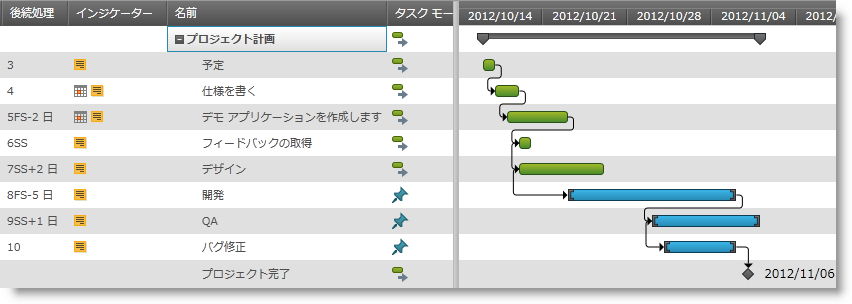
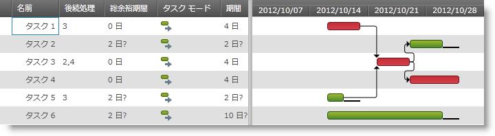

////

|metadata|
{
    "name": "xamgantt-xamgantt-overview",
    "controlName": ["xamGantt"],
    "tags": ["Getting Started"],
    "guid": "bc405a33-7557-4620-b794-ea5211d0b3a0",  
    "buildFlags": [],
    "createdOn": "2016-05-25T18:21:55.1321548Z"
}
|metadata|
////

= xamGantt の概要

== トピックの概要

=== 目的

このトピックでは、 _xamGantt™_   コントロールの概要を提供します。

=== 本トピックの内容

このトピックには次のセクションがあります。

* <<_Ref335919820, 概要 >>
* <<_Ref335919824, 関連コンテンツ >>

[[_Ref335919820]]
== 概要

=== xamGantt の概要

_xamGantt_   コントロールは Microsoft Project 2010 に似たユーザー インターフェイスを提供するクロス プラットフォーム コントロールです。

_xamGantt_   コントロールを使用して、プロジェクト計画を作成、編集、表示する、期限、マイルストーンを作成し、タスク間の依存関係を設定できます。計画を最新に保つためにコントロールのスケジューリング エンジンは編集のたびに計算を実行します。

_xamGantt_   コントロールが提供するすべての機能のリストは、 link:xamgantt-xamgantt-features.html[「xamGantt の機能」]トピックを参照してください。

以下のスクリーンショットは、依存するタスクを含むプロジェクト計画を示します。

[[_Ref335919824]]
== 関連コンテンツ

=== トピック

このトピックについては、以下のトピックも参照してください。

[options="header", cols="a,a"]
|====
|トピック|目的

| link:xamgantt-xamgantt-in-detail.html[xamGantt の詳細]
|このグループのトピックでは、 _xamGantt_ コントロールの詳細について説明します。

| link:xamgantt-xamgantt-data-binding.html[xamGantt のデータ バインディング]
|このグループのこのトピックでは、 _xamGantt_ コントロールを使用したデータ バインディングについて説明します。

| link:xamgantt-adding-xamgantt-to-a-page.html[xamGantt をページに追加]
|このトピックでは、 _xamGantt_ コントロールをページに追加する方法について説明します。

| link:xamgantt-configuring-xamgantt.html[xamGantt の構成]
|このグループのこのトピックでは、 _xamGantt_ コントロールの主要な構成可能な項目について説明します。

|====