////

|metadata|
{
    "name": "xamgantt-xamgantt-user-interactions-in-the-chart-section",
    "controlName": ["xamGantt"],
    "tags": ["Data Presentation","Getting Started","How Do I","Layouts"],
    "guid": "fbd9785a-d8f7-47be-878f-d5e693aaa089",  
    "buildFlags": [],
    "createdOn": "2016-05-25T18:21:55.181157Z"
}
|metadata|
////

= xamGantt チャート セクションにおけるユーザー インタラクション

== トピックの概要

=== 目的

このトピックでは、 _xamGantt™_   コントロールのチャート セクションを使用して使用可能なユーザー インタラクションについて紹介します。

=== 前提条件

このトピックを理解するためには、以下のトピックを理解しておく必要があります。

[options="header", cols="a,a"]
|====
|トピック|目的

| link:xamgantt-xamgantt-visual-elements.html[xamGantt のビジュアル要素]
|このトピックでは、 _xamGantt_ コントロールのグリッド セクションとチャート セクションのビジュアル要素について紹介します。

|====

=== 本トピックの内容

このトピックには次のセクションがあります。

* <<_Ref333244537, チャート セクションにおけるユーザー インタラクション >>

** <<_Ref333339035,タスク バーのドラッグ>>
** <<_Ref333339047,マイルストーンのドラッグ>>
** <<_Ref333339052,期限のドラッグ>>
** <<_Ref333339060,タスク バーのサイズ変更>>
** <<_Ref333339077,プログレス バーのサイズ変更>>
** <<_Ref333339082,タスク間に依存関係リンクを設定>>
** <<_Ref333339088,コンテキスト メニューを開く>>
** <<_Ref333339093,ヒントを表示>>

* <<_Ref333340104, 関連コンテンツ >>

** <<_Ref333476908,トピック>>

[[_Ref333244537]]
== チャート セクションにおけるユーザー インタラクション

=== チャート セクションにおけるユーザー インタラクションの概要

以下の表は、 _xamGantt_   コントロールのチャート セクションにおけるユーザー インタラクション機能の概要を示しています。表の後に、その他の詳細が紹介されています。

[options="header", cols="a,a,a,a"]
|====
|目的|方法|詳細|構成方法

|タスク バーのドラッグ
|マウス
|タスク バーをドラッグすると、タスクの開始日と終了日が変わります。
|image::images/Yes.png[] 

link:xamgantt-enabling-disabling-user-interactions.html[ユーザー インタラクションの有効化/無効化]

|マイルストーンのドラッグ
|マウス
|マイルストーンをドラッグすると終了日が変わります。
|image::images/Yes.png[] 

link:xamgantt-enabling-disabling-user-interactions.html[ユーザー インタラクションの有効化/無効化]

|期限のドラッグ
|マウス
|期限インジケーターをドラッグするとタスクの期限の日付が変わります。
|image::images/Yes.png[] 

link:xamgantt-enabling-disabling-user-interactions.html[ユーザー インタラクションの有効化/無効化]

|タスク バーのサイズ変更
|マウス
|タスク バーをサイズ変更するとタスクの期間が変わります。
| link:xamgantt-enabling-disabling-user-interactions.html[ユーザー インタラクションの有効化/無効化]

|プログレス バーのサイズ変更
|マウス
|プログレス バーをサイズ変更するとタスクの進行状況が変わります。
|image::images/Yes.png[] 

link:xamgantt-enabling-disabling-user-interactions.html[ユーザー インタラクションの有効化/無効化]

|タスク間に依存関係リンクを設定します。
|マウス
|リンクを設定するとタスクの依存関係が作成されます。
|image::images/Yes.png[] 

link:xamgantt-enabling-disabling-user-interactions.html[ユーザー インタラクションの有効化/無効化]

|コンテキスト メニューを開く
|マウス
|さまざまな要素をマウスの右ボタンでクリックすると、さまざまなコマンドを含むコンテキスト メニューが開きます。
|image::images/No.png[]

|ヒントを表示
|マウス
|異なる要素をホバーすると、ヒントが追加情報とともに表示されます。
|image::images/No.png[]

|====

[[_Ref333339035]]

=== タスク バーのドラッグ

ユーザーは  _xamGantt_   コントロールのチャート セクションでタスク バーをドラッグしてタスクの開始日と終了日を変更できます。

この操作は、タスク バーを選択してタスク バーを左または右に移動する間にマウスの左ボタンを押し続けることによって達成されます。

情報のヒントが現れて、ユーザーがタスク バーをドラッグするとタスクの開始日と終了日がどのように変わるのかを示します。

デフォルトで、ユーザーは以下のタスク バーをドラッグできます。

* 自動スケジュール タスク
* 手動スケジュール タスク
* 手動スケジュール サマリー タスク

注:

[NOTE]
====
ドラッグ操作は構成可能です。詳細は、以下の*関連トピック* セクションを参照してください。
====

ESCAPE を使用すると、変更がリセットされ、タスク バーを元の位置に戻します。

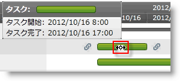

*自動スケジュール タスクのドラッグ*

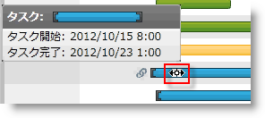

*手動スケジュール タスクのドラッグ*

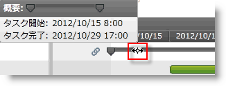

*サマリー タスクの削除*

==== 関連トピック:

* link:xamgantt-enabling-disabling-user-interactions.html[ユーザー インタラクションの有効化/無効化]

[[_Ref333339047]]

=== マイルストーンのドラッグ

ユーザーは  _xamGantt_   コントロールのチャート セクションでマイルストーンをドラッグしてタスクの終了日を変更できます。

この操作は、マイルストーンを選択してマイルストーンを左または右に移動する間にマウスの左ボタンを押し続けることによって達成されます。

情報のヒントが現れて、ユーザーがマイルストーンをドラッグするとマイルストーンの終了日がどのように変わるのかを示します。

ESCAPE を使用すると、変更がリセットされ、マイルストーンを元の位置に戻します。

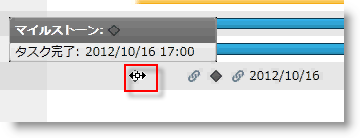

==== 関連トピック:

* link:xamgantt-enabling-disabling-user-interactions.html[ユーザー インタラクションの有効化/無効化]

[[_Ref333339052]]

=== 期限のドラッグ

ユーザーは  _xamGantt_   コントロールのチャート セクションでタスク バーの期限インジケーターをドラッグしてタスクの期限日を変更できます。

この操作は、期限インジケーターを選択して期限インジケーターを左または右に移動する間にマウスの左ボタンを押し続けることによって達成されます。

情報のヒントが現れて、ユーザーがインジケーターを前後にドラッグすると期限がどのように変わるのかを示します。

ESCAPE を使用すると、変更がリセットされ、期限インジケーターを元の位置に戻します。

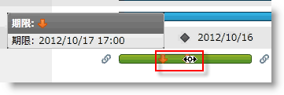

==== 関連トピック:

* link:xamgantt-enabling-disabling-user-interactions.html[ユーザー インタラクションの有効化/無効化]

[[_Ref333339060]]

=== タスク バーのサイズ変更

ユーザーは  _xamGantt_   コントロールのチャート セクションでタスク バーのサイズを変更してタスクの期間を変更できます。

この操作を完了するには、サイズ変更インジケーターが表示されている間にタスク バーの端をクリックします。インジケーターをドラッグする間マウスの左ボタンを押したままにすると、タスク バーのサイズを変更してタスク期間を変更します。

情報のヒントが現れて、ユーザーがタスク バーのサイズを変更するとタスク期間がどのように変わるのかを示します。

デフォルトで、ユーザーは以下のタスク バーのサイズを変更できます。

* 自動スケジュール タスク
* 手動スケジュール タスク
* 手動スケジュール サマリー タスク

注:

[NOTE]
====
サイズ変更操作は構成可能です。詳細は、以下の*関連トピック* セクションを参照してください。
====

ESCAPE を使用すると、変更がリセットされ、タスク バーを元のサイズに戻します。

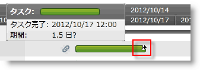

*自動スケジュール タスクのサイズ変更*

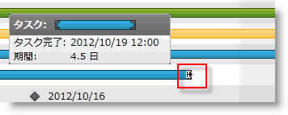

*手動スケジュール タスクのサイズ変更*

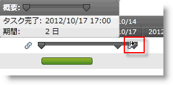

*サマリー タスクのサイズ変更*

==== 関連トピック:

* link:xamgantt-enabling-disabling-user-interactions.html[ユーザー インタラクションの有効化/無効化]

[[_Ref333339077]]

=== プログレス バーのサイズ変更

_xamGantt_   コントロールのチャート セクションでプログレス バーをサイズ変更して、タスクの完了した作業のパーセントを変更できます。

ユーザーは、進行状況のインジケーターが表示される間にタスク バーをクリックすることによってこの操作を実行します。インジケーターをドラッグする間マウスの左ボタンを押したままにすると、パーセンテージで表されるタスクの進行状況が変わります。

情報のヒントが表示して、ユーザーが進行状況バーのサイズを変更したためにタスクの進行状況がどのように変わるのかを示します。

ユーザーはプログレス バーのサイズを変更できます。

* 自動スケジュール タスク
* 手動スケジュール タスク

ESCAPE を使用すると、変更がリセットされ、プログレス バーを元のサイズに戻します。

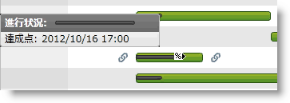

==== 関連トピック:

* link:xamgantt-enabling-disabling-user-interactions.html[ユーザー インタラクションの有効化/無効化]

[[_Ref333339082]]

=== タスク間に依存関係リンクを設定

ユーザーが  _xamGantt_   コントロールのチャート セクションでタスクをリンクできます。

ユーザーは、リンク インジケーターをクリックして矢印を表示することによってこの操作を実行します。矢印を別のタスク バーにドラッグする間マウスの左ボタンを押したままにすると、2 つのタスク間に依存関係が作成されます。

情報のヒントが表示して、依存関係のタイプ (finish-to-start、start-to-start、finish-to-finish または start-to-finish) を表示して 2 つの依存するタスクを識別します。

*ESCAPE* を使用して変更をリセットします。

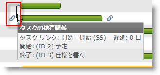

[[_Ref333339088]]

=== コンテキスト メニューを開く

_xamGantt_   コントロールのチャート セクションをマウスで右クリックした後でコンテキスト メニューが表示します。メニュー オプションはユーザーがクリックした要素によって異なります。

2 つのコンテキスト メニューがチャート セクションに表示します。

以下のスクリーンショットは、タスク バーをマウスで右クリックした結果表示するコンテキスト メニューを示します。

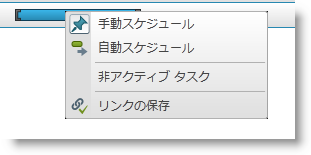

このメニューで使用可能なユーザー操作は以下の通りです。

* 手動スケジュール (タスク モードを手動スケジュールに切り替える)
* 自動スケジュール (タスク モードを自動スケジュールに切り替える)
* 非アクティブなタスク (タスクの状態を切り替える)
* リンクを優先 (依存関係に基づいてタスクの情報を再計算する)

以下のスクリーンショットは、リンクをマウスで右クリックした結果表示するコンテキスト メニューを示します。

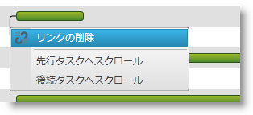

このメニューで使用可能なユーザー操作は以下の通りです。

* リンクを削除 (タスクの依存関係を削除する)
* 先行タスクへスクロール
* 後続タスクへスクロール

*ESCAPE* を使用する、またはメニューの外側をクリックすると、コンテキスト メニューが非表示になります。

[[_Ref333339093]]

=== ヒントを表示

_xamGantt_   コントロールのチャート セクションで異なる要素をホバーまたは操作する時には異なるヒントが表示します。

* マウスをタスク バーにホバー

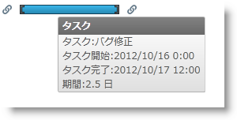

* マウスを依存関係リンクにホバー

image::images/xamGantt_User_Interactions_in_the_Chart_Section_21.png[]

[[_Ref333340104]]
== 関連コンテンツ

[[_Ref333476908]]

=== トピック

このトピックについては、以下のトピックも参照してください。

[options="header", cols="a,a"]
|====
|トピック|目的

| link:xamgantt-xamgantt-user-interactions-in-the-grid-section.html[グリッド セクションにおける xamGantt ユーザー インタラクション]
|このトピックでは、 _xamGantt_ コントロールのグリッド セクションを使用して使用可能なユーザー インタラクションについて説明します。

| link:xamgantt-columns-editing.html[xamGantt 列の編集]
|このトピックでは、 _xamGantt_ コントロールで重要なグリッド列のいくつかで使用可能な編集機能を説明します。

| link:xamgantt-keyboard-support.html[xamGantt のキーボード サポート]
|このトピックでは、 _xamGantt_ コントロールの組み込みキーボード サポート、および関連するキーボード ショートカットを持つユーザー アクションについて説明します。

|====