////

|metadata|
{
    "name": "xamgantt-xamgantt-user-interactions-in-the-grid-section",
    "controlName": ["xamGantt"],
    "tags": ["Getting Started","How Do I"],
    "guid": "8f537a01-e2e6-496d-a18f-082238cf4f1a",  
    "buildFlags": [],
    "createdOn": "2016-05-25T18:21:55.1871578Z"
}
|metadata|
////

= グリッド セクションにおける xamGantt ユーザー インタラクション

== トピックの概要

=== 目的

このトピックでは、 _xamGantt™_   コントロールのグリッド セクションを使用して使用可能なユーザー インタラクションについて説明します。

=== 前提条件

このトピックを理解するためには、以下のトピックを理解しておく必要があります。

[options="header", cols="a,a"]
|====
|トピック|目的

| link:xamgantt-xamgantt-visual-elements.html[xamGantt のビジュアル要素]
|このトピックでは、 _xamGantt_ コントロールのグリッド セクションとチャート セクションのビジュアル要素について紹介します。

|====

=== 本トピックの内容

このトピックには次のセクションがあります。

* <<_Ref333244537, グリッド セクションにおけるユーザー インタラクション >>

** <<_Ref333425337,列の並べ替え>>
** <<_Ref333425341,列の移動>>
** <<_Ref333425346,列の表示>>
** <<_Ref333425352,列の非表示>>
** <<_Ref333425357,列のサイズ変更>>
** <<_Ref333425365,サマリー タスクの展開/縮小>>
** <<_Ref333426323,選択>>
** <<_Ref333483721,タスクの挿入>>
** <<_Ref333483727,タスクの削除>>
** <<_Ref333425372,コンテキスト メニューを開く>>

* <<_Ref335407927, 関連コンテンツ >>

[[_Ref333244537]]
== グリッド セクションにおけるユーザー インタラクション

=== グリッド セクションにおけるユーザー インタラクションの概要

以下の表は、 _xamGantt_   コントロールのグリッド セクションとそのユーザー インタラクションの機能をまとめます。追加の詳細情報はこのトピックの後で説明します。

[options="header", cols="a,a,a,a"]
|====
|目的|方法|詳細|構成方法

|列の並べ替え
|マウス
|並べ替えたい列ヘッダーでマウスの左ボタンをクリックして列の並べ替えを実行します。
|image::images/No.png[]

|列の移動
|マウス
|列ヘッダーを希望の位置にドラッグする間にマウスの左ボタンを押し続けることによって列の移動を実行します。
|image::images/Yes.png[] 

link:xamgantt-enabling-disabling-user-interactions.html[ユーザー インタラクションの有効化/無効化]

|列の表示
|マウス
|コンテキスト メニューを開き表示したい列を選択することによって列の表示を実行します。
|image::images/Yes.png[] 

link:xamgantt-enabling-disabling-user-interactions.html[ユーザー インタラクションの有効化/無効化]

|列を非表示にする
|マウス
|コンテキスト メニューを開き「列の非表示」オプションを選択することによって列の非表示を実行します。
|image::images/Yes.png[] 

link:xamgantt-enabling-disabling-user-interactions.html[ユーザー インタラクションの有効化/無効化]

|列サイズの変更
|マウス
|列ヘッダーの右端または左端を外側にドラッグして拡大する、または内側に移動して列の幅を縮小することによって列サイズの変更を実行します。
|image::images/Yes.png[] 

link:xamgantt-enabling-disabling-user-interactions.html[ユーザー インタラクションの有効化/無効化]

|サマリー タスクの展開/縮小
|マウス 

キーボード
|タスク名の前にあるプラス/マイナスのアイコンをクリックすることでサマリー タスクの展開および縮小を実行します。
|image::images/No.png[]

|選択
|マウス 

キーボード
|ユーザーはセル、行、列の単一選択 (連続選択) または複数選択 (非連続選択) を実行できます。
|image::images/No.png[]

|タスクの挿入
|マウス
|コンテキスト メニューのコマンドによってタスクの挿入を実行します。
|image::images/Yes.png[] 

link:xamgantt-enabling-disabling-user-interactions.html[ユーザー インタラクションの有効化/無効化]

|タスクの削除
|マウス 

キーボード
|コンテキスト メニューのコマンドまたはキーボードの Delete ボタンを使用してタスクの削除を実行します。
|image::images/Yes.png[] 

link:xamgantt-enabling-disabling-user-interactions.html[ユーザー インタラクションの有効化/無効化]

|コンテキスト メニューを開く
|マウス
|さまざまな要素をマウスの右ボタンでクリックすると、さまざまなコマンドを含むコンテキスト メニューを表示されます。
| link:xamgantt-configuring-xamgantt-additional-context-menus.html[xamGantt 追加コンテキスト メニューの構成]

|====

[[_Ref333425337]]

=== 列の並べ替え

ユーザーは、 _xamGantt_   コントロールのグリッド セクションで列を並べ替えることができます。

この操作を実行するには、グリッド セクションの希望の列をクリックして、列ヘッダーでマウスの左ボタンを使用します。並べ替えインジケーターは実行した並べ替えのタイプ (昇順または降順) を表示します。

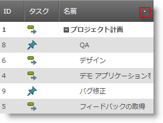

_xamGantt_   コマンドを使用して並べ替えた列を最初の順序にリセットします。

==== 関連トピック:

* link:xamgantt-using-xamgantt-commands.html[コマンドの使用]

[[_Ref333425341]]

=== 列の移動

ユーザーは、 _xamGantt_   コントロールのグリッド セクションで列を移動して位置を変更できます。

この操作を実行するには、列ヘッダーをクリックして列ヘッダーをドラッグする間にマウスの左ボタンを押し続けます。列を配置することができる時はインジケーターが表示します。

列を前の位置に戻すには *ESCAPE* を使用します。

image::images/xamGantt_User_Interactions_in_the_Grid_Section_11.png[]

==== 関連トピック:

* link:xamgantt-enabling-disabling-user-interactions.html[ユーザー インタラクションの有効化/無効化]

[[_Ref333425346]]

=== 列の表示

ユーザーは、グリッド セクションの  _xamGantt_   コントロールのビューに現在表示されている列を表示できます。

この操作を実行するには、列ヘッダー領域でマウスの右ボタンをクリックします。コンテキスト メニューは「列の挿入」オプションとともに表示します。「列の挿入」メニュー項目をホバーすると、表示する列を選択するために使用可能な列のリストが表示します。

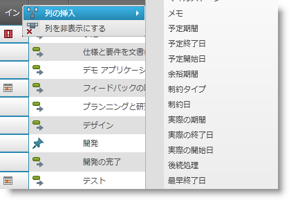

==== 関連トピック:

* link:xamgantt-enabling-disabling-user-interactions.html[ユーザー インタラクションの有効化/無効化]
* link:xamgantt-using-xamgantt-commands.html[xamGantt コマンドの使用]
* link:xamgantt-code-example-creating-view-for-xamgantt-using-custom-classes.html[コード例: カスタム クラスを使用して xamGantt のビューを作成]

[[_Ref333425352]]

=== 列の非表示

ユーザーは、 _xamGantt_   コントロールのグリッド セクションに現在表示されている列を非表示にできます。

この操作を実行するには、列の列ヘッダー領域でマウスの右ボタンをクリックします。コンテキスト メニューは「列の非表示」とともに表示します。このオプションをクリックすると、指定した列を非表示にします。

==== 関連トピック:

* link:xamgantt-enabling-disabling-user-interactions.html[ユーザー インタラクションの有効化/無効化]
* link:xamgantt-using-xamgantt-commands.html[コマンドの使用]

[[_Ref333425357]]

=== 列のサイズ変更

ユーザーは、 _xamGantt_   コントロールのグリッド セクションで列ヘッダーの左端または右端をドラッグすることによって列サイズを変更できます。

列ヘッダーの右端をマウスでダブル クリックすると、最大コンテンツの幅に列サイズを変更します。

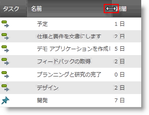

==== 関連トピック:

* link:xamgantt-enabling-disabling-user-interactions.html[ユーザー インタラクションの有効化/無効化]

[[_Ref333425365]]

=== サマリー タスクの展開/縮小

ユーザーは、 _xamGantt_   コントロールのグリッド セクションでサマリー タスクを展開/縮小できます。

この操作を実行するには、サマリー タスク名の前にあるプラス/マイナスのアイコンをクリックします。

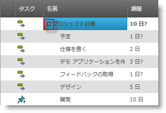

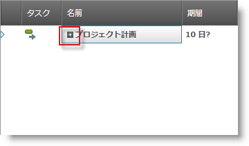

サマリー タスクの展開/縮小は、以下のキーボード ショートカットを使用して実行することもできます。

* 展開 - Alt + Shift + Plus
* 縮小 - Alt + Shift + Minus

==== 関連トピック:

* link:xamgantt-keyboard-support.html[xamGantt のキーボード サポート]

[[_Ref333426323]]

=== 選択

ユーザーは、 _xamGantt_   コントロールのグリッド セクションで行、列またはセルを選択することができます。

これを実行するには、マウス、キーボードのいずれかまたは両方を使用します。

単一要素選択を実行するには:

* セルをクリックしてセルを選択
* 行セレクターをクリックして、行を選択
* 列ヘッダーをクリックして列を選択

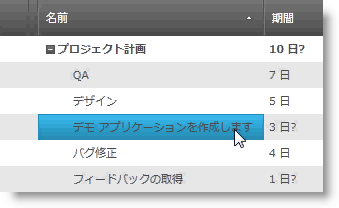

*セルの選択*

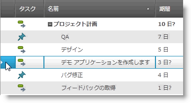

*行の選択*

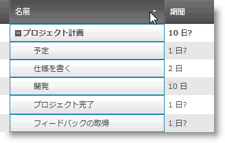

*列の選択*

複数要素の選択を実行するには以下を使用します:

* 複数の連続選択の場合は SHIFT キーを押しながらマウスをクリックします。

* 複数の非連続選択の場合は CTRL キーを押しながらマウスをクリックします。

==== 関連トピック:

* link:xamgantt-keyboard-support.html[xamGantt のキーボード サポート]

[[_Ref333483721]]

=== タスクの挿入

ユーザーは、 _xamGantt_   コントロールのグリッド セクションで新しいタスクを挿入することができます。

この操作を実行するには、グリッド領域をマウスで右クリックして、コンテキスト メニューを開きいくつかの使用可能なオプションを選択します。

目的

* 現在選択されているタスクの下に新しい兄弟タスクを追加します。

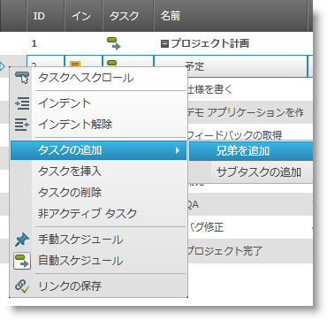

* 現在選択されているタスクに新しい子タスクを追加します。

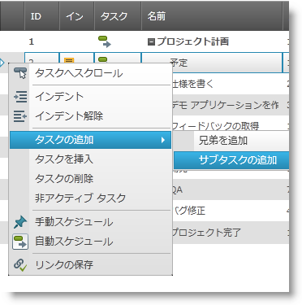

* 現在選択されているタスクの上に新しいタスクを挿入します。

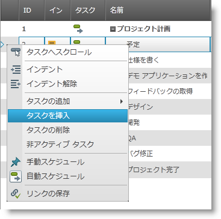

==== 関連トピック:

* link:xamgantt-enabling-disabling-user-interactions.html[ユーザー インタラクションの有効化/無効化]
* link:xamgantt-using-xamgantt-commands.html[コマンドの使用]

[[_Ref333483727]]

=== タスクの削除

ユーザーは、 _xamGantt_   コントロールのグリッド セクションでタスクを削除することができます。

この操作は以下によって実行します。

* グリッド領域をマウスで右クリックしてコンテキスト メニューを開き、「タスクの削除」を選択します。

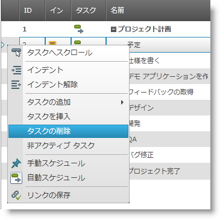

* 行を選択して *Delete* キーボード ボタンを使用します。

==== 関連トピック:

* link:xamgantt-enabling-disabling-user-interactions.html[ユーザー インタラクションの有効化/無効化]
* link:xamgantt-using-xamgantt-commands.html[コマンドの使用]

[[_Ref333425372]]

=== コンテキスト メニューを開く

マウスの右クリック イベントの後で  _xamGantt_   コントロールのグリッド セクションにコンテキスト メニューが表示します。メニュー オプションはユーザーがクリックした要素によって異なります。

いくつかのコンテキスト メニューはグリッド セクションの異なる領域に表示します。

以下のスクリーンショットは、 _xamGantt_   グリッドの左上角をマウスで右クリックした後に表示するコンテキスト メニューを示します。

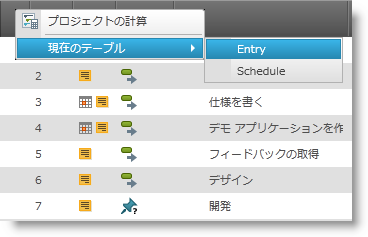

このメニューで使用可能なユーザー操作は以下の通りです。

* プロジェクトの計算 (プロジェクト計算を実行)
* 現在のテーブル (現在のテーブル ビューを変更)

** 入力 (テーブル ビュー)
** スケジュール (テーブル ビュー)

以下のスクリーンショットは、列ヘッダー領域をマウスで右クリックした後に表示するコンテキスト メニューを示します。

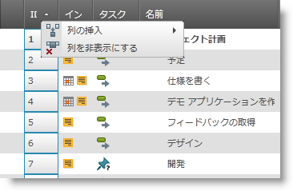

このメニューで使用可能なユーザー操作は以下の通りです。

* 列の挿入
* 列を非表示にする

以下のスクリーンショットは、マウスで右クリックした後に表示するコンテキスト メニューを示します。

* 選択された行
* 行セレクター
* 選択されたセル

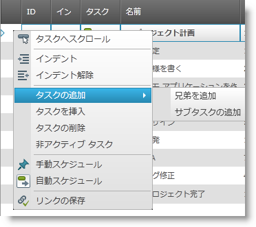

このメニューで使用可能なユーザー操作は以下の通りです。

* タスクへスクロール
* インデント
* アウトデント
* タスクの追加

** 兄弟の追加
** サブタスクの追加

* タスクの挿入
* タスクの削除
* 非アクティブ タスク
* 手動でスケジュール
* スケジュールの追加
* リンクを優先

以下のスクリーンショットは、空のグリッド セクションをマウスで右クリックした後に表示するコンテキスト メニューを示します。

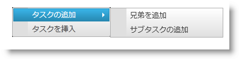

このメニューで使用可能なユーザー操作は以下の通りです。

* タスクの追加

** 兄弟の追加
** サブタスクの追加

* タスクの挿入

*ESCAPE* を使用する、またはコンテキスト メニューを非表示にするためにメニューの外側をクリックする。

[[_Ref335407927]]

== 関連コンテンツ

=== トピック

このトピックについては、以下のトピックも参照してください。

[options="header", cols="a,a"]
|====
|トピック|目的

| link:xamgantt-xamgantt-user-interactions-in-the-chart-section.html[チャート セクションにおける xamGantt ユーザー インタラクション]
|このトピックでは、 _xamGantt_ コントロールのチャート セクションで実行できるユーザー インタラクションについて解説します。

| link:xamgantt-columns-editing.html[xamGantt 列の編集]
|このトピックは、 _xamGantt_ コントロールで重要なグリッド列のいくつかで使用可能な編集機能を説明します。

| link:xamgantt-keyboard-support.html[xamGantt のキーボード サポート]
|このトピックでは、 _xamGantt_ コントロールの組み込みキーボード サポートについて説明し、および関連するキーボード ショートカットを持つユーザー アクションをリストします。

|====