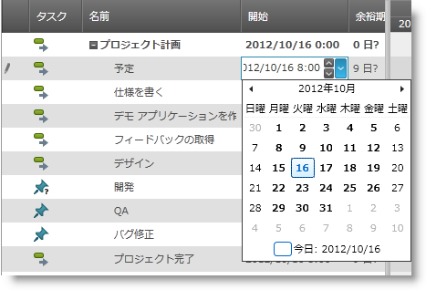

////

|metadata|
{
    "name": "xamgantt-xamgantt-visual-elements-in-the-grid-section",
    "controlName": ["xamGantt"],
    "tags": ["Data Presentation"],
    "guid": "0ced2bdf-65dc-41fc-aa7c-c5961d8dc137",  
    "buildFlags": [],
    "createdOn": "2016-05-25T18:21:55.5801773Z"
}
|metadata|
////

= xamGantt グリッド セクションにおけるビジュアル要素

== トピックの概要

=== 目的

このトピックでは、 _xamGantt™_   コントロールのグリッド セクションのビジュアル要素について紹介します。

=== 本トピックの内容

このトピックには次のセクションがあります。

* <<_Ref335676321, グリッド セクションのビジュアル要素と関連クラスおよびプロパティ >>
* <<_Ref335749471, 使用可能なグリッド列と関連プロジェクト タスク プロパティ >>
* <<_Ref335749478, タスク インジケーター >>
* <<_Ref335749482, 関連コンテンツ >>

[[_Ref335676321]]
== グリッド セクションのビジュアル要素と関連クラスおよびプロパティ

=== ビジュアル要素の概要

以下のスクリーンショットは、 _xamGantt_ コントロールのグリッド セクションのビジュアル要素を示しています。構成可能な要素のリストは画像の後に示します。

**設定可能なビジュアル要素:*

* 表
* 列
* タスク

=== ビジュアル要素と関連プロパティ

以下の表は、 _xamGantt_   コントロールのグリッド セクションのビジュアル要素を対応するクラスにマップします。

[options="header", cols="a,a,a,a"]
|====
|ビジュアル要素|クラス|プロパティ|詳細

|表
| link:{ApiPlatform}controls.schedules.xamgantt{ApiVersion}~infragistics.controls.schedules.projecttable_members.html[ProjectTable]
| link:{ApiPlatform}controls.schedules.xamgantt{ApiVersion}~infragistics.controls.schedules.xamgantt_members.html[XamGantt]. link:{ApiPlatform}controls.schedules.xamgantt{ApiVersion}~infragistics.controls.schedules.xamgantt~table.html[Table]
|`ProjectTable` クラスは、 _xamGantt_ コントロールのグリッド セクションの表示された列を記述します。

|列
| link:{ApiPlatform}controls.schedules.xamgantt{ApiVersion}~infragistics.controls.schedules.projectcolumn_members.html[ProjectColumn]
| link:{ApiPlatform}controls.schedules.xamgantt{ApiVersion}~infragistics.controls.schedules.projecttable_members.html[ProjectTable]. link:{ApiPlatform}controls.schedules.xamgantt{ApiVersion}~infragistics.controls.schedules.projecttable~columns.html[Columns]
|`ProjectColumn` は `ProjectTable` の列を表します。

|列の設定
| link:{ApiPlatform}controls.schedules.xamgantt{ApiVersion}~infragistics.controls.schedules.projectcolumnsettings_members.html[ProjectColumnSettings]
| link:{ApiPlatform}controls.schedules.xamgantt{ApiVersion}~infragistics.controls.schedules.projectcolumn_members.html[ProjectColumn]. link:{ApiPlatform}controls.schedules.xamgantt{ApiVersion}~infragistics.controls.schedules.projectcolumn~settings.html[Settings]
|`ProjectColumnSettings` は `ProjectColumn` 設定を構成するためのオプションを提供します。

|タスク
| link:{ApiPlatform}controls.schedules.xamgantt{ApiVersion}~infragistics.controls.schedules.projecttask_members.html[ProjectTask]
| link:{ApiPlatform}controls.schedules.xamgantt{ApiVersion}~infragistics.controls.schedules.project_members.html[Project]. link:{ApiPlatform}controls.schedules.xamgantt{ApiVersion}~infragistics.controls.schedules.project_members.html[RootTask]. link:{ApiPlatform}controls.schedules.xamgantt{ApiVersion}~infragistics.controls.schedules.projecttask~tasks.html[Tasks]
|`ProjectTask` はプロジェクト内の単一タスクを表します。

|====

[[_Ref335749471]]
== 使用可能なグリッド列と関連プロジェクト タスク プロパティ

=== 使用可能なグリッド列の概要

[options="header", cols="a,a"]
|====
|グリッドの列名|対応する ProjectTask プロパティ

|ID
| link:{ApiPlatform}controls.schedules.xamgantt{ApiVersion}~infragistics.controls.schedules.projecttask~id.html[ID]

|インジケーター
|以下の<<_Ref335744520,タスク インジケーターの概要>>を参照してください。

|タスク モード
| link:{ApiPlatform}controls.schedules.xamgantt{ApiVersion}~infragistics.controls.schedules.projecttask~ismanual.html[IsManual]

|名前
| link:{ApiPlatform}controls.schedules.xamgantt{ApiVersion}~infragistics.controls.schedules.projecttask~taskname.html[TaskName]

|期間
| link:{ApiPlatform}controls.schedules.xamgantt{ApiVersion}~infragistics.controls.schedules.projecttask~manualduration.html[ManualDuration]

|開始日
| link:{ApiPlatform}controls.schedules.xamgantt{ApiVersion}~infragistics.controls.schedules.projecttask~manualstart.html[ManualStart]

|完了日
| link:{ApiPlatform}controls.schedules.xamgantt{ApiVersion}~infragistics.controls.schedules.projecttask~manualfinish.html[ManualFinish]

|先行処理
| link:{ApiPlatform}controls.schedules.xamgantt{ApiVersion}~infragistics.controls.schedules.projecttask~predecessorsidtext.html[PredecessorsIdText]

|リソース名
| link:{ApiPlatform}controls.schedules.xamgantt{ApiVersion}~infragistics.controls.schedules.projecttask~resourcestext.html[ResourcesText]

|達成率
| link:{ApiPlatform}controls.schedules.xamgantt{ApiVersion}~infragistics.controls.schedules.projecttask~percentcomplete.html[PercentComplete]

|現在
| link:{ApiPlatform}controls.schedules.xamgantt{ApiVersion}~infragistics.controls.schedules.projecttask~isactive.html[IsActive]

|実際の期間
| link:{ApiPlatform}controls.schedules.xamgantt{ApiVersion}~infragistics.controls.schedules.projecttask~actualduration.html[ActualDuration]

|実際の終了日
| link:{ApiPlatform}controls.schedules.xamgantt{ApiVersion}~infragistics.controls.schedules.projecttask~actualfinish.html[ActualFinish]

|実際の開始日
| link:{ApiPlatform}controls.schedules.xamgantt{ApiVersion}~infragistics.controls.schedules.projecttask~actualstart.html[ActualStart]

|達成点
| link:{ApiPlatform}controls.schedules.xamgantt{ApiVersion}~infragistics.controls.schedules.projecttask~completethrough.html[CompleteThrough]

|制約日
| link:{ApiPlatform}controls.schedules.xamgantt{ApiVersion}~infragistics.controls.schedules.projecttask~constraintdate.html[ConstraintDate]

|制約タイプ
| link:{ApiPlatform}controls.schedules.xamgantt{ApiVersion}~infragistics.controls.schedules.projecttask~constrainttype.html[ConstraintType]

|クリティカル
| link:{ApiPlatform}controls.schedules.xamgantt{ApiVersion}~infragistics.controls.schedules.projecttask~iscritical.html[IsCritical]

|期限
| link:{ApiPlatform}controls.schedules.xamgantt{ApiVersion}~infragistics.controls.schedules.projecttask~deadline.html[Deadline]

|最早終了日
| link:{ApiPlatform}controls.schedules.xamgantt{ApiVersion}~infragistics.controls.schedules.projecttask~earlyfinish.html[EarlyFinish]

|最早開始
| link:{ApiPlatform}controls.schedules.xamgantt{ApiVersion}~infragistics.controls.schedules.projecttask~earlystart.html[EarlyStart]

|見積もり
| link:{ApiPlatform}controls.schedules.xamgantt{ApiVersion}~infragistics.controls.schedules.iprojecttask~isestimated.html[IsEstimated]

|終了余裕期間
| link:{ApiPlatform}controls.schedules.xamgantt{ApiVersion}~infragistics.controls.schedules.projecttask~finishslack.html[FinishSlack]

|余裕期間
| link:{ApiPlatform}controls.schedules.xamgantt{ApiVersion}~infragistics.controls.schedules.projecttask~freeslack.html[FreeSlack]

|バーの非表示
| link:{ApiPlatform}controls.schedules.xamgantt{ApiVersion}~infragistics.controls.schedules.projecttask~isbarhidden.html[IsBarHidden]

|最遅終了日
| link:{ApiPlatform}controls.schedules.xamgantt{ApiVersion}~infragistics.controls.schedules.projecttask~latefinish.html[LateFinish]

|最遅開始日
| link:{ApiPlatform}controls.schedules.xamgantt{ApiVersion}~infragistics.controls.schedules.projecttask~latestart.html[LateStart]

|マーク付き
| link:{ApiPlatform}controls.schedules.xamgantt{ApiVersion}~infragistics.controls.schedules.projecttask~ismarked.html[IsMarked]

|マイルストーン
| link:{ApiPlatform}controls.schedules.xamgantt{ApiVersion}~infragistics.controls.schedules.projecttask~ismilestone.html[IsMilestone]

|メモ
| link:{ApiPlatform}controls.schedules.xamgantt{ApiVersion}~infragistics.controls.schedules.projecttask~notes.html[Notes]

|アウトライン レベル
| link:{ApiPlatform}controls.schedules.xamgantt{ApiVersion}~infragistics.controls.schedules.projecttask~outlinelevel.html[OutlineLevel]

|プレースホルダー
| link:{ApiPlatform}controls.schedules.xamgantt{ApiVersion}~infragistics.controls.schedules.projecttask~isplaceholder.html[IsPlaceholder]

|残り期間
| link:{ApiPlatform}controls.schedules.xamgantt{ApiVersion}~infragistics.controls.schedules.projecttask~remainingduration.html[RemainingDuration]

|予定期間
| link:{ApiPlatform}controls.schedules.xamgantt{ApiVersion}~infragistics.controls.schedules.projecttask~scheduledduration.html[ScheduledDuration]

|予定終了日
| link:{ApiPlatform}controls.schedules.xamgantt{ApiVersion}~infragistics.controls.schedules.projecttask~scheduledfinish.html[ScheduledFinish]

|予定開始日
| link:{ApiPlatform}controls.schedules.xamgantt{ApiVersion}~infragistics.controls.schedules.projecttask~scheduledstart.html[ScheduledStart]

|開始余裕期間
| link:{ApiPlatform}controls.schedules.xamgantt{ApiVersion}~infragistics.controls.schedules.projecttask~startslack.html[StartSlack]

|後続処理
| link:{ApiPlatform}controls.schedules.xamgantt{ApiVersion}~infragistics.controls.schedules.projecttask~successorsidtext.html[SuccessorsIdText]

|概要
| link:{ApiPlatform}controls.schedules.xamgantt{ApiVersion}~infragistics.controls.schedules.projecttask~issummary.html[IsSummary]

|総余裕期間
| link:{ApiPlatform}controls.schedules.xamgantt{ApiVersion}~infragistics.controls.schedules.projecttask~totalslack.html[TotalSlack]

|====

[[_Ref335749478]]
== タスク インジケーター

[[_Ref335744520]]

=== タスク インジケーターの概要

_xamGantt_ コントロールのグリッドの *Indicators* 列には対応する ProjectTask プロパティがありません。

この列はタスクの状態を反映し、インジケーターを表示します (追加情報を提供するヒントとともに)。この列のセルには以下のインジケーターが 1 つまたは複数表示される場合があります。

以下の表に画像とインジケーターの説明をリストします。

[options="header", cols="a,a,a"]
|====
|画像|インジケーター タイプ|説明

|image:images/xamGantt_indicator_inflexibleConstraint.png[]
|強い制約
|このタイプの制約は「指定日に開始」などの強い制約です。 

.注: 
[NOTE] 
==== 
このインジケーターは自動スケジュール タスクのみに表示します。 
====

|image:images/xamGantt_indicator_flexibleConstraint.png[]
|弱い制約
|この制約のタイプは開始からスケジュールされたプロジェクトの「指定日以後に開始」などの弱い制約です。 

注: 

[NOTE] 

==== 

このインジケーターは自動スケジュールのタスクのみに表示します。 

====

|image:images/xamGantt_indicator_constraintViolation.png[]
|制約違反
|制約基準を満たすことができません (タスクの制約タイプと制約日)。 

注: 

[NOTE] 

==== 

このインジケーターは自動スケジュール タスクのみに表示します。 

====

|image:images/xamGantt_indicator_note.png[]
|注:
|タスクにメモが含まれます。

|image:images/xamGantt_indicator_deadline.png[]
|期限
|タスクは期限を超えました。

|image:images/xamGantt_indicator_completed.png[]
|完了
|進行状況が 100% の完了タスク

|====

[[_Ref335749482]]
== 関連コンテンツ

=== トピック

このトピックについては、以下のトピックも参照してください。

[options="header", cols="a,a"]
|====
|トピック|目的

| link:xamgantt-xamgantt-visual-elements-overview.html[xamGantt のビジュアル要素の概要]
|このトピックは、 _xamGantt_ コントロールの主要なビジュアル要素の概要です。

| link:xamgantt-xamgantt-visual-elements-in-the-chart-section.html[チャート セクションにおける xamGantt ビジュアル要素]
|このトピックでは、 _xamGantt™_ コントロールのチャート セクションのビジュアル要素について紹介します。

|====