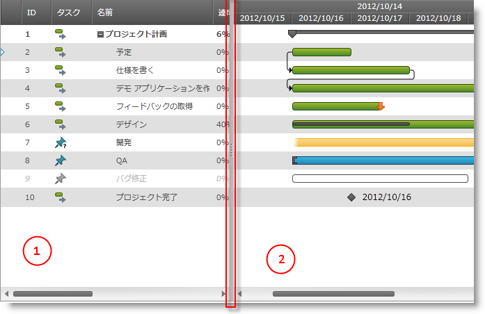

////

|metadata|
{
    "name": "xamgantt-xamgantt-visual-elements-overview",
    "controlName": ["xamGantt"],
    "tags": ["Data Presentation"],
    "guid": "6c71f25f-b3a3-4f3c-841c-37c3513beeff",  
    "buildFlags": [],
    "createdOn": "2016-05-25T18:21:55.5741415Z"
}
|metadata|
////

= xamGantt のビジュアル要素の概要

== トピックの概要

=== 目的

このトピックでは、 _xamGantt™_   コントロールの主要なビジュアル要素を説明します。

=== 本トピックの内容

このトピックには次のセクションがあります。

* <<_Ref333496014, xamGantt コントロールのビジュアル要素 >>
* <<_Ref333512375, 関連コンテンツ >>

[[_Ref333496014]]
== xamGantt コントロールのビジュアル要素

=== ビジュアル要素の概要

以下のスクリーンショットは、 _xamGantt_   コントロールの主要なビジュアル要素を示しています。

*_xamGantt_*  の主要なビジュアル要素:

* グリッド セクション (セクション 1)
* グリッド セクション (セクション 2)
* スプリッター

[[_Ref333512375]]
== 関連コンテンツ

=== トピック

このトピックについては、以下のトピックも参照してください。

[options="header", cols="a,a"]
|====
|トピック|目的

| link:xamgantt-xamgantt-visual-elements-in-the-grid-section.html[グリッド セクションにおける xamGantt ビジュアル要素]
|このトピックでは、 _xamGantt_ コントロールのグリッド セクションのビジュアル要素について紹介します。

| link:xamgantt-xamgantt-visual-elements-in-the-chart-section.html[チャート セクションにおける xamGantt ビジュアル要素]
|このトピックでは、 _xamGantt™_ コントロールのチャート セクションのビジュアル要素について紹介します。

|====