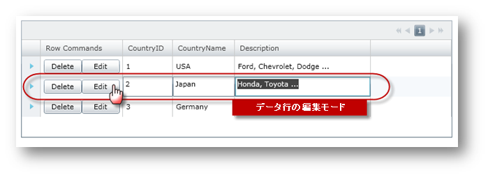

////

|metadata|
{
    "name": "xamgrid-add-row-commands",
    "controlName": ["xamGrid"],
    "tags": ["Grids","How Do I"],
    "guid": "{D1D2F1AD-ECA5-4237-89E9-A6165AC451D7}",  
    "buildFlags": [],
    "createdOn": "2016-05-25T18:21:56.100208Z"
}
|metadata|
////

{XamGridHeader}

= 行コマンドの追加

xamGrid コントロールによってグリッドの各行に行コマンドを追加できます。xamGrid のテンプレート列を使用して、2 つのボタン コントロールを追加します。その Click イベントは xamGrid コントロールの link:{ApiPlatform}controls.grids.xamgrid{ApiVersion}~infragistics.controls.grids.xamgridrowcommandsource.html[xamGridRowCommandSource] プロパティを使用して、Delete 行および Edit 行コマンドにマップされます。以下の表は、使用可能な link:{ApiPlatform}controls.grids.xamgrid{ApiVersion}~infragistics.controls.grids.xamgridrowcommand.html[xamGridRowCommand] 値を示します。

[options="header", cols="a,a"]
|====
|xamGirdRowCommand|説明

| link:{ApiPlatform}controls.grids.xamgrid{ApiVersion}~infragistics.controls.grids.xamgridrowcommand.html[Delete]
|行を削除します。

| link:{ApiPlatform}controls.grids.xamgrid{ApiVersion}~infragistics.controls.grids.xamgridrowcommand.html[Edit]
|行を編集モードにします。

| link:{ApiPlatform}controls.grids.xamgrid{ApiVersion}~infragistics.controls.grids.xamgridrowcommand.html[Collapse]
|行を縮小します。

| link:{ApiPlatform}controls.grids.xamgrid{ApiVersion}~infragistics.controls.grids.xamgridrowcommand.html[Expand]
|行を展開します。

|====

以下のコードは、テンプレート列を使用して xamGrid で各行に Delete 行コマンドと Edit 行コマンドがマップされたボタンを表示する方法を示します。

[NOTE]
====
*注:* このコードは「データ バインディング」トピックで説明されるカスタム データへのデータ バインディングを使用しています。
====

*XAML の場合:*

----
xmlns:ig="http://schemas.infragistics.com/xaml"
...
<ig:XamGrid x:Name="xamGrid" Margin="20"  
   ItemsSource="{Binding Source={StaticResource DataToolCars}, Path=CountryCarMakers}">
   <ig:XamGrid.PagerSettings>
      <ig:PagerSettings AllowPaging="Top" PageSize="8" 
   </ig:XamGrid.PagerSettings>
   <ig:XamGrid.Columns>
      <!-- TODO: Row コマンドで Unbound Column オブジェクトを追加します -->
      <ig:UnboundColumn Key="Row Commands" HorizontalContentAlignment="Center">
         <ig:UnboundColumn.ItemTemplate>
            <DataTemplate>
               <!-- Row コマンドにマップされたコントロールで StackPanel を追加します -->
               <StackPanel Orientation="Horizontal"  >
                  <Button Content="Delete" Width="60" >
                     <ig:Commanding.Command>
                        <ig:XamGridRowCommandSource EventName="Click" 
                                                           CommandType="Delete">
                        </ig:XamGridRowCommandSource>
                     </ig:Commanding.Command>
                  </Button>
                  <Button Content="Edit" Width="60" >
                     <ig:Commanding.Command>
                        <ig:XamGridRowCommandSource EventName="Click" 
                                                           CommandType="Edit">
                        </ig:XamGridRowCommandSource>
                     </ig:Commanding.Command>
                  </Button>
               </StackPanel>
            </DataTemplate>
         </ig:UnboundColumn.ItemTemplate>
      </ig:UnboundColumn>
   </ig:XamGrid.Columns>
</ig:XamGrid>
----

以下の画像は、各データ行に Delete 行コマンドと Edit 行コマンドがマップされた 2 つのボタンが付いた xamGrid を示します。

ifdef::sl,wpf[]

endif::sl,wpf[]

ifdef::win-rt[]
image::images/RT_xamGrid_Add_Row_Commands_01.png[]
endif::win-rt[]

== 関連トピック

link:xamgrid-add-new-row.html[新規行の追加]

link:xamgrid-auto-expand-data-rows-and-child-bands.html[データ行と子バンドの自動展開]

link:xamgrid-change-row-hover-type.html[行ホバー タイプの変更]

link:xamgrid-remove-alternative-row-styling.html[代替え行スタイリングの削除]

link:xamgrid-row-deletion.html[行の削除]