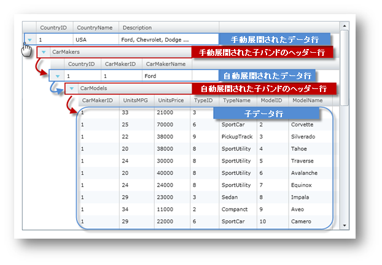

////

|metadata|
{
    "name": "xamgrid-auto-expand-data-rows-and-child-bands",
    "controlName": ["xamGrid"],
    "tags": ["Editing","Grids","How Do I"],
    "guid": "{D2398252-D308-4341-A9EB-0C013292223D}",  
    "buildFlags": [],
    "createdOn": "2016-05-25T18:21:56.1062087Z"
}
|metadata|
////

{XamGridHeader}

= データ行と子バンドの自動展開

== 始める前に

このセクションは、データ行および xamGrid コントロールの子バンド ヘッダー行を自動展開する方法を示します。

== 達成すること

xamGrid コントロールでは、 link:{ApiPlatform}controls.grids.xamgrid{ApiVersion}~infragistics.controls.grids.primitives.expandablerowbase~isexpanded.html[IsExpanded] プロパティを True に設定することによって、データ行および ChildBand ヘッダー行を自動展開することができます。このトピックでは、xamGrid コントロールの link:{ApiPlatform}controls.grids.xamgrid{ApiVersion}~infragistics.controls.grids.xamgrid~rowexpansionchanged_ev.html[RowExpansionChanged] イベントを使用して、データ行および ChildBand ヘッダー行を自動展開する方法を示します。

ifdef::sl,wpf[]

endif::sl,wpf[]

ifdef::win-rt[]
image::images/RT_xamGrid_Auto_Expand_Data_Rows_and_Child_Bands_01.png[]
endif::win-rt[]

ifdef::win-rt[]
[start=1]
. 手動展開されたデータ行
[start=2]
. 自動展開された子バンドのヘッダー行

endif::win-rt[]

== 以下の手順を実行します。

以下のコードは、xamGrid コントロールに {PlatformName} プロジェクトを設定する方法を知っていることを前提とします。

[start=1]
. 以下の名前空間宣言を追加します。

ifdef::wpf[]

*XAML の場合:*

----
xmlns:ig="http://schemas.infragistics.com/xaml"
----

endif::wpf[]

*Visual Basic の場合:*

----
Imports Infragistics.Controls.Grids
  Imports Infragistics.Controls.Grids.Primitives
----

*C# の場合:*

----
using Infragistics.Controls.Grids;
  using Infragistics.Controls.Grids.Primitives;
----

[start=2]
. RowExpansionChanged イベントのイベント ハンドラーとともに、xamGrid コントロールを追加し､コントロールの link:{ApiPlatform}controls.grids.xamgrid{ApiVersion}~infragistics.controls.grids.columnlayoutheadervisibility.html[ColumnLayoutHeaderVisibility] プロパティを Always に設定します。

[NOTE]
====
*注:* このコードは、データ バインディング トピックで詳述されているカスタム データへのデータ バインディングを使用しています。
====

*XAML の場合:*

----
<ig:XamGrid x:Name="xamGrid" ColumnLayoutHeaderVisibility="Always"
    RowExpansionChanged="xamGrid_RowExpansionChanged"
    ItemsSource="{Binding Source={StaticResource DataUtil}, Path=CategoriesAndProducts}" />
----

*Visual Basic の場合:*

----
Private xamGrid As XamGrid
    ' ...
    InitializeComponent()
    ' ...
    xamGrid = New XamGrid()
    xamGrid.ColumnLayoutHeaderVisibility = ColumnLayoutHeaderVisibility.Always
    xamGrid.ItemsSource = DataUtil.CategoriesAndProducts
    AddHandler xamGrid.RowExpansionChanged, AddressOf xamGrid_RowExpansionChanged
    Me.LayoutRoot.Children.Add(xamGrid)
----

*C# の場合:*

----
private XamGrid xamGrid;
    //...
    InitializeComponent();
    // ...
    xamGrid = new XamGrid();
    xamGrid.ColumnLayoutHeaderVisibility = ColumnLayoutHeaderVisibility.Always;
    xamGrid.RowExpansionChanged += xamGrid_RowExpansionChanged;
    xamGrid.ItemsSource = DataUtil.CategoriesAndProducts;
    this.LayoutRoot.Children.Add(xamGrid);
----

[start=3]
. Row オブジェクトを自動展開するために以下のメソッドを追加します。

*Visual Basic の場合:*

----
Private Sub AutoExpandAllChildRows(ByVal parentRow As Row)
   For Each cb As ChildBand In parentRow.ChildBands
      cb.IsExpanded = True
      If cb.HasChildren Then
         AutoExpandAllChildBands(cb)
      End If
   Next
End Sub
----

*C# の場合:*

----
private void AutoExpandAllChildRows(Row parentRow)
{
   foreach (ChildBand cb in parentRow.ChildBands)
   {
      cb.IsExpanded = true;
      if (cb.HasChildren)
         AutoExpandAllChildBands(cb);
    }
}
----

[start=4]
. ChildBand オブジェクトを自動展開するために以下のメソッドを追加します。

*Visual Basic の場合:*

----
Private Sub AutoExpandAllChildBands(ByVal parentBand As ChildBand)
   For Each r As Row In parentBand.Rows
      r.IsExpanded = True
      If r.HasChildren Then
         AutoExpandAllChildRows(r)
      End If
   Next
End Sub
----

*C# の場合:*

----
private void AutoExpandAllChildBands(ChildBand parentBand)
{
   foreach (Row r in parentBand.Rows)
   {
      r.IsExpanded = true;
      if (r.HasChildren)
         AutoExpandAllChildRows(r);
   }
}
----

[start=5]
. Boolean AutoExpanding フラグを追加して、xamGrid コントロールの RowExpansionChanged イベントのイベント ハンドラーを実装します。

*Visual Basic の場合:*

----
Private AutoExpanding As Boolean = False
' ...
Private Sub xamGrid_RowExpansionChanged(ByVal sender As System.Object, ByVal e As RowExpansionChangedEventArgs)
   If Not AutoExpanding Then
      ' 親行が展開される場合に限り子行を展開します。
      If e.Row.IsExpanded Then
         AutoExpanding = True
         If (e.Row.RowType = RowType.DataRow) Then
            AutoExpandAllChildRows(TryCast(e.Row, Row))
         End If
         If (e.Row.RowType = RowType.ColumnLayoutHeaderRow) Then
            AutoExpandAllChildBands(TryCast(e.Row, ChildBand))
         End If
         AutoExpanding = False
      End If
   End If
End Sub
----

*C# の場合:*

----
private bool AutoExpanding = false;
// ...
private void xamGrid_RowExpansionChanged(object sender, RowExpansionChangedEventArgs e)
{
   if (!AutoExpanding)
   {    
      // 親行が展開される場合に限り子行を展開します。
      if (e.Row.IsExpanded)
      {
         AutoExpanding = true;
         if (e.Row.RowType == RowType.DataRow)
            AutoExpandAllChildRows((Row)e.Row);
         if (e.Row.RowType == RowType.ColumnLayoutHeaderRow)
            AutoExpandAllChildBands((ChildBand)e.Row);
         AutoExpanding = false;
      }
   }
}
----

[start=6]
. アプリケーションを実行します。RowExpansionChanged イベントが発生すると必ず、xamGrid コントロールのすべての子行および ChildBand が自動展開します。

== 関連トピック

link:xamgrid-add-new-row.html[新規行の追加]

link:xamgrid-add-row-commands.html[行コマンドの追加]

link:xamgrid-change-row-hover-type.html[行ホバー タイプの変更]

link:xamgrid-remove-alternative-row-styling.html[代替え行スタイリングの削除]

link:xamgrid-row-deletion.html[行の削除]