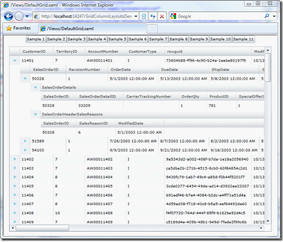

////

|metadata|
{
    "name": "xamgrid-auto-generate-columns",
    "controlName": ["xamGrid"],
    "tags": ["Data Binding","Grids","How Do I"],
    "guid": "3c21bdb0-92ba-48c7-b4fc-bee3c8395013",  
    "buildFlags": [],
    "createdOn": "2016-05-25T18:21:56.2881807Z"
}
|metadata|
////

{XamGridHeader}

= 列の自動生成

ColumnLayout オブジェクトを生成するためのデフォルトおよび最もシンプルな方法は、ユーザーに代わってコントロールにこの作業を実行させることです。これを確認するために実行する必要があるのはコントロールで link:{ApiPlatform}controls.grids.xamgrid{ApiVersion}~infragistics.controls.grids.xamgrid~itemssource.html[ItemsSource] プロパティを設定することだけです。

*Visual Basic の場合:*

----
Me.xamGrid1.ItemsSource = e.Result
----

*C# の場合:*

----
this.xamGrid1.ItemsSource = e.Result;
----

ifdef::sl,wpf[]

endif::sl,wpf[]

ifdef::win-rt[]
image::images/RT_xamGrid_Define_Column_Layout_01.png[]
endif::win-rt[]

xamGrid がデータ オブジェクトのすべてのパブリック プロパティを表示し、関連するコレクションおよび追加された子列レイアウトにデータが存在することが自動的にわかることを確認できます。デフォルトでは、xamGrid は IEnumerable を実装するタイプを公開するプロパティを子 ColumnLayout オブジェクトとして扱います。

もちろん、 link:{ApiPlatform}controls.grids.xamgrid{ApiVersion}~infragistics.controls.grids.xamgrid~autogeneratecolumns.html[AutoGenerateColumns] プロパティを False に設定することで、列の自動生成を無効にすることもできます。

*XAML の場合:*

----
<ig:XamGrid x:Name="xamGrid1" AutoGenerateColumns="False" />
----

自動生成されるすべての列に対して ColumnAutoGenerated イベントが発生します。これを使って列プロパティを変更したり、列が xamGrid コントロールに追加されるのを防いだりすることができます。

[options="header", cols="a,a,a"]
|====
|イベント|Event Argument|説明

| link:{ApiPlatform}controls.grids.xamgrid{ApiVersion}~infragistics.controls.grids.xamgrid~columnautogenerated_ev.html[ColumnAutoGenerated]
| link:{ApiPlatform}controls.grids.xamgrid{ApiVersion}~infragistics.controls.grids.columnautogeneratedeventargs.html[ColumnAutoGeneratedEventArgs]
|自動生成されるすべての列に対してこのイベントが発生します。この引数は link:{ApiPlatform}controls.grids.xamgrid{ApiVersion}~infragistics.controls.grids.column.html[Column]オブジェクトへの参照を提供します。

|====

== コード例

=== 例の詳細

以下のコードは、ColumnAutoGenerated イベントに関する、可能性のある使用事例を示しています。

*XAML の場合:*

----
<ig:XamGrid x:Name="dataGrid"
            AutoGenerateColumns="True"         
            ColumnAutoGenerated="dataGrid_ColumnAutoGenerated" … />
----

*Visual Basic の場合:*

[source]
----
Private Sub dataGrid_ColumnAutoGenerated(sender As Object,
e As Infragistics.Controls.Grids.ColumnAutoGeneratedEventArgs)
    If e.Column.Key = "Column1" Then
        ' 列が xamGrid コントロールに追加されるのを防ぎます
        e.Column = Nothing
    End If
    If e.Column.Key = "EditableColumn2" Then
        ' Display an editable column as an editor that is always in edit mode. 
        TryCast(e.Column, Infragistics.Controls.Grids.CustomDisplayEditableColumn).EditorDisplayBehavior =
                Infragistics.Controls.Grids.EditorDisplayBehaviors.Always
    End If
    If e.Column.Key = "Column3" Then
        ' 列ヘッダー テキストを設定します 
        e.Column.HeaderText = "Column Header Text"
    End If
End Sub
----

*C# の場合:*

----
private void dataGrid_ColumnAutoGenerated(object sender, Infragistics.Controls.Grids.ColumnAutoGeneratedEventArgs e)
{
    if (e.Column.Key == "Column1")
    {
        // 列が xamGrid コントロールに追加されるのを防ぎます
        e.Column = null;
    }
    if (e.Column.Key == "EditableColumn2")
    {
        // 常に編集モードにあるエディターとして編集可能な列を表示します 
        (e.Column as Infragistics.Controls.Grids.CustomDisplayEditableColumn).EditorDisplayBehavior =         Infragistics.Controls.Grids.EditorDisplayBehaviors.Always;
    }
    if (e.Column.Key == "Column3")
    {
        // Set a column header text. 
        e.Column.HeaderText = "Column Header Text";
    }
}
----

列の自動生成はプロトタイプのためにすばやく起動して実行するための優れたソリューションですが、一般的にその段階を通過すると、列レイアウトの定義を開始したくなります。

関連トピック

link:xamgrid-defining-a-self-related-hierarchical-structure.html[自己関係の階層構造の定義]

link:xamgrid-defining-hierarchical-layouts.html[階層的レイアウトの定義]

link:xamgrid-defining-unstructured-column-layout-collections.html[構造化されていない列レイアウト コレクションの定義]

link:xamgrid-manually-defining-a-basic-column-structure.html[基本的な列構造を手動で定義]

link:xamgrid-targettypename-resolution.html[TargetTypeName の解決]