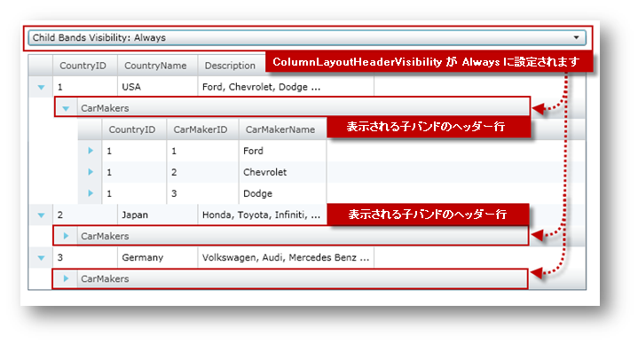

////

|metadata|
{
    "name": "xamgrid-change-child-bands-visibility",
    "controlName": ["xamGrid"],
    "tags": ["Data Presentation","Grids","Layouts","Selection"],
    "guid": "4f9562a9-473c-43bf-9a5a-da831623c61c",  
    "buildFlags": [],
    "createdOn": "2016-05-25T18:21:56.5122034Z"
}
|metadata|
////

{XamGridHeader}

= 子バンドの表示/非表示の変更

== 始める前に

xamGrid コントロールの link:{ApiPlatform}controls.grids.xamgrid{ApiVersion}~infragistics.controls.grids.columnlayoutheadervisibility.html[ColumnLayoutHeaderVisibility] プロパティを使用すると、特定の ColumnLayout の子行を保持する ChildBand ヘッダー行の表示/非表示を変更できます。以下の表は ColumnLayoutHeaderVisibility プロパティのメンバーを示します。

[options="header", cols="a,a"]
|====
|ColumnLayoutHeaderVisibility|説明

| link:{ApiPlatform}controls.grids.xamgrid{ApiVersion}~infragistics.controls.grids.columnlayoutheadervisibility.html[Always]
|ChildBands ヘッダー行は常に表示されます。

| link:{ApiPlatform}controls.grids.xamgrid{ApiVersion}~infragistics.controls.grids.columnlayoutheadervisibility.html[Never]
|ChildBands ヘッダー行は決して表示されません。

| link:{ApiPlatform}controls.grids.xamgrid{ApiVersion}~infragistics.controls.grids.columnlayoutheadervisibility.html[SiblingsExist]
|ColumnLayout に兄弟がある場合に限り ChildBands ヘッダー行は表示されます。

|====

== 達成すること

ColumnLayoutHeaderVisibility 列挙値を ComboBox コントロールにバインドし、これを使用してラインタイムに xamGrid コントロールの ChildBand ヘッダー行の表示/非表示を変更します。

== 以下の手順を実行します。

以下のコードは、xamGrid コントロールに WPF プロジェクトを設定する方法を理解していることを前提とします。

[start=1]
. 以下の名前空間宣言を追加します。

*XAML の場合:*

----
xmlns:ig="http://schemas.infragistics.com/xaml"
----

*Visual Basic の場合:*

----
Imports System.Reflection
Imports Infragistics
Imports Infragistics.Controls.Grids
----

*C# の場合:*

----
using System.Reflection;
using Infragistics;
using Infragistics.Controls.Grids;
----

[start=2]
. xamGrid コントロールの ChildBand ヘッダー行の表示/非表示を変更するために 、ComboBox コントロールと共に StackPanel を追加します。

*XAML の場合:*

----
<StackPanel>
   <ComboBox x:Name="cmbSelection" Margin="10,10,10,0"
             SelectionChanged="cmbSelection_SelectionChanged">
   </ComboBox>
   <!-- TODO: xamGrid コントロールを追加します -->
</StackPanel>
----

[NOTE]
====
*注:* ComboBox コントロールは、ユーザー コントロールのメンバーでなければなりません。また以下のコードをコントロールのコンストラクターに配置する必要があります。
====

*Visual Basic の場合:*

----
Private cmbSelection As ComboBox
' ...
InitializeComponent()
' ...
Dim sp As New StackPanel()
sp.Orientation = Orientation.Vertical
cmbSelection = New ComboBox()
cmbSelection.Margin = New Thickness(10, 10, 10, 0)
AddHandler cmbSelection.SelectionChanged, AddressOf cmbSelection_SelectionChanged
sp.Children.Add(cmbSelection)
'TODO xamGrid コントロールを追加します 
Me.LayoutRoot.Children.Add(sp)
'TODO: メソッドの呼び出しを追加します。 
----

*C# の場合:*

----
private ComboBox cmbSelection;
// ...
InitializeComponent();
// ...
StackPanel sp = new StackPanel();
sp.Orientation = Orientation.Vertical;
cmbSelection = new ComboBox(); 
cmbSelection.Margin = new Thickness(10, 10, 10, 0);
cmbSelection.SelectionChanged += cmbSelection_SelectionChanged;
sp.Children.Add(cmbSelection);
//TODO xamGrid コントロールを追加します 
this.LayoutRoot.Children.Add(sp);
// メソッドの呼び出しを追加します。 
----

[start=3]
. 以下の属性を持つ xamGrid コントロールを StackPanel に追加します。

[NOTE]
====
*注:* このコードは、Data Binding トピックで詳述されているカスタム データへのデータ バインディングを使用しています。
====

*XAML の場合:*

----
<ig:XamGrid x:Name="xamGrid" Margin="10" 
    ColumnLayoutHeaderVisibility="Always" 
    ItemsSource="{Binding Source={StaticResource DataToolCars}, Path=CountryCarMakers}">
    <ig:XamGrid.PagerSettings>
       <ig:PagerSettings AllowPaging="None" PageSize="5" />
    </ig:XamGrid.PagerSettings>
</ig:XamGrid>
----

[NOTE]
====
*注:* xamGrid コントロールは、ユーザー コントロールのメンバーでなければなりません。また以下のコードをコントロールのコンストラクターに配置する必要があります。
====

*Visual Basic の場合:*

----
Private xamGrid As xamGrid
' ...
xamGrid = New XamGrid()
xamGrid.Margin = New Thickness(10)
xamGrid.ColumnLayoutHeaderVisibility = ColumnLayoutHeaderVisibility.Always
xamGrid.PagerSettings.AllowPaging = PagingLocation.None
xamGrid.ItemsSource = DataToolCars.CountryCarMakers
sp.Children.Add(xamGrid)
----

*C# の場合:*

----
private xamGrid xamGrid;
// ...
xamGrid = new XamGrid();
xamGrid.Margin = new Thickness(10);
xamGrid.ColumnLayoutHeaderVisibility = ColumnLayoutHeaderVisibility.Always;
xamGrid.PagerSettings.AllowPaging = PagingLocation.None;
xamGrid.ItemsSource = DataToolCars.CountryCarMakers;
sp.Children.Add(xamGrid);
----

[start=4]
. 以下のメソッドを追加して、ColumnLayoutHeaderVisibility 列挙値をロードします。

*Visual Basic の場合:*

----
Private Sub LoadChildBandsVisibilityValues()
   Dim en As [Enum] = xamGrid.ColumnLayoutHeaderVisibility
   Dim enumValues As IEnumerable(Of [Enum]) = From f In en.GetType().GetFields(BindingFlags.Static Or BindingFlags.Public) _
                                                   Select DirectCast(f.GetValue(en), [Enum])
   For Each enums As [Enum] In enumValues
      cmbSelection.Items.Add("Child Bands Visibility: " & enums.ToString())
   Next
End Sub
----

*C# の場合:*

----
private void LoadChildBandsVisibilityValues()
{
    Enum en = xamGrid.ColumnLayoutHeaderVisibility;
    IEnumerable<Enum> enumValues = from f in en.GetType().GetFields(BindingFlags.Static | BindingFlags.Public)
                                   select (Enum)f.GetValue(en);
    foreach (Enum enums in enumValues)
    {
        cmbSelection.Items.Add("Child Bands Visibility: " + enums.ToString());
    }
}
----

[start=5]
. 以下のメソッドの呼び出しをコンストラクターの最後に追加します。

*Visual Basic の場合:*

----
InitializeComponent()
' ...
LoadChildBandsVisibilityValues()
----

*C# の場合:*

----
InitializeComponent();
// ...
LoadChildBandsVisibilityValues();
----

[start=6]
. ComboBox コントロールの SelectionChanged イベントのイベント ハンドラーを実装します。

*Visual Basic の場合:*

----
Private Sub cmbSelection_SelectionChanged(ByVal sender As Object, ByVal e As SelectionChangedEventArgs)
   Dim val As ColumnLayoutHeaderVisibility = DirectCast(cmbSelection.SelectedIndex, ColumnLayoutHeaderVisibility)
   Me.xamGrid.ColumnLayoutHeaderVisibility = val
End Sub
----

*C# の場合:*

----
private void cmbSelection_SelectionChanged(object sender, SelectionChangedEventArgs e)
{
   ColumnLayoutHeaderVisibility val = (ColumnLayoutHeaderVisibility)cmbSelection.SelectedIndex;
   this.xamGrid.ColumnLayoutHeaderVisibility = val;
}
----

[start=7]
. アプリケーションを実行します。ComboBox コントロールで項目を選択すると、必ず xamGrid コントロールの ChildBand ヘッダー行の表示/非表示は変わります。以下の画像は、ColumnLayoutHeaderVisibility プロパティが Always に設定された場合に、xamGrid がどのように表示されるのかを示します。

image::images/xamGrid_Change_Child_Band_Visibility_02.png[]

== 関連トピック

link:xamgrid-data-binding.html[データ バインディング]

link:xamgrid-auto-expand-data-rows-and-child-bands.html[データ行と子バンドの自動展開]