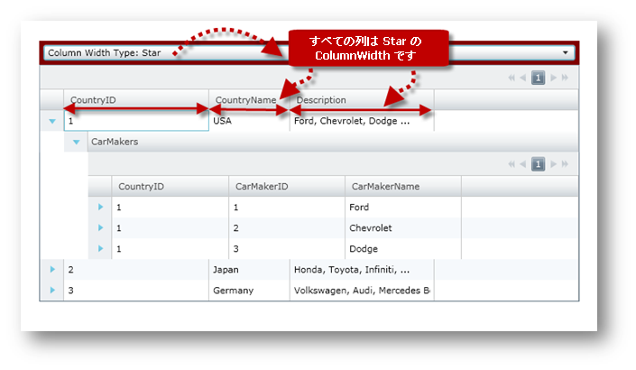

////
|metadata|
{
    "name": "xamgrid-change-column-width-settings",
    "controlName": ["xamGrid"],
    "tags": ["Editing","Grids","How Do I","Layouts","Styling"],
    "guid": "{B8C11958-DE93-41FA-81A3-17A723BEAA62}",
    "buildFlags": [],
    "createdOn": "2016-05-25T18:21:56.1232102Z"
}
|metadata|
////

{XamGridHeader}

= 列幅設定の変更

== 始める前に

xamGrid コントロールの link:{ApiPlatform}controls.grids.xamgrid{ApiVersion}~infragistics.controls.grids.columnwidth.html[ColumnWidth] プロパティを link:{ApiPlatform}controls.grids.xamgrid{ApiVersion}~infragistics.controls.grids.columnwidth.html[ColumnWidth] オブジェクトのインスタンスと共に使用して、xamGrid ですべての列に適用される幅を変更できます。以下の表は、ColumnWidth オブジェクトの link:{ApiPlatform}controls.grids.xamgrid{ApiVersion}~infragistics.controls.grids.columnwidth~widthtype.html[WidthType] プロパティの列挙値を示します。

[options="header", cols="a,a"]
|====
|ColumnWidthType|説明

| link:{ApiPlatform}controls.grids.xamgrid{ApiVersion}~infragistics.controls.grids.columnwidthtype.html[Auto]
|列の幅は列の最大ヘッダーまたは列のセルに変更されます。注: 大きいコンテンツをスクロールして表示するときに、列の幅が大きくなる場合があります。ただし、減少することはありません。

| link:{ApiPlatform}controls.grids.xamgrid{ApiVersion}~infragistics.controls.grids.columnwidthtype.html[InitialAuto]
|列の幅は列の最大ヘッダーまたは列のセルに変更されます。ただし、グリッドが初めてロードする時、またはユーザーがリサイズするために列ヘッダーの端をダブルクリックする時に限りこれが発生します。

| link:{ApiPlatform}controls.grids.xamgrid{ApiVersion}~infragistics.controls.grids.columnwidthtype.html[Numeric]
|列の幅は指定された値に基づいて変更します。

| link:{ApiPlatform}controls.grids.xamgrid{ApiVersion}~infragistics.controls.grids.columnwidthtype.html[SizeToCells]
|列の幅は列の最大セルに変更されます。注: 大きいコンテンツをスクロールして表示するときに、列の幅が大きくなる場合があります。ただし、減少することはありません。

| link:{ApiPlatform}controls.grids.xamgrid{ApiVersion}~infragistics.controls.grids.columnwidthtype.html[SizeToHeader]
|列の幅は列ヘッダーに変更されます。

| link:{ApiPlatform}controls.grids.xamgrid{ApiVersion}~infragistics.controls.grids.columnwidthtype.html[Star]
|列の幅は xamGrid の残りスペースを埋めるために変更されます。複数の列に star 値が指定されている場合、残りの幅は列で均等に分割されます。他の列がスペースのほとんどを使っている場合、列の幅は 0 に設定します。xamGrid コントロールの幅が Infinity の場合、列は Auto ColumnWidthType 幅として動作します。

|====

以下のリストは、xamGrid で列の幅を変更するための様々な手法を示します。

* ColumnWidth オブジェクトのインスタンスを使用 - ColumnWidth オブジェクトのコンストラクターにパスされる数値に列幅プロパティを設定します。2 番目の引数が False の場合、列は指定された値に変更されます (最初の例を参照)。そうでない場合、列は Star ColumnWidthType ですべてのその他の列と比較してパーセント値に変更されます (2 番目の例を参照)。これは Microsoft Grid コントロールの Column Definition の幅設定と同様の効果があります。たとえば、xamGrid に対応する幅 (2$$*$$、1$$*$$ および 3$$* $$) の 列が 3 つあり、残りの幅が 600 の場合、これらの列は 200、100、300 の幅値を持つことになります。

*XAML の場合:*

----
<ig:XamGrid x:Name="xamGrid" ColumnWidth="40">
   <!-- ...-->
</ig:XamGrid>       
<ig:XamGrid x:Name="xamGrid" ColumnWidth="2*" 
   <!-- ...-->
</ig:XamGrid>
----

*Visual Basic の場合:*

----
xamGrid.ColumnWidth = New ColumnWidth(40, False)     ' または 
xamGrid.ColumnWidth = New ColumnWidth(2, True)
----

*C# の場合:*

----
xamGrid.ColumnWidth = new ColumnWidth (40, false);   // または 
xamGrid.ColumnWidth = new ColumnWidth (2, true);
----

* 静的な InitialAuto 値の使用 - 列幅プロパティを InitialAuto ColumnWidth 値の静的インスタンスに設定します。この技術が使用される場合、すべての列は列の最大ヘッダーまたはセルに変更されます。ただし、グリッドが初めてロードする時、またはユーザーがリサイズするために列ヘッダーの端をダブルクリックする時に限りこれが発生します。

*XAML の場合:*

----
<ig:XamGrid x:Name="xamGrid" ColumnWidth="InitialAuto">
   <!-- ...-->
</ig:XamGrid>
----

*Visual Basic の場合:*

----
xamGrid.ColumnWidth = ColumnWidthType.InitialAuto
----

*C# の場合:*

----
xamGrid.ColumnWidth = ColumnWidthType.InitialAuto;
----

* 静的な Auto 値の使用 - 列幅プロパティを Auto ColumnWidth 値の静的インスタンスに設定します。この技術が使用される場合、すべての列は列の最大ヘッダーまたはセルに変更されます。スクロールすると、大きいコンテンツが表示されるにしたがって列の幅が大きくなる場合があります。ただし、幅が小さくなることはありません。

*XAML の場合:*

----
<ig:XamGrid x:Name="xamGrid" ColumnWidth="Auto">
   <!-- ... -->
</ig:XamGrid>
----

*Visual Basic の場合:*

----
xamGrid.ColumnWidth = ColumnWidthType.Auto
----

*C# の場合:*

----
xamGrid.ColumnWidth = ColumnWidthType.Auto;
----

* 静的な SizeToCells 値の使用 - 列幅プロパティを SizeToCells ColumnWidth 値の静的インスタンスに設定します。この技術が使用される場合、すべての列は列の最大セルに変更されます。スクロールすると、大きいコンテンツが表示されるにしたがって列の幅が大きくなる場合があります。ただし、幅が小さくなることはありません。

*XAML の場合:*

----
<ig:XamGrid x:Name="xamGrid" ColumnWidth="SizeToCells">
   <!-- ... -->
</ig:XamGrid>
----

*Visual Basic の場合:*

----
xamGrid.ColumnWidth = ColumnWidthType.SizeToCells
----

*C# の場合:*

----
xamGrid.ColumnWidth = ColumnWidthType.SizeToCells;
----

* 静的な SizeToHeader 値の使用 - 列幅プロパティを SizeToHeader ColumnWidth 値の静的インスタンスに設定します。この技術が使用される場合、すべての列は列のヘッダーに変更されます。

*XAML の場合:*

----
<ig:XamGrid x:Name="xamGrid" ColumnWidth="SizeToHeader">
   <!-- ... -->
</ig:XamGrid>
----

*Visual Basic の場合:*

----
xamGrid.ColumnWidth = ColumnWidthType.SizeToHeader
----

*C# の場合:*

----
xamGrid.ColumnWidth = ColumnWidthType. SizeToHeader;
----

* 静的な Star 値の使用 - 1 と True の値を ColumnWidth コンストラクターに渡すことに等しい Star ColumnWidth 値の静的インスタンスに列幅プロパティを設定します。この手法を使用する場合、すべての列は xamGrid の残りのスペースを埋めるために変更されます。複数の列に star 値が指定されている場合、残りの幅は列で均等に分割されます。他の列がスペースのほとんどを使っている場合、列の幅は 0 に設定します。xamGrid コントロールの幅が Infinity の場合、列は Auto ColumnWidthType 幅として動作します。

*XAML の場合:*

----
<ig:XamGrid x:Name="xamGrid" ColumnWidth="Star"
</ig:XamGrid>
   <!-- 同じ: -->
<ig:XamGrid x:Name="xamGrid" ColumnWidth="1*"
</ig:XamGrid>
----

*Visual Basic の場合:*

----
xamGrid.ColumnWidth = ColumnWidthType.Star         ' 同じ:
xamGrid.ColumnWidth = New ColumnWidth(1, True)
----

*C# の場合:*

----
xamGrid.ColumnWidth = ColumnWidthType.Star;        // 同じ:
xamGrid.ColumnWidth = new ColumnWidth (1, true);
----

== 達成すること

ランタイムに xamGrid ですべての列の幅を変更するユーザー コントロールを作成します。

== 以下の手順を実行します。

以下のコードは、ColumnWidth オブジェクトを使用して、ランタイムに xamGrid コントロールの列幅を変更する方法を示します。

[start=1]
. 以下の NuGet パッケージ参照をアプリケーションに追加します。

* Infragistics.WPF.Controls.Grids.XamGrid

NuGet フィードのセットアップと NuGet パッケージの追加の詳細については、link:nuget-feeds.html[NuGet フィード] ドキュメントを参照してください。

[start=2]
. MainPage.xaml ファイルで、以下の名前空間宣言を追加します。

[NOTE]
====
*注:* [DATA_MODEL_NAMESPACE] 文字列は、アセンブリ プロジェクトの名前で置き換える必要があります。
====

ifdef::wpf[]

*XAML の場合:*

----
xmlns:ig="http://schemas.infragistics.com/xaml"
xmlns:local="clr-namespace:[DATA_MODEL_NAMESPACE]"
----

endif::wpf[]

*Visual Basic の場合:*

----
Imports Infragistics.Controls.Grids
----

*C# の場合:*

----
using Infragistics.Controls.Grids;
----

[start=3]
. 以下のタグをユーザー コントロールのリソース ディレクトリに追加します。

[NOTE]
====
*注:* 以下のコードは「データ バインディング」トピックに詳述されるカスタム データへのデータ バインディングを使用します。
====

*XAML の場合:*

----
<UserControl.Resources>
   <local:DataUtil x:Key="categoryData" />
</UserControl.Resources>
----

[start=4]
. 列幅設定コントロールと xamGrid コントロールのコンテナーとして使用される StackPanel コントロールを追加します。

*XAML の場合:*

----
<StackPanel Name="spMainPanel" Orientation="Vertical" Margin="15" >
     <!--TODO: Combobox コントロールを追加して ColumnWidth 設定を変更します -->
     <!--TODO: xamGrid コントロールを追加します -->
</StackPanel>
----

*Visual Basic の場合:*

----
Dim spMainPanel As StackPanel = New StackPanel With {.Orientation = Orientation.Vertical, _
                                                     .Margin = New Thickness(15)
' TODO: Combobox コントロールを追加して ColumnWidth 設定を変更します  
' TODO: xamGrid コントロールを追加します  
Me.LayoutRoot.Children.Add(spMainPanel)
----

*C# の場合:*

----
StackPanel spMainPanel = new StackPanel()
{ 
     Orientation = Orientation.Vertical, Margin = new Thickness(15) 
};
// TODO: Combobox コントロールを追加して ColumnWidth 設定を変更します  
// TODO: xamGrid コントロールを追加します  
this.LayoutRoot.Children.Add(spMainPanel);
----

[start=5]
. 以下の属性を持つ ComboBox コントロールを追加します。この ComboBox は ColumnWidth 設定を変更するために使用されます。

*XAML の場合:*

----
<Border Background="Maroon" >
   <ComboBox x:Name="cmbSelection" Margin="5" 
             HorizontalAlignment="Stretch" 
             SelectionChanged="cmbSelection_SelectionChanged">
   </ComboBox>                  
</Border>
----

*Visual Basic の場合:*

----
' ColumnWidth を変更するためにコントロールを宣言します
Private cmbSelection As ComboBox
'...
cmbSelection = New ComboBox()
cmbSelection.Margin = New Thickness(5)
AddHandler cmbSelection.SelectionChanged, AddressOf cmbSelection_SelectionChanged
Dim brdSelection As Border = New Border()
brdSelection.Background = New SolidColorBrush(Colors.Red)
brdSelection.Child = cmbSelection
spMainPanel.Children.Add(brdSelection)
----

*C# の場合:*

----
// ColumnWidth タイプを変更するためにコントロールを宣言します
private ComboBox cmbSelection;
// ...
cmbSelection = new ComboBox();
cmbSelection.Margin = new Thickness(5);
cmbSelection.SelectionChanged += cmbSelection_SelectionChanged;
Border brdSelection = new Border();
brdSelection.Background = new SolidColorBrush(Colors.Red);
brdSelection.Child = cmbSelection;
// brd Border を spMainPanel StackPanel に追加します
spMainPanel.Children.Add(brdSelection);
----

[start=6]
. xamGrid コントロールを追加します。

*XAML の場合:*

----
<ig:XamGrid x:Name="xamGrid"
  ItemsSource="{Binding Source={StaticResource categoryData}, Path=CategoriesAndProducts}"  Loaded="XamGrid_OnLoaded" >
  </ig:XamGrid>
----

*Visual Basic の場合:*

----
' xamGrid コントロールを宣言します 
Private xamGrid As XamGrid
'...
' init xamGrid コントロール
xamGrid = New XamGrid()
' 注: このコントロールは xamGrid コントロールの ItemsSource へのカスタム データ バインディングを使用しています 
' 詳細はデータ バインディングのセクションを参照してください
xamGrid.ItemsSource = DataUtil.CategoriesAndProducts
' xamGrid xamGrid を spMainPanel StackPanel に追加します
spMainPanel.Children.Add(xamGrid)
AddHandler xamGrid.Loaded, AddressOf xamGrid_Loaded
----

*C# の場合:*

----
// xamGrid コントロールを宣言します 
private XamGrid xamGrid;
// ...
// init xamGrid コントロール
xamGrid = new XamGrid();
// 注: このコントロールは xamGrid コントロールの ItemsSource へのカスタム データ バインディングを使用しています 
// 詳細はデータ バインディングのセクションを参照してください
xamGrid.ItemsSource = DataUtil.CategoriesAndProducts;
// xamGrid xamGrid を spMainPanel StackPanel に追加します
spMainPanel.Children.Add(xamGrid);
xamGrid.Loaded += xamGrid_Loaded;
----

[start=7]
. 以下のメソッドを追加して、ColumnWidth タイプを ComboBox コントロールにロードします。

*Visual Basic の場合:*

[source,vb]
----
Private Sub xamGrid_Loaded(sender As Object, e As RoutedEventArgs)
  cmbSelection.ItemsSource = [Enum].GetValues(GetType(ColumnWidthType))
  cmbSelection.SelectedIndex = 1
  End Sub
----

*C# の場合:*

[source,csharp]
----
private void xamGrid_Loaded(object sender, RoutedEventArgs e)
{
    cmbSelection.ItemsSource = Enum.GetValues(typeof(ColumnWidthType));
    cmbSelection.SelectedIndex = 1;
}
----

[start=8]
. ComboBox コントロールの SelectionChanged イベントのイベント ハンドラーを実装します。

*Visual Basic の場合:*

----
Private Sub cmbSelection_SelectionChanged(sender As Object, e As SelectionChangedEventArgs)
      If cmbSelection IsNot Nothing Then
            Dim selectedItem = DirectCast(e.AddedItems(0), ColumnWidthType)
            If selectedItem = ColumnWidthType.Numeric Then
                  xamGrid.ColumnWidth = New ColumnWidth(80, False)
            ElseIf selectedItem = ColumnWidthType.Auto Then
                  xamGrid.ColumnWidth = ColumnWidth.Auto
            ElseIf selectedItem = ColumnWidthType.InitialAuto Then
                  xamGrid.ColumnWidth = ColumnWidth.InitialAuto
            ElseIf selectedItem = ColumnWidthType.SizeToCells Then
                  xamGrid.ColumnWidth = ColumnWidth.SizeToCells
            ElseIf selectedItem = ColumnWidthType.SizeToHeader Then
                  xamGrid.ColumnWidth = ColumnWidth.SizeToHeader
            ElseIf selectedItem = ColumnWidthType.Star Then
                  xamGrid.ColumnWidth = ColumnWidth.Star
            End If
      End If
End Sub
----

*C# の場合:*

[source,csharp]
----
private void cmbSelection_SelectionChanged(object sender, SelectionChangedEventArgs e)
{
    if (cmbSelection != null)
    {
        var selectedItem = (ColumnWidthType)e.AddedItems[0];
        if (selectedItem == ColumnWidthType.Numeric)
            xamGrid.ColumnWidth = new ColumnWidth(80, false);
        else if (selectedItem == ColumnWidthType.Auto)
            xamGrid.ColumnWidth = ColumnWidth.Auto;
        else if (selectedItem == ColumnWidthType.InitialAuto)
            xamGrid.ColumnWidth = ColumnWidth.InitialAuto;
        else if (selectedItem == ColumnWidthType.SizeToCells)
            xamGrid.ColumnWidth = ColumnWidth.SizeToCells;
        else if (selectedItem == ColumnWidthType.SizeToHeader)
            xamGrid.ColumnWidth = ColumnWidth.SizeToHeader;
        else if (selectedItem == ColumnWidthType.Star)
            xamGrid.ColumnWidth = ColumnWidth.Star;
    }
}
----

[start=9]
. アプリケーションを実行します。ユーザー コントロールは、カスタム データがロードされた xamGrid と、xamGrid コントロールで列幅設定を変更するために使用できる ComboBox コントロールを表示します。以下の画像はユーザー コントロールがどのように表示されるのかを示します。

ifdef::sl,wpf[]
image::images/xamGrid_Change_Column_Width_Settings_02.png[]
endif::sl,wpf[]

ifdef::win-rt[]
image::images/RT_xamGrid_Change_Column_Width_Settings_02.png[]
endif::win-rt[]