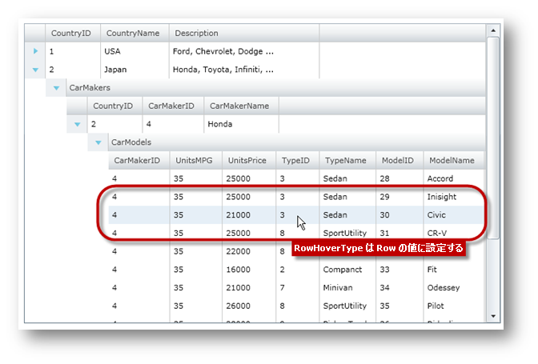

////

|metadata|
{
    "name": "xamgrid-change-row-hover-type",
    "controlName": ["xamGrid"],
    "tags": ["Data Presentation","Grids","How Do I","Layouts","Styling"],
    "guid": "{B17C09B5-1AF9-4550-966A-45C9FF0DA143}",  
    "buildFlags": [],
    "createdOn": "2016-05-25T18:21:56.1112091Z"
}
|metadata|
////

{XamGridHeader}

= 行ホバー タイプの変更

xamGrid コントロールは、マウス カーソルがグリッドの行またはセル領域の上に移動するとホバー効果を変更する、非常にシンプルな方法を提供します。xamGrid コントロールの link:{ApiPlatform}controls.grids.xamgrid{ApiVersion}~infragistics.controls.grids.xamgrid~rowhover.html[RowHover] プロパティはホバー効果を設定するために使用され、以下の link:{ApiPlatform}controls.grids.xamgrid{ApiVersion}~infragistics.controls.grids.rowhovertype.html[RowHoverType] 列挙値に設定できます。

[options="header", cols="a,a"]
|====
|RowHoverType|説明

| link:{ApiPlatform}controls.grids.xamgrid{ApiVersion}~infragistics.controls.grids.rowhovertype.html[Cell]
|ホバー効果はマウス カーソルが配置されるセルに限って適用されます。

| link:{ApiPlatform}controls.grids.xamgrid{ApiVersion}~infragistics.controls.grids.rowhovertype.html[Row]
|ホバー効果はマウス カーソルが配置される行のすべての Cell オブジェクトに限って適用されます。

| link:{ApiPlatform}controls.grids.xamgrid{ApiVersion}~infragistics.controls.grids.rowhovertype.html[None]
|マウス カーソルがセルまたは行の上に配置される場合であってもセルまたは行にホバー効果は適用されません。

|====

以下のコードは xamGrid でホバー効果を変更する方法を示します。これは xamGrid の {PlatformName} プロジェクトを設定する方法を理解していることを前提とします。

[NOTE]
====
*注:* 以下のコードはデータ バインディング トピックで説明されるカスタム データへのデータ バインディングを使用しています。
====

*XAML の場合:*

----
<ig:XamGrid x:Name="xamGrid"
                RowHover="Row"
    ItemsSource="{Binding Source={StaticResource DataUtil}, Path=CategoriesAndProducts}" >
    </ig:XamGrid>
----

*Visual Basic の場合:*

----
InitializeComponent()
    ' ...
    Dim xamGrid As New XamGrid()
    xamGrid.RowHover = RowHoverType.Row
    xamGrid.ItemsSource = DataUtil.CategoriesAndProducts
    Me.LayoutRoot.Children.Add(xamGrid)
----

*C# の場合:*

----
InitializeComponent();
    // ...
    xamGrid xamGrid = new XamGrid();
    xamGrid.RowHover = RowHoverType.Row;
    xamGrid.ItemsSource = DataUtil.CategoriesAndProducts;
    this.LayoutRoot.Children.Add(xamGrid);
----

以下の画像は RowHover プロパティが Row に設定された xamGrid を示します。

ifdef::sl,wpf[]

endif::sl,wpf[]

ifdef::win-rt[]
image::images/RT_xamGrid_Change_Row_Hover_Type_01.png[]
endif::win-rt[]

== 関連トピック

link:xamgrid-add-new-row.html[新規行の追加]

link:xamgrid-add-row-commands.html[行コマンドの追加]

link:xamgrid-auto-expand-data-rows-and-child-bands.html[データ行と子バンドの自動展開]

link:xamgrid-remove-alternative-row-styling.html[代替え行スタイリングの削除]

link:xamgrid-row-deletion.html[行の削除]