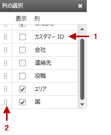

////

|metadata|
{
    "name": "xamgrid-column-chooser-dialog-window",
    "controlName": ["xamGrid"],
    "tags": ["Data Presentation","Grids","Layouts","Selection"],
    "guid": "01db01a7-d15b-464f-bc63-40c65e57b1c6",  
    "buildFlags": [],
    "createdOn": "2016-05-25T18:21:56.1402105Z"
}
|metadata|
////

{XamGridHeader}

= 列の選択ダイアログ ウィンドウ

列の選択ダイアログ ウィンドウは、特定の link:{ApiPlatform}controls.grids.xamgrid{ApiVersion}~infragistics.controls.grids.columnbase~columnlayout.html[ColumnLayout] の列コレクションを表示します。ColumnLayout オブジェクトを含む、すべての ColumnBase オブジェクトをそのコレクションに表示します。また、各列のとなりにチェックボックスを表示します。その特定の列が非表示の場合、このチェックボックスは選択が解除されます。エンドユーザーは、対応するチェックボックスを選択することで列の可視性を切り替えることができます。

列の選択ダイアログ ウィンドウが最初に表示されるとき、xamGrid コントロールに対してセンタリングされます。エンドユーザーが列の選択ダイアログ ウィンドウをブラウザー ウィンドウの外にドラッグした場合、マウスをリリースすると、列の選択ダイアログ ウィンドウは、ダイアログが消えないように xamGrid コントロールに対して再度センタリングされます。

列の選択ダイアログ ウィンドウは、xamGrid コントロール内の列順序に基づいて列ヘッダーを構成します。ただし、エンドユーザーが、列の選択ダイアログ ウィンドウ内で、チェックボックスの左に表示されているアイコンを使用して列をドラッグ アンドドロップすると、列ヘッダーの順序を変更できます。エンドユーザーが列の選択ダイアログ ウィンドウ内で列を並べ替えると、xamGrid コントロール内でも並べ替えられます。

[NOTE]
====
*注:* 列の選択ダイアログ ウィンドウにスクロールバーがある場合、列の選択ダイアログ ウィンドウの上に項目をドラッグすると、リストはスクロール アップし、列の選択ダイアログ ウィンドウの下に項目をドラッグすると、リストはスクロール ダウンします。項目のドラッグ中に、Esc キーを押すと、項目は元の場所に戻ります。
====

列の選択ダイアログ ウィンドウの列に表示されるテキストは、ColumnBase オブジェクトの DisplayName プロパティからきています。これは、読み取り専用プロパティで、最初に link:{ApiPlatform}controls.grids.xamgrid{ApiVersion}~infragistics.controls.grids.columnbase~headertext.html[HeaderText] プロパティが設定されているかどうかを確認します。設定されていれば、その値を使用します。そうでない場合は、ColumnKey プロパティの値を使用します。

また、列の選択ダイアログ ウィンドウのチェックボックスを無効にして、エンドユーザーが特定の列を非表示にできないようにすることが可能です。詳細については、「列が非表示にされることを防止する」を参照してください。

次のスクリーンショットは、列の選択ダイアログ ウィンドウを示しています。

ifdef::sl,wpf[]

endif::sl,wpf[]

ifdef::win-rt[]
image::images/RT_xamGrid_columnChooser2.png[]
endif::win-rt[]

[start=1]
. *非表示の列*
[start=2]
. *列を並べ替えるために使用されるアイコン*  

== 関連トピック

link:xamgrid-enabling-column-chooser.html[列の選択を有効にする]

link:xamgrid-column-chooser-settings.html[列の選択設定]

link:xamgrid-prevent-columns-from-being-hidden.html[列が非表示にされることを防止する]