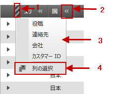

////

|metadata|
{
    "name": "xamgrid-column-chooser",
    "controlName": ["xamGrid"],
    "tags": ["Grids","How Do I","Layouts"],
    "guid": "7937a8e9-2f69-4fd2-b7db-72150ae323cf",  
    "buildFlags": [],
    "createdOn": "2016-05-25T18:21:56.1342109Z"
}
|metadata|
////

{XamGridHeader}

= 列の選択

列選択機能によってエンド ユーザーは、ランタイムに xamGrid コントロールで列の表示/非表示を変更することができます。

ifdef::sl,wpf[]
列選択は、列チューザー アイコンと共に列ヘッダーのリストを表示します。エンド ユーザーは列ヘッダー内の列チューザー アイコンをクリックして、特定の列を非表示にすることができます。
endif::sl,wpf[]

ifdef::win-rt[]
列の表示状態を変更するには、列ヘッダーにクリック/タップし、列メニューを開き、「列選択」のメニュー項目を選択します。表示されたダイアログで、列の非表示 / 表示をチェックボックスで選択できます。また列項目をドラッグして順序を変更することもできます。
endif::win-rt[]

特定の列が非表示になると、列チューザー インジケーターが、隣接する列の右側に現れます。このインジケーターをクリックすると、非表示の列が表示されたドロップダウンが現れます。

ifdef::win-rt[]
非表示の列インジケーターは、タッチ インタラクションのみのインジケーターです。
endif::win-rt[]

さらに、xamGrid コントロールを階層的なデータ ソースにバインドしている場合、列チューザー機能によってエンド ユーザーは、列チューザー ダイアログ ウィンドウから列レイアウトの表示/非表示を切り替えることができます。

xamGrid コントロールは、列チューザー ダイアログ ウィンドウを表示するための複数のオプションを提供します。

ifdef::win-rt[]
* 列ヘッダーをクリック/タップして列メニューを開き、「列選択」項目を選択します。

endif::win-rt[]

* 非表示の列インジケーターをクリックし、列選択のドロップダウン リストから「列選択」を選択します。
* link:{ApiPlatform}controls.grids.xamgrid{ApiVersion}~infragistics.controls.grids.xamgrid~showcolumnchooser.html[ShowColumnChooser]() または ShowColumnChooser(ColumnLayout) メソッドを起動します。列チューザーが表示する場所を指定したい場合は、ShowColumnChooser(Point) または ShowColumnChooser(ColumnLayout, Point) メソッドを起動します。ColumnChooser および GroupColumn 機能 (詳細は link:xamgrid-group-column.html[列のグループ化]を参照) の使用時は、ShowColumnChooser(Column) メソッドを起動することによって列チューザーを表示することができます。

列選択ダイアログ ウィンドウは、以下の方法で非表示にすることができます:

* エンド ユーザーは、列選択ダイアログ ウィンドウに表示される閉じるボタンをクリック pick:[win-rt="/タップ"] することができます。
* link:{ApiPlatform}controls.grids.xamgrid{ApiVersion}~infragistics.controls.grids.xamgrid~hidecolumnchooser.html[HideColumnChooser]() メソッドを起動します。

最後の列が非表示になると、列選択インジケーターが、最後の可視の列のヘッダーの右側に現れます。このインジケーターをクリックすると、その特定の列の右側にすべての非表示列が表示されます。

ifdef::win-rt[]
タッチ ジェスチャを使用して列選択機能の詳細については、 link:xamgrid-touch-support.html[タッチ サポート] トピックを参照してください。
endif::win-rt[]

以下のスクリーンショットは、列選択機能の主な特長を示しています。

ifdef::sl,wpf[]

[start=1]
. *列の選択インジケーター*
[start=2]
. *列の選択非表示アイコン*
[start=3]
. *列の選択ドロップダウン リスト*
[start=4]
. *列の選択ボタン*

endif::sl,wpf[]

ifdef::win-rt[]

image::images/RT_xamGrid_columnChooser1.png[]

*列メニューおよび「列選択」メニュー項目*
endif::win-rt[]

ifdef::win-rt[]

image::images/RT_xamGrid_columnChooser1_1.png[]

[start=1]
. *列の選択インジケーター*
[start=2]
. *列の選択ドロップダウン リスト*

endif::win-rt[]

以下のスクリーンショットは、列チューザー ダイアログ ウィンドウの主な機能を示しています。

ifdef::wpf,sl[]
image::images/xamGrid_columnChooser2.png[]
endif::wpf,sl[]

ifdef::win-rt[]
image::images/RT_xamGrid_columnChooser2.png[]
endif::win-rt[]

[start=1]
. *非表示の列*
[start=2]
. 列を並べ替えるために使用されるアイコン

*関連トピック*

link:xamgrid-enabling-column-chooser.html[列の選択を有効にする]

link:xamgrid-column-chooser-dialog-window.html[列の選択ダイアログ ウィンドウ]

link:xamgrid-column-chooser-settings.html[列の選択設定]

link:xamgrid-prevent-columns-from-being-hidden.html[列が非表示にされることを防止する]

pick:[win-rt=" link:xamgrid-touch-support.html[タッチ サポート]"]