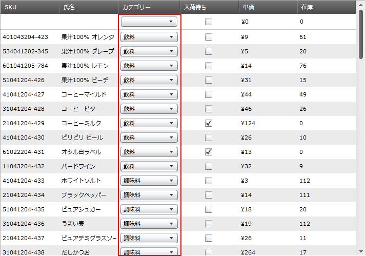
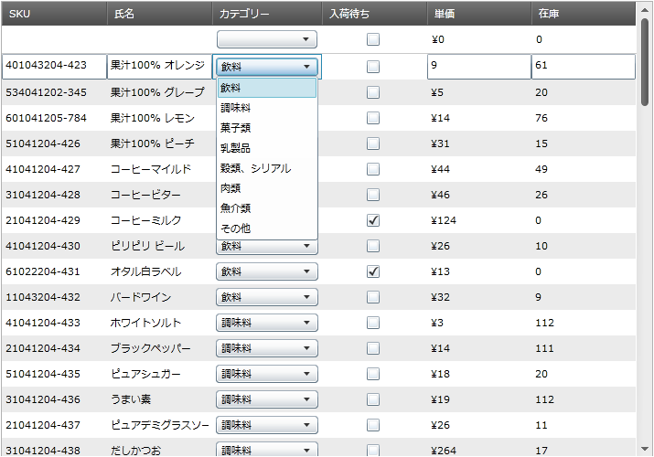

////

|metadata|
{
    "name": "xamgrid-comboboxcolumn-column",
    "controlName": ["xamGrid"],
    "tags": ["Data Presentation","Grids","Templating"],
    "guid": "934885fe-5bc5-4d19-9927-0b8722700670",  
    "buildFlags": [],
    "createdOn": "2016-05-25T18:21:56.4822013Z"
}
|metadata|
////

{XamGridHeader}

= ComboBoxColumn 列

タイプ link:{ApiPlatform}controls.grids.xamgrid{ApiVersion}~infragistics.controls.grids.comboboxcolumn.html[ComboBoxColumn] の列によって、事前設定された項目のドロップダウン リストから値を選択して、xamGrid コントロールのセル値を編集できます。

以下は ComboBoxColumn がある xamGrid の図です。

ifdef::sl,wpf[]

endif::sl,wpf[]

ifdef::win-rt[]
image::images/RT_xamGrid_ComboBoxColumn_Column_01.png[]
endif::win-rt[]

図 1: ComboBoxColumn 列がある xamGrid

以下のリストは、ComboBoxColumn の主なプロパティを説明しています:

* link:{ApiPlatform}controls.grids.xamgrid{ApiVersion}~infragistics.controls.grids.comboboxcolumn~itemssource.html[ItemsSource] - ComboBoxColumn 列のデータ ソースを指定します
* link:{ApiPlatform}controls.grids.xamgrid{ApiVersion}~infragistics.controls.grids.comboboxcolumn~itemtemplate.html[ItemTemplate] - 使用されるデータ テンプレートを指定します。これによって列に項目が表示される方法をカスタマイズできます
* link:{ApiPlatform}controls.grids.xamgrid{ApiVersion}~infragistics.controls.grids.comboboxcolumn~displaymemberpath.html[DisplayMemberPath] - ComboBoxColumn に表示される項目のソースのデータ プロパティを指定します
* link:{ApiPlatform}controls.grids.xamgrid{ApiVersion}~infragistics.controls.grids.comboboxcolumn~selectedvaluepath.html[SelectedValuePath] - ユーザーがドロップダウン リストから値を選択した時に返される値を指定します

以下のコードは、ComboBoxColumn 列を xamGrid コントロールに追加する方法を示します。

*XAML の場合:*

----
 <ig:ComboBoxColumn Key="Category" Width="120" 
                    HorizontalContentAlignment="Stretch"
                    ItemsSource="{Binding Source={StaticResource optionsList}}"
                    SelectedValuePath="Name"
                    DisplayMemberPath="Name">
----

デフォルトでは、ComboBoxColumn 列はドロップダウン リストのセル値を表示します。ただし、テンプレートを使用することでこのデフォルトの表示を変更できます。

これを行うには、以下のコードで示すように、ComboBoxColumn 列の ItemTemplate プロパティをデータ テンプレートのインスタンスに設定します。

*XAML の場合:*

----
<ig:ComboBoxColumn Key="Category" Width="200" HorizontalContentAlignment="Stretch"
                   ItemsSource="{Binding Source={StaticResource optionsList}}"
                   SelectedValuePath="Name"
                   AllowEditingValidation=">
   <ig:ComboBoxColumn.ItemTemplate>
      <DataTemplate>
         <Grid>
            <Grid.ColumnDefinitions>
               <ColumnDefinition Width="20"></ColumnDefinition>
               <ColumnDefinition Width="20"></ColumnDefinition>
               <ColumnDefinition Width="160"></ColumnDefinition>
            </Grid.ColumnDefinitions>
            <TextBlock Text="{Binding ID}"  Grid.Column="0"></TextBlock>
            <TextBlock Text=" |"  Grid.Column="1"></TextBlock>
            <TextBlock Text="{Binding Name}"  Grid.Column="2"></TextBlock>
         </Grid>
      </DataTemplate>
   </ig:ComboBoxColumn.ItemTemplate>
</ig:ComboBoxColumn>
----

以下の図は、データ テンプレートのインスタンスに設定された ComboBoxColumn を示しています。

ifdef::sl,wpf[]

endif::sl,wpf[]

ifdef::win-rt[]
image::images/RT_xamGrid_ComboBoxColumn_Column_02.png[]
endif::win-rt[]

図 2: データ テンプレートのインスタンスに設定された ComboBoxColumn*

== 関連トピック

link:xamgrid-columns.html[列]