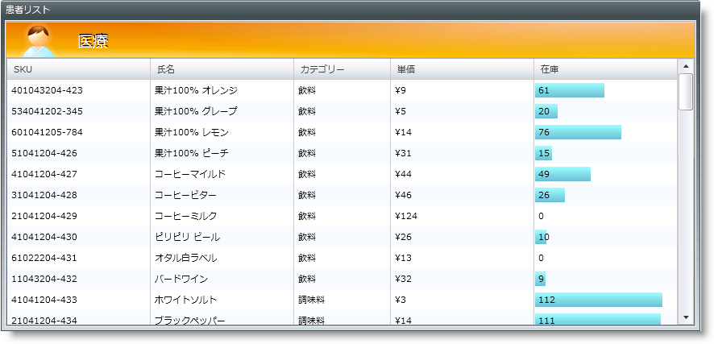

////

|metadata|
{
    "name": "xamgrid-conditional-formatting",
    "controlName": ["xamGrid"],
    "tags": ["Data Presentation","Formatting","Getting Started","Grids","Layouts"],
    "guid": "{21A89092-2C0F-4692-A4C9-181FF5530539}",  
    "buildFlags": [],
    "createdOn": "2016-05-25T18:21:56.0821697Z"
}
|metadata|
////

{XamGridHeader}

= 条件付き書式

条件付き書式によって、xamGrid のセルの列などの特定の値をテストしたり、特定の条件に一致するセルに特定の外観を適用したりすることができます。たとえば、セル値が特定の数 (ゼロなど) より下かどうかをチェックする条件を構築して、スタイルをこれらのセルに適用することができます。

列にはこれらに適用される複数の条件を持つことができ、各条件は定義された順番で評価されますが、条件をひとつの評価要素にグループ化できます。

ifdef::sl,wpf[]

endif::sl,wpf[]

ifdef::win-rt[]
image::images/RT_xamGrid_Conditional_Formatting_01.png[]
endif::win-rt[]

*条件フォーマッティングを有効にする*

link:{ApiPlatform}controls.grids.xamgrid{ApiVersion}~infragistics.controls.grids.conditionalformattingsettings.html[ConditionalFormattingSettings] オブジェクトの link:{ApiPlatform}controls.grids.xamgrid{ApiVersion}~infragistics.controls.grids.conditionalformattingsettings~allowconditionalformatting.html[AllowConditionalFormatting] プロパティを True に設定することによって、条件付き書式設定を有効にできます。

各 link:{ApiPlatform}controls.grids.xamgrid{ApiVersion}~infragistics.controls.grids.column.html[Column] は ConditionalFormat ルールを保持するコレクションです。ルールは Column を共有するすべての列アイランドに適用され、ルールは個々の行アイランドに適用されません。

以下のコードは、xamGrid コントロールの link:{ApiPlatform}controls.grids.xamgrid{ApiVersion}~infragistics.controls.grids.databarconditionalformatrule.html[DataBarConditionalFormatRule] UnitPrice 列を設定する方法を示します。

*XAML の場合:*

----
<ig:XamGrid Grid.Row="0" x:Name="MyDataGrid" AutoGenerateColumns="False">
   <ig:XamGrid.ConditionalFormattingSettings>
      <ig:ConditionalFormattingSettings AllowConditionalFormatting="True"/>
      </ig:XamGrid.ConditionalFormattingSettings>
      <ig:XamGrid.Columns>
      <ig:TextColumn Key="ProductID"/>
      <ig:TextColumn Key="ProductName"/>
      <ig:TextColumn Key="QuantityPerUnit"/>
      <ig:TextColumn Key="UnitPrice"/>
      <!-- 条件フォーマッティング ルールを列に追加します。 -->         
      <ig:TextColumn Key="UnitsInStock">
         <ig:TextColumn.ConditionalFormatCollection>
            <ig:DataBarConditionalFormatRule  
               DataBarDirection="Bidirectional"  
               DataBrush="Red" MaximumValue="50" MinimumValue="0" 
               StyleScope="Cell" NegativeDataBrush="Yellow" 
               UseNegativeDataBar="True">
            </ig:DataBarConditionalFormatRule>  
         </ig:TextColumn.ConditionalFormatCollection>
      </ig:TextColumn>
      <ig:TextColumn Key="UnitsOnOrder"/>
      <ig:TextColumn Key="ReorderLevel"/>
      <ig:TextColumn Key="Discontinued"/>
   </ig:XamGrid.Columns>
</ig:XamGrid>
----

*Visual Basic の場合:*

----
'  条件付き書式設定を有効にします   
Me.MyDataGrid.ConditionalFormattingSettings.AllowConditionalFormatting = true
Dim MyRule As New DataBarConditionalFormatRule
MyRule.DataBarDirection = DataBarDirection.Bidirectional
MyRule.DataBrush = New SolidColorBrush(Colors.Red)
MyRule.NegativeDataBrush = New SolidColorBrush(Colors.Yellow)
MyRule.StyleScope = StyleScope.Cell
MyRule.UseNegativeDataBar = true
'  ルールを UnitsInStock 列に追加します               
Me.MyDataGrid.Columns.DataColumns("UnitsInStock").ConditionalFormatCollection.Add(MyRule)
----

*C# の場合:*

----
// 条件フォーマッティングを有効にします。   
this.MyDataGrid.ConditionalFormattingSettings.AllowConditionalFormatting = true;
// DataBarConditionFormatRule を作成します。    
DataBarConditionalFormatRule MyRule = new DataBarConditionalFormatRule();
MyRule.DataBarDirection = DataBarDirection.Bidirectional;
MyRule.DataBrush = new SolidColorBrush(Colors.Red);
MyRule.NegativeDataBrush = new SolidColorBrush(Colors.Yellow);
MyRule.StyleScope = StyleScope.Cell;
MyRule.UseNegativeDataBar = true;
// ルールを UnitsInStock 列に追加します。 
this.MyDataGrid.Columns.DataColumns["UnitsInStock"].ConditionalFormatCollection.Add(MyRule);
----

ifdef::win-rt[]
image::images/RT_xamGrid_DataBarConditionalFormatRule.png[]
endif::win-rt[]

条件付き書式設定の各ルールにはデフォルトのスタイルがなく、自分でスタイルを定義する必要があります。

link:{ApiPlatform}controls.grids.xamgrid{ApiVersion}~infragistics.controls.grids.iconconditionalformatrule.html[IconConditionalFormatRule] に定義されたデフォルトのアイコンはありません。固有のアイコン セットを定義する必要があります。アイコンは DataTemplates です。

同じスタイルのアスペクトをすべて変更できる link:{ApiPlatform}controls.grids.xamgrid{ApiVersion}~infragistics.controls.grids.column~conditionalformatcollection.html[ConditionalFormatCollection] で複数のルールを定義できます。

優先度は上から下に与えられ、一番上の要素に最高の優先度が与えられます。たとえば、以下の 2 つのルールを ConditionalFormatCollection で定義した場合:

*XAML の場合:*

----
<ig:GreaterThanConditionalFormatRule Value="5"  StyleToApply="{StaticResource Style1}"/>
<ig:GreaterThanConditionalFormatRule Value="10" StyleToApply="{StaticResource Style2}"/>
----

現在のセル値が 30 の場合、両方のルールは True として表示されます。ただし、最初のルールが優先されるため、セルは Style1 に設定されます。

条件によって link:{ApiPlatform}controls.grids.xamgrid{ApiVersion}~infragistics.controls.grids.conditionalformattingrulebase~isterminalrule.html[IsTerminalRule] プロパティを設定することは、その条件が評価されると、それに続く条件が評価されないことを意味します。

以下の例で、2 番目の条件に達すると、3 番目の条件は決して評価されません。

*XAML の場合:*

----
<ig:XamGrid Grid.Row="0" x:Name="MyDataGrid" AutoGenerateColumns="False">
   <ig:XamGrid.ConditionalFormattingSettings>
      <ig:ConditionalFormattingSettings 
          AllowConditionalFormatting="True"/>    
      </ig:XamGrid.ConditionalFormattingSettings>
      <ig:XamGrid.Columns>
      <ig:TextColumn Key="ProductID"/>
      <ig:TextColumn Key="ProductName"/>
      <ig:TextColumn Key="QuantityPerUnit"/>
      <ig:TextColumn Key="UnitPrice"/>
      <ig:TextColumn Key="UnitsInStock">
         <ig:TextColumn.ConditionalFormatCollection>
            <ig:GreaterThanConditionalFormatRule Value="5" StyleToApply="{StaticResource Style1}">
            </ig:GreaterThanConditionalFormatRule>
            <ig:GreaterThanConditionalFormatRule Value="10" IsTerminalRule="True" StyleToApply="{StaticResource Style2}">
            </ig:GreaterThanConditionalFormatRule>
            <ig:GreaterThanConditionalFormatRule Value="15" StyleToApply="{StaticResource Style3}">
            </ig:GreaterThanConditionalFormatRule>
         </ig:TextColumn.ConditionalFormatCollection>
      </ig:TextColumn>
      <ig:TextColumn Key="UnitsOnOrder"/>
      <ig:TextColumn Key="ReorderLevel"/>
      <ig:TextColumn Key="Discontinued"/>
   </ig:XamGrid.Columns>
</ig:XamGrid>
----

関連トピック

link:xamgrid-types-of-rules.html[ルールのタイプ]