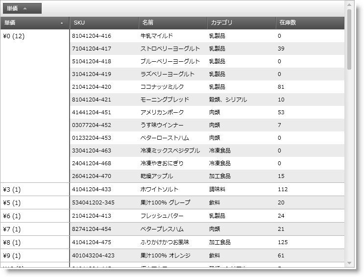

////

|metadata|
{
    "name": "xamgrid-custom-display-for-merged-cells",
    "controlName": ["xamGrid"],
    "tags": ["How Do I","Styling","Templating"],
    "guid": "1cfea8ac-6681-4d97-9151-7f125093093b",  
    "buildFlags": [],
    "createdOn": "2016-05-25T18:21:56.4641999Z"
}
|metadata|
////

{XamGridHeader}

= 結合されたセルのカスタム表示

デフォルトで、結合された列には列の値が表示されます。ただし、テンプレートを使用することでこのデフォルトの表示を変更できます。

以下のスクリーンショットは、セルの結合機能を使用して、グリッド内でグループ化された単価列を表示します。結合されたセル値は、書式を通貨に設定した単価の値、および xamGrid コントロール内の各結合された列のグループ行の数を示します。

ifdef::sl,wpf[]

endif::sl,wpf[]

ifdef::win-rt[]
image::images/RT_xamGrid_Custom_Display_Merged_Cells.png[]
endif::win-rt[]

図 1: MergedItemTemplate プロパティをデータ テンプレートのインスタンスに設定した xamGrid コントロール

これは Column の link:{ApiPlatform}controls.grids.xamgrid{ApiVersion}~infragistics.controls.grids.column~mergeditemtemplate.html[MergedItemTemplate] プロパティをデータ テンプレートのインスタンスに設定することで実行されます。このデータ テンプレートのデータ コンテキストは、以下の 3 つのプロパティを持つ MergedItemDataContext タイプです。

* Value - 結合された列の値
* Records - 結合された列に属するデータ オブジェクトのコレクション
* Count - 結合された列に属する項目の数。

*XAML の場合:*

----
<ig:TextColumn Key="UnitPrice" FormatString="{}{0:C}">
   <!-- データ テンプレートを使用して、結合された列ごとにカスタム キャプションを設定します -->
   <ig:TextColumn.MergedItemTemplate>
      <DataTemplate>
         <StackPanel Orientation="Horizontal">
            <!-- 通貨として Value をフォーマットするために値コンバーターを使用します -->
            <TextBlock Text="{Binding Value, Converter={StaticResource GroupByValueConverter}}"></TextBlock>
            <TextBlock Text=" (" />
            <TextBlock Text="{Binding Count}"></TextBlock>
            <TextBlock Text=")" />
         </StackPanel>
      </DataTemplate>
   </ig:TextColumn.MergedItemTemplate>
</ig:TextColumn>
----

関連トピック

link:xamgrid-merged-cells.html[結合セル]

link:xamgrid-custom-merged-cells.html[カスタムの結合セル]