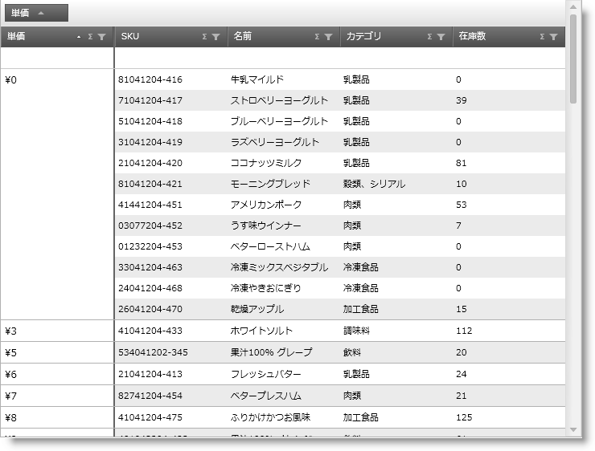
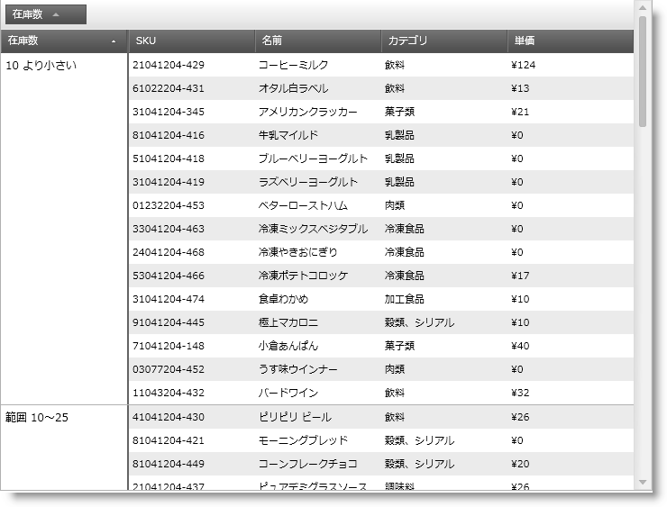

////

|metadata|
{
    "name": "xamgrid-custom-merged-cells",
    "controlName": ["xamGrid"],
    "tags": ["Data Presentation","Grids"],
    "guid": "8d5def84-443a-49b9-ac32-9ba7be269c37",  
    "buildFlags": [],
    "createdOn": "2016-05-25T18:21:56.470201Z"
}
|metadata|
////

{XamGridHeader}

= カスタムの結合セル

xamGrid コントロールの結合セル機能のデフォルト動作は、同じ値を含むセルのみを結合します (結合されたセルは結合された列エリアに配置されます)。

以下のスクリーンショットは、セルの結合機能のデフォルトの動作を使用して、グリッド内でグループ化された単価列を表示します。

ifdef::sl,wpf[]

endif::sl,wpf[]

ifdef::win-rt[]
image::images/RT_xamGrid_CellMerging_Default.png[]
endif::win-rt[]

図 1 デフォルトのセル結合機能を使用してグループ化された単価列のある xamGrid コントロール

ただし、このデフォルトの動作をオーバーライドして、カスタムの条件に基づいてグループを作成できます。

これは、一般的な IEqualityComparer インターフェイスを実装するカスタムの比較演算子を作成することで実行され、列の基盤となる値に一致するタイプを提供します。xamGrid コントロールの GroupByComparer プロパティでカスタムの比較演算子を構成します。

以下のスクリーンショットは、以下の値に基づいて列が結合されるグリッドを表示します。

* 10 より小さい
* 10～25 の範囲
* 25～50 ユニットの範囲
* 50～75 ユニットの範囲
* 75 より大きい

[NOTE]
====
*注:*

サイズ制限のために、10 ユニットよりも小さく、10～25 ユニットの範囲の結合された値がスクリーンショットに表示されます。
====

ifdef::sl,wpf[]

endif::sl,wpf[]

ifdef::win-rt[]
image::images/RT_xamGrid_Custom_Merged_Cells_01.png[]
endif::win-rt[]

図 2 デフォルトのセル結合機能を使用してグループ化された単価列のある xamGrid コントロール

以下の図は、上記にリストされた値に基づいて値を結合するように列を設定する方法を示します。この例は、整数のための IEqualityComparer インターフェイスを実装するカスタム比較子を使用します。結合されたセルごとにカスタム値を表示するために IValueConverter インターフェイスを実装する GroupedValuesConverter クラスも使用します。

*XAML の場合:*

----
<!--カスタム比較子を設定します -->
   <ig:TextColumn Key="UnitsInStock" GroupByComparer="{StaticResource GroupByCustomComparer}">
   <!-- データ テンプレートを使用して、結合された列ごとにカスタム キャプションを設定します -->
   <ig:TextColumn.MergedItemTemplate>
      <DataTemplate>
         <StackPanel Orientation="Horizontal">
            <TextBlock Text="{Binding Value, Converter={StaticResource GroupedValuesConverter}}" />
         </StackPanel>
      </DataTemplate>
   </ig:TextColumn.MergedItemTemplate>
</ig:TextColumn>
----

*Visual Basic の場合:*

----
Public Class GroupByCustomComparer Implements IEqualityComparer(Of Integer)
    Public Function Equals1(ByVal x As Integer, ByVal y As Integer) As Boolean Implements System.Collections.Generic.IEqualityComparer(Of Integer).Equals
        ' GetHashCode で作成された各グループの値を比較します
        ' 追加的な条件は不要なので、True を返すだけです
        Return True
    End Function
    Public Function GetHashCode1(ByVal obj As Integer) As Integer Implements System.Collections.Generic.IEqualityComparer(Of Integer).GetHashCode
 ' 値を比較し、グループごとに同じハッシュコードを返します
        If obj >= 0 AndAlso obj < 10 Then
            Return "0".GetHashCode()
        End If
        If obj >= 10 AndAlso obj < 25 Then
            Return "10".GetHashCode()
        End If
        If obj >= 25 AndAlso obj < 50 Then
            Return "25".GetHashCode()
        End If
        If obj >= 50 AndAlso obj < 75 Then
            Return "50".GetHashCode()
        End If
        If obj >= 75 Then
            Return "75".GetHashCode()
        Else
            Return obj.GetHashCode()
        End If
    End Function
End Class
Public Class GroupedValuesConverter
    Implements IValueConverter
    Public Function Convert(ByVal value As Object, ByVal targetType As System.Type, ByVal parameter As Object, ByVal culture As System.Globalization.CultureInfo) As Object Implements System.Windows.Data.IValueConverter.Convert
        ' 変換する値を取得します
        Dim val As Integer = CInt(value)
        ' 値を比較し、各 Groupby 行に表示される値の範囲の説明を返します
        If val >= 0 AndAlso val < 10 Then
            Return " Less than 10 Units "
        ElseIf val >= 10 AndAlso val < 25 Then
            Return " Between 10 and 25 Units "
        ElseIf val >= 25 AndAlso val < 50 Then
            Return " Between 25 And 50 Units "
        ElseIf val >= 50 AndAlso val < 75 Then
            Return " Between 50 And 75 Units "
        ElseIf val >= 75 Then
            Return "75 or Greater Units in Stock"
        Else
            Return val.ToString()
        End If
    End Function
    Public Function ConvertBack(ByVal value As Object, ByVal targetType As System.Type, ByVal parameter As Object, ByVal culture As System.Globalization.CultureInfo) As Object Implements System.Windows.Data.IValueConverter.ConvertBack
        Throw New NotImplementedException()
    End Function
End Class
public class GroupByCustomComparer : IEqualityComparer<int>
{
    #region IEqualityComparer<int> Members
    public bool Equals(int x, int y)
    {
        // Compares values for each group created by GetHashCode
        // Since no additional conditions is required, just return true
        return true;
    }
    public int GetHashCode(int obj)
    {
        // Compare value and return the same hashcode for each group
        if (obj >= 0 && obj < 25)
            return "0".GetHashCode();
        if (obj >= 25 && obj < 50)
            return "25".GetHashCode();
        if (obj >= 50 && obj < 75)
            return "50".GetHashCode();
        if (obj >= 75)
            return "75".GetHashCode();
        else
            return obj.GetHashCode();
    }
    #endregion
}
public class GroupedValuesConverter : IValueConverter
{
    #region IValueConverter Members
    public object Convert(object value, Type targetType, object parameter, System.Globalization.CultureInfo culture)
    {
        // Get value to convert
        int val = (int)value;
    // Compare value and returns a description of the value' を返します。
        if (val >= 0 && val < 25)
            return "Under 25 Units in Stock";
        else if (val >= 25 && val < 50)
            return "Between 25 and 50 Units in Stock";
        else if (val >= 50 && val < 75)
            return "Between 50 and 75 Units in Stock";
        else if (val >= 75)
            return "75 or Greater Units in Stock";
        else
            return val.ToString();
    }
    public object ConvertBack(object value, Type targetType, object parameter, System.Globalization.CultureInfo culture)
    {
        throw new NotImplementedException();
    }
    #endregion
}
----

*C# の場合:*

----
public class GroupByCustomComparer : IEqualityComparer<int>
{
   #region IEqualityComparer<int> Members
   public bool Equals(int x, int y)
   {
      // GetHashCode で作成された各グループの値を比較します
      // 追加的な条件は不要なので、True を返すだけです
      return true;
   }
   public int GetHashCode(int obj)
   {
      // 値を比較し、グループごとに同じハッシュコードを返します
      if (obj >= 0 && obj < 10)
         return "0".GetHashCode();
      if (obj >= 10 && obj < 25)
         return "10".GetHashCode();
      if (obj >= 25 && obj < 50)
         return "25".GetHashCode();
      if (obj >= 50 && obj < 75)
         return "50".GetHashCode();
      if (obj >= 75)
         return "75".GetHashCode();
      else
         return obj.GetHashCode();
   }
   #endregion
}
public class GroupedValuesConverter : IValueConverter
{
   #region IValueConverter Members
   public object Convert(object value, Type targetType, object parameter, System.Globalization.CultureInfo culture)
   {
      // 変換する値を取得します
      int val = (int)value;
      // 値を比較し、各結合された列に表示される値の範囲の説明を返します
      if (val >= 0 && val < 10)
         return “Less than 10 Units”;
      else if (val >= 10 && val < 25)
         return “Between 10 and 25 Units”;
      else if (val >= 25 && val < 50)
         return ”Between 25 And 50 Units”;
      else if (val >= 50 && val < 75)
         return ”Between 50 And 75 Units;
      else if (val >= 75)
         return “Greater Than 75 Units”;
      else
         return val.ToString();
    }
    public object ConvertBack(object value, Type targetType, object parameter, System.Globalization.CultureInfo culture)
    {
       throw new NotImplementedException();
    }
    #endregion
}
----