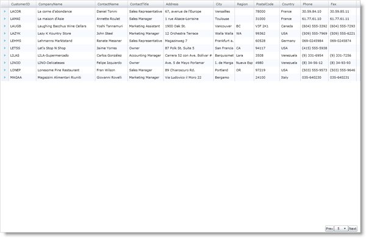

////

|metadata|
{
    "name": "xamgrid-customize-the-pager",
    "controlName": ["xamGrid"],
    "tags": ["Grids","Paging","Styling"],
    "guid": "{77C6E31C-D9DB-4F11-AADD-A6328B433C65}",  
    "buildFlags": [],
    "createdOn": "2016-05-25T18:21:55.894197Z"
}
|metadata|
////

{XamGridHeader}

= ページャーをカスタマイズ

== 始める前に

xamGrid コントロールによって、ページャーの外観のカスタマイズが迅速かつ簡単になります。このコントロールは link:{ApiPlatform}controls.grids.xamgrid{ApiVersion}~infragistics.controls.grids.primitives.pagercontrol.html[PagerControl] オブジェクトを使用して、ページャー内のページング コントロールを表します。ページング コントロールをカスタマイズするためにこのオブジェクトを対象とするページャー スタイルを提供できます。Infragistics Commanding Framework を使用してページング コントロール動作を変更できます。このフレームワークによって、特定のイベントに応答して実行するコマンドを指定できます。これによってエンドユーザーがボタンをクリックした時に NextPage コマンドなどのページング コマンドが実行されるように指定することができます。

== 達成すること

2 つのボタンとドロップダウン コントロールがあるページャーの作成方法を学びます。このガイドでは完全な link:resources-custom-pager.html[CustomPager] ファイルを開発者に提供します。

== 次の手順を実行します

[start=1]
. xamGrid コントロールを Microsoft® {PlatformName}™ プロジェクトに追加し、それをデータにバンドします。詳細については、 link:xamgrid-data-binding.html[データ バインディング]を参照してください。
[start=2]
. UserControl タグに以下の名前空間宣言を追加します。

ifdef::wpf[]

*XAML の場合:*

----
xmlns:ig="http://schemas.infragistics.com/xaml"
xmlns:gridPrim="http://schemas.infragistics.com/xaml/primitives"
----

endif::wpf[]

[start=3]
. ページングを有効にし、キー CustomPager1 を使用して link:{ApiPlatform}controls.grids.xamgrid{ApiVersion}~infragistics.controls.grids.pagersettings.html[PagerSettings] オブジェクトの link:{ApiPlatform}controls.grids.xamgrid{ApiVersion}~infragistics.controls.grids.stylesettingsbase~style.html[Style] プロパティを設定します。このスタイルを後の手順で作成します。ページングの有効化についての詳細は、 link:xamgrid-paging.html[「ページング」]を参照してください。

*XAML の場合:*

----
<ig:XamGrid x:Name="xamGrid1">
   <ig:XamGrid.PagerSettings>
      <ig:PagerSettings AllowPaging="Bottom" PageSize="10" Style="{StaticResource CustomPager1}" />
   </ig:XamGrid.PagerSettings>
</ig:XamGrid>
----

[start=4]
. Style オブジェクトを UserControl のリソース ディクショナリに追加します。

** Key プロパティを CustomPager1 に設定します。
** TargetType プロパティを grid:PagerCellControl に設定します。
** Template プロパティの Setter オブジェクトを追加します。

*XAML の場合:*

----
<UserControl.Resources>
   
</UserControl.Resources>
----

[start=5]
. PagerControl オブジェクトをコントロール テンプレートに追加します。

** PagerControl オブジェクトのコントロール テンプレートを作成します。
** StackPanel コンテナーをコントロール テンプレートに追加します。
** 2 つの Button コントロールを StackPanel コンテナーに追加します。これらのボタンによって、エンドユーザーは前ページまたは次ページにナビゲートできます。
** ComboBox コントロールを StackPanel コンテナーに追加します。ComboBox コントロールによって、エンドユーザーは特定のページをナビゲートすることができます。

.注:
[NOTE]
====
ページの選択のために使用するコントロールは Selector クラスから派生する必要があり、項目のバインディングが自動的に実行されるように「PagerItems」という名前を付ける必要があります。
====

*XAML の場合:*

----
<ig:PagerControl x:Name="PagerItemControl">
   <!-- TODO: PagerCellControl オブジェクトのコマンドを指定します -->
   <ig:PagerControl.Style>
      
   </ig:PagerControl.Style>
</ig:PagerControl>
----

[start=6]
. 前ページ コマンドを前ページ ボタンに追加し、ボタンの Click イベントに応答してそれを実行します。

*XAML の場合:*

----
<ig:Commanding.Command>
   <ig:XamGridPagingControlsCommandSource EventName="Click" CommandType="PreviousPage"  ></ig:XamGridPagingControlsCommandSource>
</ig:Commanding.Command>
----

[start=7]
.  次ページ コマンドを次ページ ボタンに追加し、ボタンの Click イベントに応答してそれを実行します。

*XAML の場合:*

----
<ig:Commanding.Command>
   <ig:XamGridPagingControlsCommandSource EventName="Click" CommandType="NextPage"  ></ig:XamGridPagingControlsCommandSource>
</ig:Commanding.Command>
----

[start=8]
.  指定ページに移動コマンドをコンボボックスに追加し、コンボボックスの SelectionChanged eイベントに応答してそれを実行します。

*XAML の場合:*

----
<ig:Commanding.Command>
   <ig:XamGridPagingControlsCommandSource EventName="SelectionChanged" CommandType="GoToPage"  ></ig:XamGridPagingControlsCommandSource>
</ig:Commanding.Command>
----

[start=9]
. コマンドを PagerControl オブジェクトに追加します。PagerControl オブジェクトがページング イベントを発生させると、コマンドが実行され、xamGrid がページングされます。コントロール テンプレートで個々のコントロールに指定したコマンドは、PagerControl オブジェクトに対してページング イベントをトリガーしますが、xamGrid を直接操作しません。

*XAML の場合:*

----
<!-- 特定の PagerControl イベントが起動すると PagerCellControl でコマンドを実行します-->
<ig:Commanding.Commands>
   <ig:XamGridPagingCommandSource EventName="FirstPage"  CommandType="FirstPage" >
   </ig:XamGridPagingCommandSource>
   <ig:XamGridPagingCommandSource EventName="LastPage"  CommandType="LastPage" >
   </ig:XamGridPagingCommandSource>
   <ig:XamGridPagingCommandSource EventName="PreviousPage"  CommandType="PreviousPage" >
   </ig:XamGridPagingCommandSource>
   <ig:XamGridPagingCommandSource EventName="NextPage"  CommandType="NextPage" >
   </ig:XamGridPagingCommandSource>
   <ig:XamGridPagingCommandSource EventName="GoToPage"  CommandType="GoToPage" >
   </ig:XamGridPagingCommandSource>
</ig:Commanding.Commands>
----

[start=10]
. アプリケーションを実行します。連続するページ間でナビゲートするためのボタンや特定のページにナビゲートするためのコンボ ボックスを使用して xamGrid コントロールを操作できます。

ifdef::sl,wpf[]

endif::sl,wpf[]

ifdef::win-rt[]
image::images/RT_xamGrid_Customize_the_Pager_01.png[]
endif::win-rt[]

== 関連トピック

link:xamgrid-paging.html[ページング]

link:xamgrid-paging-events.html[ページング イベント]