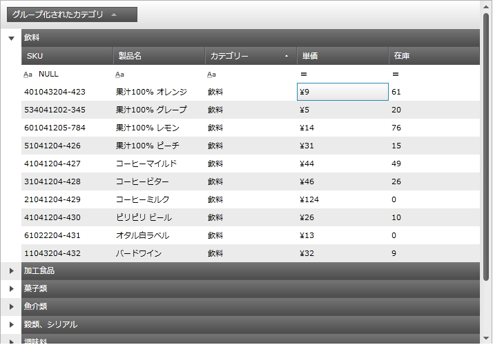

////
|metadata|
{
    "name": "xamgrid-data-annotations",
    "controlName": ["xamGrid"],
    "tags": ["Data Binding","Data Presentation","Grids","How Do I"],
    "guid": "14ebc8b1-fa5f-44c4-9b6a-d0e0104cbc4d",
    "buildFlags": [],
    "createdOn": "2016-05-25T18:21:56.476201Z"
}
|metadata|
////

{XamGridHeader}

= データの注釈

== トピックの概要

=== 目的

このトピックでは、 _xamGrid_™   でデータの注釈を使用してデータ クラスに属性を適用する方法を紹介します。

=== 前提条件

以下の表は、このトピックの前提条件として必要なトピックを示しています。

[options="header", cols="a,a"]
|====
|トピック|目的

| link:xamgrid-data-binding.html[データ バインディング]
|_xamGrid_ コントロールによって、IEnumerable インターフェイスを実装する任意のオブジェクトにバインドすることができます。データへのバインドはシンプルで、コントロールの  link:{ApiPlatform}controls.grids.xamgrid{ApiVersion}~infragistics.controls.grids.xamgrid~itemssource.html[ItemsSource] プロパティを設定することだけを必要とします。

|====

=== このトピックの内容

このトピックは以下のセクションからなります。

* <<_Ref330915070, データの注釈の構成 >>

** <<_Ref330915088,概要>>

** <<_preview,プレビュー>>

** <<_Ref330915059,要件>>

** <<_Ref330915149,サポートされる属性>>

** <<_Ref330915157,データ クラスの属性の適用>>

* <<_Ref323199323, 関連コンテンツ >>

[[_Ref330915070]]
== データの注釈の構成

[[_Ref330915088]]

=== 概要

_xamGrid_   のデータの注釈を使用すると、データ クラスで属性を適用できます。この注釈は、検証ルールの指定、データの表示の決定、クラス間の関係の設定などの操作で便利です。

クラスでデータの注釈の属性を使用する主な利点は、同じ規則を何回も設定する必要がないことです。これは、データ定義がセントラル ロケーションにあるからで、これにより複数の場所に同一の規則を設定することを排除します。

_xamGrid_   コントロールはデータ クラスに適用されるデータの注釈を認識します。グリッドは、グリッドでデータを管理するために使用される `DataManager` を変更することができるプロバイダー モデルを公開します。

`AnnotationsDataManagerProvider` クラスは、`System.ComponentModel.DataAnnotations` `アセンブリ`に依存します。このプロバイダーを使用すると、データの注釈の完全な認識が自動的に有効となります。

[[_preview]]

=== プレビュー

以下のスクリーンショットは結果のプレビューです。以下のフィールドの属性が構成したデータ属性を表示します。

* カテゴリ

カテゴリの指定した属性:

`[DisplayAttribute(GroupName = "Grouped Category")]`

* 名前

名前の指定した属性:

`[DisplayAttribute(ShortName = "Short Name")]`

* 単価

単価の指定した属性:

`[DisplayFormat(DataFormatString = "{0:C}", ApplyFormatInEditMode = true)]`

ifdef::sl,wpf[]

endif::sl,wpf[]

ifdef::win-rt[]
image::images/RT_xamGrid_DataAnnotations_01.png[]
endif::win-rt[]

[[_Ref330915059]]

=== 要件

この手順を実行するには、以下のリソースが必要です。

この手順を行うには、以下の NuGet パッケージ参照が必要です。

* Infragistics.WPF.AnnotationsDataManager
* Infragistics.WPF.Controls.Grids.XamGrid
* Microsoft System.ComponentModel.DataAnnotations.dll への参照

* アプリケーションの XAML ファイルで名前空間を参照します。

** xmlns:ig="http://schemas.infragistics.com/xaml"
** xmlns:igData="http://schemas.infragistics.com/xaml"

* デザイン タイムまたは `ItemSource` を設定する前に `AnnotationsDataManagerProvider` を設定します。そうでない場合プロパティは無視されます。

*XAML の場合:*

[source,xaml]
----
<ig:XamGrid.DataManagerProvider>
    <ig:AnnotationsDataManagerProvider />
</ig:XamGrid.DataManagerProvider>
----

*C# の場合:*

[source,csharp]
----
this.xamGrid1.DataManagerProvider = 
     new AnnotationsDataManagerProvider();
this.xamGrid1.ItemsSource = DataUtil.Products;
----

*Visual Basic の場合:*

[source,vb]
----
Me.xamGrid1.DataManagerProvider = New AnnotationsDataManagerProvider()
Me.xamGrid1.ItemsSource = DataUtil.Products
----

[[_Ref330915149]]

=== サポートされる属性

*DisplayAttribute*  *:*

*  _AutoGenerate_   – 列がフィールドのために生成されるかどうかを指定します。
*  _ShortName_   - 列の HeaderText として使用されます。
*  _GroupName_   – グループ化される時に GroupBy 列の HeaderText として使用されます。
*  _Order_   – AutoGenerated 列が配置される順序を設定します。

.注:
[NOTE]
====
1 つのフィールドの順序を `int.Max` 以外に設定すると、その順序は順序が設定されているその他のフィールドに相対するため、最初に表示されることになります。また、順序を `int.Max` に設定すると、デフォルトの順序は指定した順序をオーバーライドします。
====

*DisplayFormatAttribute*  *:*

* ApplyFormatInEditMode – 編集モードになった時に指定した FormatString を Text 列に適用します。たとえば、編集モードの時に、列値は通貨値として表示されますが、セルが編集モードになると、通貨文字列の書式を保持できます。
* ConvertEmptyStringToNull – 編集モードを解除した時、値が空の文字列になる場合、文字列は null に設定されます。
* DataFormatString – TextColumns に使用される FormatString
* NullDisplayText – 値が null の場合に表示されるテキストを設定します。

*EditableAttribute*  *:*

* AllowEdit – フィールドが編集モードになれるかどうかを決定します。
* AllowInitialValue – AddNewRow 行のフィールドで編集が許可されるかどうかを決定します。

*TimestampAttribute*  *:*

* 設定されると、この属性に対して列は自動生成されません。

[[_Ref330915157]]

=== データ クラスの属性の適用

以下のコードは、 _DisplayAttribute_   と  _DisplayFormat_   属性の設定を示します。

*C# の場合:*

[source,csharp]
----
private string _category;
[DisplayAttribute(GroupName = "Grouped Category")]
public string Category
{
    get { return _category; }
    set
    {
        if (_category != value)
        {
            _category = value;
            this.OnPropertyChanged("Category");
        }
    }
}
private string _name;
[DisplayAttribute(ShortName = "Short Name")]
public string Name
{
    get { return _name; }
    set
    {
        if (_name != value)
        {
            _name = value;
            this.OnPropertyChanged("Name");
        }
    }
}
private double _unitPrice;
[DisplayFormat(DataFormatString = "{0:C}", ApplyFormatInEditMode = true)]
public double UnitPrice
{
    get { return _unitPrice; }
    set
    {
        if (_unitPrice != value)
        {
            _unitPrice = value;
            this.OnPropertyChanged("UnitPrice");
        }
    }
}
----

*Visual Basic の場合:*

[source,vb]
----
Private _category As String
<DisplayAttribute(GroupName := "Grouped Category")> _
Public Property Category() As String
      Get
            Return _category
      End Get
      Set
            If _category <> value Then
                  _category = value
                  Me.OnPropertyChanged("Category")
            End If
      End Set
End Property
Private _name As String
<DisplayAttribute(ShortName := "Short Name")> _
Public Property Name() As String
      Get
            Return _name
      End Get
      Set
            If _name <> value Then
                  _name = value
                  Me.OnPropertyChanged("Name")
            End If
      End Set
End Property
Private _unitPrice As Double
<DisplayFormat(DataFormatString := "{0:C}", ApplyFormatInEditMode := True)> _
Public Property UnitPrice() As Double
      Get
            Return _unitPrice
      End Get
      Set
            If _unitPrice <> value Then
                  _unitPrice = value
                  Me.OnPropertyChanged("UnitPrice")
            End If
      End Set
End Property
----

[[_Ref323199323]]
== 関連コンテンツ

=== トピック

以下のトピックでは、このトピックに関連する追加情報を提供しています。

[options="header", cols="a,a"]
|====
|トピック|目的

| link:xamgrid-using-xamgrid.html[xamGrid の使用]
|このセクションは、 _xamGrid_ コントロールの重要な概念および機能を効果的に使用するためのタスク ベースの情報について説明します。

|====