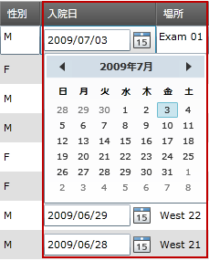

////

|metadata|
{
    "name": "xamgrid-datecolumn",
    "controlName": ["xamGrid"],
    "tags": ["Data Presentation","Editing","Grids","Layouts","Selection"],
    "guid": "dc32ca26-d732-4fd6-9909-6dd25be8d6fa",  
    "buildFlags": [],
    "createdOn": "2016-05-25T18:21:56.5502056Z"
}
|metadata|
////

{XamGridHeader}

= DateColumn

== トピックの概要

=== 目的

このトピックでは、 _DateColumn_  列タイプを使用して、 xamGrid™ コントロールで DateTime データを表示する方法を説明します。

=== 前提条件

以下の表に、このトピックを理解するための前提条件として求められるトピックをリストします。

[options="header", cols="a,a"]
|====
|トピック|目的

| link:xamgrid-columns.html[列]
|このトピックは、基本データ ソース内のプロパティのデータ タイプに基づいて xamGrid 列を示します。

|====

=== 本トピックの内容

このトピックには次のセクションがあります。

* <<_Ref319602379, DateColumn 列を xamGrid に追加 >>
* <<_Ref317600351, コード例 >>
* <<_Ref317600356, 関連コンテンツ >>

[[_Ref317600346]]
[[_Ref317872499]]
[[_Ref319602379]]
== DateColumn 列を xamGrid に追加

=== 概要

以下の例では、DateColumn 列を xamGrid コントロールに追加し、その主要プロパティを設定する方法を示しています。また、表示された DateTime 値に書式を適用する方法も示します。

=== プロパティ設定

以下の表は、推奨の構成/ビヘイビアーをプロパティ設定にマップしています。

[options="header", cols="a,a,a"]
|====
|目的|プロパティ|次に設定

|表示された DateTime 値に書式を適用
| link:{ApiPlatform}controls.grids.xamgrid{ApiVersion}~infragistics.controls.grids.datecolumn~selecteddateformat.html[SelectedDateFormat]
|
* _Long_ 

日付の月および曜日が、完全な書式で表示されます。 

* _ショート_ 

日付の月および曜日が、数で表示されます。

|====

[[_Ref317600351]]
== コード例

=== 説明

以下のコードは、DateColumn を xamGrid コントロールに追加して、基本データの DateTime 値を視覚化する方法を示しています。また、表示された DateTime 値に書式を適用する方法も説明します。

以下のスクリーンショットは、以下の設定を行った後の DateColumn および xamGrid の外観を示しています。

[options="header", cols="a,a"]
|====
|プロパティ|値

|_SelectedDateFormat_
|_Long_

|====

=== コード

*XAML の場合:*

[source,xaml]
----
<ig:XamGrid x:Name="dataGrid"
            ItemsSource="{StaticResource Patients}"
            AutoGenerateColumns="False"
            ColumnWidth="*">
    <ig:XamGrid.Columns>
        <!-- ここにさらに列を追加します -->
        <!-- ここで DateTimeColumn を追加します -->
        <ig:DateColumn Key="AdmittanceDate" 
                       SelectedDateFormat="Long"
                       HeaderText="Admittance Date" />
        <!-- ここにさらに列を追加します -->
    </ig:XamGrid.Columns>
</ig:XamGrid>
----

[[_Ref317600356]]
== 関連コンテンツ

=== トピック

以下のトピックでは、このトピックに関連する情報を提供しています。

[options="header", cols="a,a"]
|====
|トピック|目的

| link:xamgrid-datetime-columns.html[DateTime 列]
|このトピックでは、DateTime データを xamGrid コントロールで表示する方法を説明します。

|====