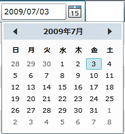
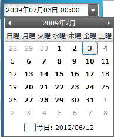

////

|metadata|
{
    "name": "xamgrid-datetime-columns",
    "controlName": ["xamGrid"],
    "tags": ["Grids","Layouts","Selection"],
    "guid": "a1cb679a-f329-4428-8045-bae0522206e7",  
    "buildFlags": [],
    "createdOn": "2016-05-25T18:21:56.5432046Z"
}
|metadata|
////

{XamGridHeader}

= DateTime 列

== トピックの概要

=== 目的

このトピックでは、xamGrid™ コントロール内での DateTime データの表示方法について説明します。

=== 前提条件

以下の表に、このトピックを理解するための前提条件として求められるトピックをリストします。

[options="header", cols="a,a"]
|====
|トピック|目的

| link:xamgrid-columns.html[列]
|このトピックは、基本データ ソース内のプロパティのデータ タイプに基づいて xamGrid 列を示します。

| link:xamgrid-data-binding.html[データ バインディング]
|このトピックでは、データ バインディングを xamGrid コントロールに実装する方法を説明します。

|====

=== 本トピックの内容

このトピックには次のセクションがあります。

* <<_Ref319678190, xamGrid コントロールの DateTime 列 >>

ifdef::sl,wpf[]
** <<_Ref319672779,DateColumn>>

endif::sl,wpf[]

** <<_Ref319672792,DateTimeColumn>>

* <<_Ref319678200, 関連コンテンツ >>

[[_Ref319678190]]
== xamGrid コントロールの DateTime 列

=== 概要

xamGrid コントロールの DateTime 値は、DateColumn および DateTimeColumn タイプで表示します。以下のブロックでこれについて説明します。

=== DateTime 列の概要

列タイプについての詳細は、以下の概要テーブルの後をご覧ください。

[options="header", cols="a,a"]
|====
|列タイプ|説明

ifdef::sl,wpf[]
|<<_Ref319672779,DateColumn>>
|Microsoft {PlatformName} DatePicker コントロールを使用して日付を表示します。日付の書式を決定するには、 link:{ApiPlatform}controls.grids.xamgrid{ApiVersion}~infragistics.controls.grids.datecolumn~selecteddateformat.html[SelectedDateFormat] プロパティを Long または Short に設定します。
endif::sl,wpf[]

|<<_Ref319672792,DateTimeColumn>>
| link:xamdatetimeinput.html[xamDateTimeInput] コントロールを使用して日付を表示します。link:{ApiPlatform}controls.grids.datetimecolumn{ApiVersion}~infragistics.controls.grids.datetimecolumn~selecteddatemask.html[SelectedDateMask] プロパティを特定のマスクに設定することによって、日付の書式を決定できます。 

適用された有効なマスクに関する詳細は、 link:xaminputs-masks.html[マスク] トピックに含まれています。

|====

ifdef::sl,wpf[]

[[_Ref319672779]]

=== DateColumn

これは、プラットフォーム固有の列タイプです。列の DateTime 値を表示するために、{PlatformName} xamGrid アプリケーションの Microsoft {PlatformName} DatePicker コントロールを使用します。

==== 関連トピック:

* link:xamgrid-datecolumn.html[DateColumn 列]

endif::sl,wpf[]

[[_Ref319672792]]

=== DateTimeColumn

DateTimeColumn は {PlatformName} xamGrid アプリケーションで使用できます。xamDataTimeInput コントロールを使用して、この列内で DateTime 値を表示します。

ユーザー入力は、有効な日付および時間の書式のみに制限されます。この列は、エンドユーザー入力用のテキスト ボックス、および日付を選択するためのドロップダウン カレンダーを提供します。DateTime 値が表示する書式には、さまざまなマスクを適用できます。

==== 関連トピック:

* link:xamgrid-datetimecolumn.html[DateTimeColumn 列]

[[_Ref317600356]]
[[_Ref319678200]]
== 関連コンテンツ

=== トピック

以下のトピックでは、このトピックに関連する情報を提供しています。

[options="header", cols="a,a"]
|====
|トピック|目的

| link:xamgrid-define-column-layout.html[列レイアウトの定義]
|このトピックでは、列レイアウトの変更方法を説明します

| link:xamgrid-change-column-width-settings.html[列幅設定の変更]
|このトピックでは、列幅の構成方法を説明します

| link:xamgrid-override-settings.html[Override の設定]
|このトピックでは、列のレイアウト レベルまたは列レベルの設定を使用することによって、xamGrid の設定をオーバーライドする方法を説明します

| link:xamgrid-set-the-text-alignment-on-column-headers.html[列ヘッダーでテキストの配置を設定]
|このトピックでは、列ヘッダー テキストの配置を設定する方法を説明します

|====