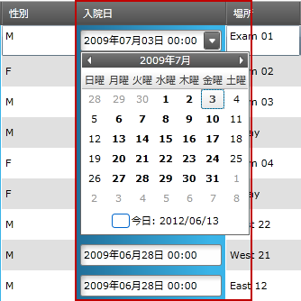

////
|metadata|
{
    "name": "xamgrid-datetimecolumn",
    "controlName": ["xamGrid"],
    "tags": ["Data Presentation","Editing","Grids","Layouts","Selection"],
    "guid": "285e22fc-c98d-462e-8e8a-9c452a242c89",
    "buildFlags": [],
    "createdOn": "2016-05-25T18:21:56.5562052Z"
}
|metadata|
////

{XamGridHeader}

= DateTimeColumn

== トピックの概要

=== 目的

このトピックでは、 _DateColumn_  列タイプを使用して、xamGrid™ コントロールで DateTime データを表示する方法を説明します。

=== 前提条件

以下の表に、このトピックを理解するための前提条件として求められるトピックをリストします。

[options="header", cols="a,a"]
|====
|トピック|目的

| link:xamgrid-columns.html[列]
|このトピックは、基本データ ソース内のプロパティのデータ タイプに基づいて xamGrid 列を示します。

|====

=== 本トピックの内容

このトピックには次のセクションがあります。

* <<_Ref319600175, 要件 >>
* <<_Ref319602379, DateTimeColumn 列を xamGrid に追加 >>
* <<_Ref317600351, コード例 >>
* <<_Ref317600356, 関連コンテンツ >>

[[_Ref319600175]]
== 要件

=== 概要

DateTimeColumn を使用する場合、追加アセンブリへの複数の参照が必要です。

=== 要件

DateTimeColumn を XamGrid コントロールに追加するには、以下の NuGet パッケージ参照を追加する必要があります。

* Infragistics.WPF.Controls.Grids.DateTimeColumn

NuGet フィードのセットアップと NuGet パッケージの追加の詳細については、link:nuget-feeds.html[NuGet フィード] ドキュメントを参照してください。

[[_Ref319602379]]
== DateTimeColumn 列を xamGrid に追加

=== 概要

以下の例は、DateTimeColumn 列を xamGrid コントロールに追加して、その主要プロパティを設定する方法を示します。また、マスクを適用して表示された DateTime 値の書式設定を行う方法も示します。

=== プロパティ設定

以下の表は、推奨の構成/ビヘイビアーをプロパティ設定にマップしています。

[options="header", cols="a,a,a"]
|====
|目的|プロパティ|次に設定

|表示された DateTime 値にマスクを適用します
| link:{ApiPlatform}controls.grids.datetimecolumn{ApiVersion}~infragistics.controls.grids.datetimecolumn~selecteddatemask.html[SelectedDateMask]
|表示された DateTime 値に適用されたマスクを表す文字列。 

以下のマスクの例です。 

* _{date}_ - 短い日付パターンに基づいて「日付のみ」マスクを作成します。 

* _{time}_ - 短い時刻パターンに基づいて「時間のみ」マスクを作成します。 

* _{longtime}_ - 長い時刻パターンに基づいて「時刻のみ」マスクを作成します。これは通常、秒を含みます。 

* _{date} {time}_ - 短い日付および短い時刻パターンに基づいて、「日付および時刻」マスクを作成します。 

* _mm/dd/yyyy_ - 「日付のみ」マスクを作成します。 

.注: 
[NOTE] 
==== 
波括弧は構文の一部です。 
==== 

[NOTE] 
==== 
XAML コード内でマスクを指定し、波括弧で囲まれた特別なトークンの 1 つを使用する場合、{}{date} といったように {} をマスクの前に配置する必要があります。 
====

|====

[[_Ref317600351]]
== コード例

=== 説明

以下のコード スニペットは、DateTimeColumn を xamGrid コントロールに追加して、基本データの DateTime 値を視覚化する方法を示します。また、マスクを適用して、表示された DateTime 値の書式設定を行う方法も示します。

以下のスクリーンショットは、以下の設定を行った後の、DateTimeColumn および xamGrid の外観を示しています。

[options="header", cols="a,a"]
|====
|プロパティ|値

|_SelectedDateMask_
|_{}{date} {time}_

|====

ifdef::sl,wpf[]

endif::sl,wpf[]

ifdef::win-rt[]
image::images/RT_xamGrid_DateTimeColumn_1.png[]
endif::win-rt[]

=== コード

*XAML の場合:*

[source,xaml]
----
<ig:XamGrid x:Name="dataGrid"
            ItemsSource="{StaticResource Patients}"
            AutoGenerateColumns="False"
            ColumnWidth="*">
    <ig:XamGrid.Columns>
        <!-- ここにさらに列を追加します -->
        <!-- ここで DateTimeColumn を追加します -->
        <ig:DateTimeColumn Key="AdmittanceDate" 
                           SelectedDateMask="{}{date} {time}"
                           HeaderText="Admittance Date" />
        <!-- ここにさらに列を追加します -->
    </ig:XamGrid.Columns>
</ig:XamGrid>
----

[[_Ref317600356]]
== 関連コンテンツ

=== トピック

以下のトピックでは、このトピックに関連する情報を提供しています。

[options="header", cols="a,a"]
|====
|トピック|目的

| link:xamgrid-datetime-columns.html[DateTime 列]
|このトピックでは、DateTime データを xamGrid コントロールで表示する方法を説明します。

| link:xaminputs-masks.html[マスク]
|このトピックは、マスク構文が対応するあらゆるマスク文字とトークンを示しています。

| link:xamdatetimeinput.html[xamDateTime 入力]
|このセクションには、コントロールの動作、アプリケーションでコントロールを使用する理由から、コントロールを使用して共通タスクを実現する方法の手順まで、xamDateTimeInput コントロールに関する有益な情報が含まれています。

|====