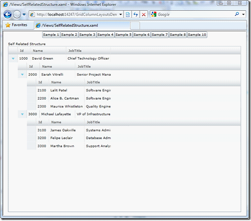

////

|metadata|
{
    "name": "xamgrid-defining-a-self-related-hierarchical-structure",
    "controlName": ["xamGrid"],
    "tags": ["Data Binding","Data Presentation","Grids","How Do I","Layouts"],
    "guid": "8e39a177-8187-46af-93c6-06c9cbe1f0a3",  
    "buildFlags": [],
    "createdOn": "2016-05-25T18:21:56.3181915Z"
}
|metadata|
////

{XamGridHeader}

= 自己関係の階層構造の定義

xamGrid コントロールによって、列レイアウトを使用して、自己関係の階層データ構造を定義することもできます。自己関係データの一般的な例は従業員の階層で、マネージャには従業員がいて、彼ら自身もマネージャであって従業員がいます。

以下の例では、この文書の最初に参照された Employees コレクションに xamGrid をバインドすることによって、自己関係の構造を表示する方法を示します。必要なのは、Employee データソースが公開する Employees コレクションに一致するように、TargetTypeName を使用する ColumnLayout オブジェクトを作成することです。

*XAML の場合:*

----
<ig:XamGrid x:Name="xamGrid1" AutoGenerateColumns="False" Grid.Row="1">   
    <ig:XamGrid.ColumnLayouts>   
        <ig:ColumnLayout Key="DirectReports" TargetTypeName="Employee">   
            <ig:ColumnLayout.Columns>   
                <ig:TextColumn Key="Id" />   
                <ig:TextColumn Key="Name" />   
                <ig:TextColumn Key="JobTitle" />   
            </ig:ColumnLayout.Columns>   
        </ig:ColumnLayout>   
    </ig:XamGrid.ColumnLayouts>   
</ig:XamGrid> 
----

ifdef::sl,wpf[]

endif::sl,wpf[]

ifdef::win-rt[]
image::images/RT_xamGrid_Define_Column_Layout_08.png[]
endif::win-rt[]

コントロールの link:{ApiPlatform}controls.grids.xamgrid{ApiVersion}~infragistics.controls.grids.xamgrid~maxdepth.html[MaxDepth] プロパティを設定することで、xamGrid がどの程度の深さまで自己関係データ構造を移動するかを制御することもできます。

*XAML の場合:*

----
<ig:XamGrid x:Name="xamGrid1" AutoGenerateColumns="False" Grid.Row="1" MaxDepth="1"> 
----

[NOTE]
====
*注* : MaxDepth プロパティはゼロから始まる値で、ここでゼロはルート列のレイアウトです。したがって、このケースでは、最大の深さは、ルート レイアウトよりも 1 レベル深くなります。つまり MaxDepth = 1 です。
====

関連トピック

link:xamgrid-auto-generate-columns.html[列の自動生成]

link:xamgrid-defining-hierarchical-layouts.html[階層的レイアウトの定義]

link:xamgrid-defining-unstructured-column-layout-collections.html[構造化されていない列レイアウト コレクションの定義]

link:xamgrid-manually-defining-a-basic-column-structure.html[基本的な列構造を手動で定義]

link:xamgrid-targettypename-resolution.html[TargetTypeName の解決]