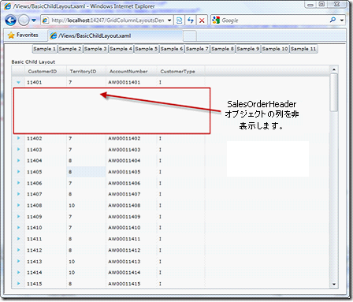
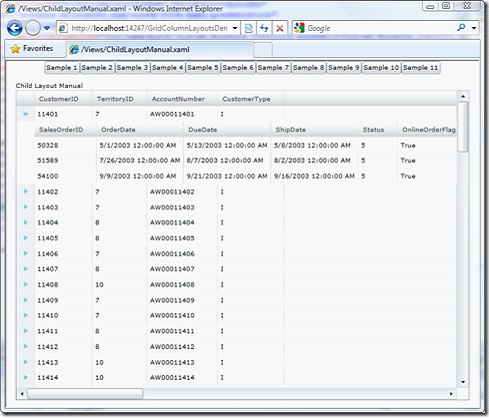

////

|metadata|
{
    "name": "xamgrid-defining-hierarchical-layouts",
    "controlName": ["xamGrid"],
    "tags": ["Data Binding","Data Presentation","Grids","How Do I"],
    "guid": "ce74cf1c-344c-4169-a922-e062334d9352",  
    "buildFlags": [],
    "createdOn": "2016-05-25T18:21:56.3001863Z"
}
|metadata|
////

{XamGridHeader}

= 階層的レイアウトの定義

以前のセクションから XAML を使用してアプリケーションを実行すると、グリッドが Customer オブジェクトのリストを表示することを確認しましたが、データ ソースの Customer オブジェクトがオブジェクトのコレクションを返すプロパティを公開しても、表示される階層はありませんでした。AutoGenerateColumns は False であるので、このコントロールは列を自動で生成しないので、これらのコレクションを含む列を含めるように手動で指示する必要があります。各 Customer に関連付けられた SalesOrderHeader オブジェクトのコレクションを表示するには、子 ColumnLayout オブジェクトをルートの Customers 列レイアウトに追加する必要があります。

*XAML の場合:*

[source,xaml]
----
<ig:XamGrid x:Name="xamGrid1" AutoGenerateColumns="False" ItemsSource="{Binding Source={StaticResource categoryData}, Path=CategoriesAndProducts}">
    <ig:XamGrid.Columns>
    <ig:TextColumn Key="CategoryID" />
    <ig:TextColumn Key="CategoryName" />
    <ig:ColumnLayout Key="Products" />
    </ig:XamGrid.Columns>
    </ig:XamGrid>
----

このコードを実行すると、SalesOrderHeaders 列レイアウトは各 Customer オブジェクトの子として表示を開始しますが、そこに列は表示されません。

ifdef::sl,wpf[]

endif::sl,wpf[]

ifdef::win-rt[]
image::images/RT_xamGrid_Define_Column_Layout_03.png[]
endif::win-rt[]

これは SalesOrderHeaders 列レイアウトがその親列レイアウトから AutoGenerateColumns プロパティ値を継承しているからです。したがって SalesOrderHeaders 列レイアウトで AutoGenerateColumns を True に設定することでオーバーライドする必要があります。または、以下に示すように SalesOrderHeaders ColumnLayout オブジェクト内の列のセットを手動で定義できます。

*XAML の場合:*

[source,xaml]
----
<ig:XamGrid x:Name="xamGrid1" AutoGenerateColumns="False" ItemsSource="{Binding Source={StaticResource categoryData}, Path=CategoriesAndProducts}">
    <ig:XamGrid.Columns>
    <ig:TextColumn Key="CategoryID" />
    <ig:TextColumn Key="CategoryName" />
    <ig:ColumnLayout Key="Products" >
    <ig:ColumnLayout.Columns>
    <ig:TextColumn Key="ProductID" />
    <ig:TextColumn Key="ProductName" />
    <ig:TextColumn Key="UnitPrice"/>
    </ig:ColumnLayout.Columns>
    </ig:ColumnLayout>
    </ig:XamGrid.Columns>
    </ig:XamGrid>
----

これで Products 列が期待するように表示されます。

ifdef::sl,wpf[]

endif::sl,wpf[]

ifdef::win-rt[]
image::images/RT_xamGrid_Define_Column_Layout_04.png[]
endif::win-rt[]

列キーと同じように、子 ColumnLayout オブジェクトを定義し、提供されたキーに一致するプロパティ名が親データ オブジェクトで見つからない場合、グリッドは例外をスローします。

ネストされたレイアウト構造に複数の兄弟 ColumnLayout オブジェクトを定義することもできます。

xamGrid コントロールは自動的に兄弟レイアウトの存在を検出し、列レイアウト ヘッダーを表示するため、ユーザーは兄弟を個別に展開または折り畳むことができます。

== 関連トピック

link:xamgrid-auto-generate-columns.html[列の自動生成]

link:xamgrid-defining-a-self-related-hierarchical-structure.html[自己関連階層構造の定義]

link:xamgrid-defining-unstructured-column-layout-collections.html[構造化されていない列レイアウト コレクションの定義]

link:xamgrid-manually-defining-a-basic-column-structure.html[基本的な列構造を手動で定義]

link:xamgrid-targettypename-resolution.html[TargetTypeName の解決]