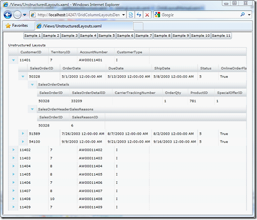

////

|metadata|
{
    "name": "xamgrid-defining-unstructured-column-layout-collections",
    "controlName": ["xamGrid"],
    "tags": ["Data Binding","Data Presentation","Grids","Layouts"],
    "guid": "4c8af1bb-c16a-4e4a-8e86-cd1e42d6201f",  
    "buildFlags": [],
    "createdOn": "2016-05-25T18:21:56.3061863Z"
}
|metadata|
////

{XamGridHeader}

= 構造化されていない列レイアウト コレクションの定義

特定の階層レイアウト構造を定義したくない場合や事前に知ることができないが、データ ソースに含むことができるコレクションの名前が分かっているケースがあります。そのようなケースでは、ネストされた列レイアウト構造を定義するのではなく、xamGrid のルート link:{ApiPlatform}controls.grids.xamgrid{ApiVersion}~infragistics.controls.grids.xamgrid~columnlayouts.html[ColumnLayouts] コレクション内で ColumnLayout オブジェクトのコレクションを代わりに定義できます。

ランタイムで、xamGrid はバインドされたデータ ソースを調べ、データ ソースのプロパティ名に一致するキーを含む ColumnLayout オブジェクトの検索を試みます。

*XAML の場合:*

[source,xaml]
----
<ig:XamGrid x:Name="xamGrid1" AutoGenerateColumns="True" ItemsSource="{Binding Source={StaticResource categoryData}, Path=CategoriesAndProducts}">
    <ig:XamGrid.Columns>
    <ig:TextColumn Key="CategoryID" />
    <ig:TextColumn Key="CategoryName" />
    <ig:TextColumn Key="Description" />
    </ig:XamGrid.Columns>
    <ig:XamGrid.ColumnLayouts >
    <ig:ColumnLayout Key="Products">
    <ig:ColumnLayout.Columns>
    <ig:TextColumn Key="ProductID" />
    <ig:TextColumn Key="ProductName" />
    <ig:TextColumn Key="UnitPrice"/>
    </ig:ColumnLayout.Columns>
    </ig:ColumnLayout>
    </ig:XamGrid.ColumnLayouts>
    </ig:XamGrid>
----

このコードの実行が前述のサンプルと同じグリッド レイアウトとなることを以下のスクリーンショットから確認できます。

ifdef::sl,wpf[]

endif::sl,wpf[]

ifdef::win-rt[]
image::images/RT_xamGrid_Define_Column_Layout_06.png[]
endif::win-rt[]

ロードしているデータが特定の ColumnLayout の link:{ApiPlatform}controls.grids.xamgrid{ApiVersion}~infragistics.controls.grids.columnbase~key.html[Key] を含むかどうかをわからない場合でも、xamGrid コントロールによって、任意の数の ColumnLayout オブジェクトを定義できます。データ ソースに存在しないキーを含む ColumnLayout を定義すると、xamGrid はそれを単純に無視します。

構造化されていない列レイアウトのシリーズを定義し、同じキーを持つ複数の列レイアウトを定義する場合、そのグリッドは特定のデータ ソース プロパティ名に一致するキーを持つコレクションで見つけた最初の ColumnLayout オブジェクトを自動的に使用します。同じキーを持つ追加的な ColumnLayout オブジェクトは無視されます。

== 関連トピック

link:xamgrid-auto-generate-columns.html[列の自動生成]

link:xamgrid-defining-a-self-related-hierarchical-structure.html[自己関連階層構造の定義]

link:xamgrid-defining-hierarchical-layouts.html[階層的レイアウトの定義]

link:xamgrid-manually-defining-a-basic-column-structure.html[基本的な列構造を手動で定義]

link:xamgrid-targettypename-resolution.html[TargetTypeName の解決]