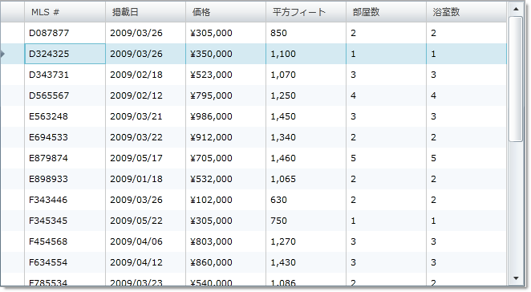

////

|metadata|
{
    "name": "xamgrid-disable-row-numbering",
    "controlName": ["xamGrid"],
    "tags": ["Grids","How Do I","Selection"],
    "guid": "{FF1885CA-6A14-48AD-A008-52B29B5952B5}",  
    "buildFlags": [],
    "createdOn": "2016-05-25T18:21:55.7391885Z"
}
|metadata|
////

{XamGridHeader}

= 行の番号付けを無効にする

デフォルトでは、行番号は行セレクター列に表示されます。ただし、以下のコードで示すように、 link:{ApiPlatform}controls.grids.xamgrid{ApiVersion}~infragistics.controls.grids.rowselectorsettings.html[RowSelectorSettings] オブジェクトの link:{ApiPlatform}controls.grids.xamgrid{ApiVersion}~infragistics.controls.grids.rowselectorsettings~enablerownumbering.html[EnableRowNumbering] プロパティを False に設定することで行番号の表示を無効にすることができます。

*XAML の場合:*

----
<ig:XamGrid x:Name="MyGrid" AutoGenerateColumns="False">
   <ig:XamGrid.RowSelectorSettings>
      <ig:RowSelectorSettings Visibility="Visible" EnableRowNumbering="/>
   </ig:XamGrid.RowSelectorSettings>
   …
</ig:XamGrid>
----

*Visual Basic の場合:*

----
Me.MyGrid.RowSelectorSettings.Visibility = Visibility.Visible
Me.MyGrid.RowSelectorSettings.EnableRowNumbering = False
----

*C# の場合:*

----
this.MyGrid.RowSelectorSettings.Visibility = Visibility.Visible
this.MyGrid.RowSelectorSettings.EnableRowNumbering = false;
----

ifdef::sl,wpf[]

endif::sl,wpf[]

ifdef::win-rt[]
image::images/RT_xamGrid_Disable_Row_Numbering_01.png[]
endif::win-rt[]

== 関連トピック

link:xamgrid-row-selectors.html[行セレクター]

link:xamgrid-row-selector-events.html[行セレクター イベント]