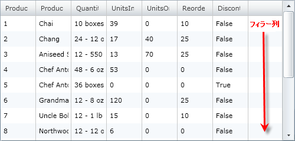

////

|metadata|
{
    "name": "xamgrid-filler-column",
    "controlName": ["xamGrid"],
    "tags": ["Data Presentation","Grids","Layouts"],
    "guid": "{CA874638-4131-4FD1-B896-EB44F1EDB9CD}",  
    "buildFlags": [],
    "createdOn": "2016-05-25T18:21:56.0512096Z"
}
|metadata|
////

{XamGridHeader}

= フィラー列

FillerColumn は xamGrid コントロールの残りのスペースを埋める列です。xamGrid で特定の幅を設定すると、すべての列は link:{ApiPlatform}controls.grids.xamgrid{ApiVersion}~infragistics.controls.grids.columnwidth.html[ColumnWidth]プロパティに基づいて描画され、描画される追加スペースはフィラー列になります。

以下の FillerColumnSettings オブジェクトのプロパティを設定することで、フィラー列のスタイル プロパティを変更できます。

* link:{ApiPlatform}controls.grids.xamgrid{ApiVersion}~infragistics.controls.grids.xamgrid~footerstyle.html[FooterStyle] - xamGrid コントロールのすべての link:{ApiPlatform}controls.grids.xamgrid{ApiVersion}~infragistics.controls.grids.columnbase~columnlayout.html[ColumnLayout] オブジェクトで link:{ApiPlatform}controls.grids.xamgrid{ApiVersion}~infragistics.controls.grids.primitives.fillercolumn.html[FillerColumn] の link:{ApiPlatform}controls.grids.xamgrid{ApiVersion}~infragistics.controls.grids.primitives.footercellcontrol.html[FooterCellControl] オブジェクトで使用されるスタイルを設定します。
* link:{ApiPlatform}controls.grids.xamgrid{ApiVersion}~infragistics.controls.grids.xamgrid~headerstyle.html[HeaderStyle] - xamGrid コントロールのすべての ColumnLayout オブジェクトで FillerColumn の link:{ApiPlatform}controls.grids.xamgrid{ApiVersion}~infragistics.controls.grids.primitives.headercellcontrol.html[HeaderCellControl] オブジェクトで使用されるスタイルを設定します。
* Style - ColumnLayout のすべての StyleSettingsBase オブジェクトで使用される link:{ApiPlatform}controls.grids.xamgrid{ApiVersion}~infragistics.controls.grids.stylesettingsbase.html[StyleSettingsBase]. link:{ApiPlatform}controls.grids.xamgrid{ApiVersion}~infragistics.controls.grids.stylesettingsbase~style.html[Style] を設定します。

水平の幅が残っている場合、フィラー列は常に表示されます。明示的にこれをオフにできませんが、表示しないことを確認できる方法があります。例：

* star width を持つように列を設定します。この方法で列はグリッドの余分なスペースを使用します。
* グリッドの幅をより小さく変更します。
* HorizontalScrolling を auto に設定した ScrollViewer などのコンテナーに配置することによって、グリッドに infinity width を設定します。ただし、これを行う場合、 link:xamgrid-virtualization.html[Virtualization] はオフになります。

ifdef::sl,wpf[]

endif::sl,wpf[]

ifdef::win-rt[]
image::images/RT_xamGrid_Filler_Column_01.png[]
endif::win-rt[]

== 関連トピック

link:xamgrid-define-column-layout.html[列レイアウトの定義]

link:xamgrid-change-column-type-mapping.html[列タイプ マッピングの変更]

link:xamgrid-comboboxcolumn-column.html[ComboBoxColumn 列]

link:xamgrid-create-a-template-column.html[テンプレート列の作成]

link:xamgrid-editing-data-in-a-template-column.html[テンプレート列でデータを編集]