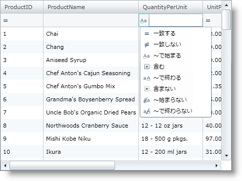

////

|metadata|
{
    "name": "xamgrid-filtering",
    "controlName": ["xamGrid"],
    "tags": ["Filtering","Grids"],
    "guid": "{FA3D3BB7-392B-40ED-89E9-D6901FA8D6BE}",  
    "buildFlags": [],
    "createdOn": "2016-05-25T18:21:55.9232003Z"
}
|metadata|
////

{XamGridHeader}

= フィルタリング

xamGrid コントロールによって、エンドユーザーはグリッド内に含まれるデータをフィルターすることができます。この機能を使用すれば、エンドユーザーは必要となるデータを見つける支援となるより管理しやすい方法でデータのサブセットを表示できます。

*フィルター メニュー*

フィルタリング機能のフィルター メニュー セクションは、個々の列で使用可能な一意の一連の値とともにメニューをエンドユーザーに表示します。またエンドユーザーは特定の値を選択してフィルターに含めることができます。

フィルターしたい個々の値をエンドユーザーが入力することを可能にする追加のオプションも使用できます。これは、Filters オプションを選択することで実行できます。オペランドのドロップダウンがエンドユーザーに表示されます。カスタムのフィルターを作成した場合、ドロップダウンにこれらも表示されます。詳細は、 link:xamgrid-create-a-custom-filter.html[カスタムフィルターの作成]を参照してください。

*フィルター行*

フィルタリングを有効にすると、列ごとのテキストボックスとドロップダウン リストを含むフィルター行が表示されます。エンドユーザーはテキストボックスにフィルターしたい値を入力でき、ドロップダウン リストのフィルター ルールに基づいて、フィルターされたデータがエンドユーザーに表示されます。

*フィルター オペランド*

フィルター行は、エンドユーザーに以下のオペランドを提供します。

* 等しい
* 等しくない
* より小さい
* 以下
* より大きい
* 以上
* ～で始まる
* 含む
* ～で終わる
* ～始まらない
* 含まない
* ～で終わらない

=== フィルタリングを有効にする

ifdef::sl[]
[NOTE]
====
*注:* {ProductName} 2010 リリース volume 1 では、AllowFilterRow プロパティは廃止されています。AllowFiltering プロパティで置き換えられています。
====
endif::sl[]

デフォルトでは、Filtering は xamGrid コントロールで有効ではありません。フィルタリングを有効または無効にするには、 link:{ApiPlatform}controls.grids.xamgrid{ApiVersion}~infragistics.controls.grids.filteringsettings.html[FilteringSettings] オブジェクトの link:{ApiPlatform}controls.grids.xamgrid{ApiVersion}~infragistics.controls.grids.filteringsettings~allowfiltering.html[AllowFiltering] プロパティを link:{ApiPlatform}controls.grids.xamgrid{ApiVersion}~infragistics.controls.grids.filteruitype.html[FilterUIType] 列挙体の以下の値のいずれかに設定します。

* FilterRowTop - この値はフィルタリングを有効にし、xamGrid コントロールの上にフィルター行を配置します。
* FilterRowBottom - この値はフィルタリングを有効にし、xamGrid コントロールの下にフィルター行を配置します。
* FilterMenu - この値によってフィルタリングを有効にして、ヘッダー セルにフィルター メニューを表示します。 ;
* None - この値はフィルタリングを無効にします。

ifdef::win-rt[]
タッチ ジェスチャを使用してフィルターする詳細については、link:xamgrid-touch-support.html[タッチ サポート] トピックを参照してください。
endif::win-rt[]

以下に、フィルタリングを有効する方法を示します。

*XAML の場合:*

----
<Grid x:Name="LayoutRoot" Background="White">
   <ig:XamGrid x:Name="dataGrid" AutoGenerateColumns="False">
      <ig:XamGrid.FilteringSettings>
         <ig:FilteringSettings AllowFiltering="FilterRowTop">      
         </ig:FilteringSettings>
      </ig:XamGrid.FilteringSettings>
      …
   </ig:XamGrid>
</Grid>
----

*Visual Basic の場合:*

----
Me.dataGrid.FilteringSettings.AllowFiltering = FilterUIType.FilterRowTop
----

*C# の場合:*

----
this.dataGrid.FilteringSettings.AllowFiltering = FilterUIType.FilterRowTop;
----

ifdef::sl,wpf[]

endif::sl,wpf[]

ifdef::win-rt[]
image::images/RT_xamGrid_Filtering_01.png[フィルタリング]
endif::win-rt[]

== 関連トピック

link:xamgrid-filtering-events.html[フィルタリング イベントの処理]

link:xamgrid-programmatically-create-a-filter.html[プログラムによってフィルターを作成]

link:xamgrid-create-a-custom-filter.html[カスタム フィルターの作成]

link:xamgrid-filter-operands.html[フィルター オペランド]

link:xamgrid-using-the-custom-filter-dialog.html[カスタム フィルター ダイアログの使用]

ifdef::win-rt[]
link:xamgrid-touch-support.html[タッチ サポート]
endif::win-rt[]