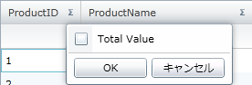

////

|metadata|
{
    "name": "xamgrid-formatting-row-summaries",
    "controlName": ["xamGrid"],
    "tags": ["Grids","Styling","Summaries"],
    "guid": "69c9f421-126f-4713-84ba-915156023bef",  
    "buildFlags": [],
    "createdOn": "2016-05-25T18:21:56.2821807Z"
}
|metadata|
////

{XamGridHeader}

= 行集計の書式設定

状況によっては、デフォルトの集計値がアプリケーションの要件に適合するフォーマットで表示されない場合があります。

$$.NET$$ Framework コンポジット フォーマット文字列を使用して集計結果をフォーマットすることができます。たとえば、貨幣値を表すために集計値を希望する場合、集計オペランドの StringFormat プロパティを XAML で "{}{0:c}" またはプロシージャー コードで "{0:c}" に設定できます。

以下のコード例は、集計結果のフォーマット方法を示します。

*XAML の場合:*

----
<ig:TextColumn Key="UnitPrice">
   <ig:TextColumn.SummaryColumnSettings>
      <ig:SummaryColumnSettings>
         <ig:SummaryColumnSettings.SummaryOperands>
            <ig:MaximumSummaryOperand FormatString="{}{0:c}" >
            </ig:MaximumSummaryOperand>
         </ig:SummaryColumnSettings.SummaryOperands>
      </ig:SummaryColumnSettings>
   </ig:TextColumn.SummaryColumnSettings>
</ig:TextColumn>
----

*C# の場合:*

----
Column DisplaySummary = this.MyDataGrid.Columns.DataColumns["UnitPrice"];
MaximumSummaryOperand MyMax = new MaximumSummaryOperand();
MyMax.FormatString = "{0:c}";
DisplaySummary.SummaryColumnSettings.SummaryOperands.Add(MyMax);
----

ifdef::win-rt[]

image::images/RT_xamGrid_Format_Summaries_01.png[]

endif::win-rt[]

デフォルトでは、集計結果は集計名とともに表示され、名前の後に等号、集計結果が続きます。

たとえば、ProductID 列の値の合計を取得することを選択する場合、以下のように表示されます。

ifdef::sl,wpf[]
image::images/Grid_Formatting_Row_Summaries_01.png[]
endif::sl,wpf[]

ifdef::win-rt[]
image::images/RT_Grid_Formatting_Row_Summaries_01.png[]
endif::win-rt[]

以下のコード スニペットで示すように、Summary オペランドの  pick:[sl,win-rt=" link:{RootAssembly}{ApiVersion}~infragistics.summaryoperandbase~rowdisplaylabel.html[RowDisplayLabel]"]  pick:[wpf=" link:{ApiPlatform}datamanager{ApiVersion}~infragistics.summaryoperandbase~rowdisplaylabel.html[RowDisplayLabel]"]  プロパティを設定することによって、集計行に表示されるデフォルトの集計オペランド名を変更できます。

*XAML の場合:*

----
<ig:TextColumn Key="ProductID">
   <ig:TextColumn.SummaryColumnSettings>
      <ig:SummaryColumnSettings>
         <ig:SummaryColumnSettings.SummaryOperands>
            <ig:SumSummaryOperand RowDisplayLabel="Total Value" IsApplied="True" />
         </ig:SummaryColumnSettings.SummaryOperands>
      </ig:SummaryColumnSettings>
   </ig:TextColumn.SummaryColumnSettings>
</ig:TextColumn>
----

*Visual Basic の場合:*

----
MyMax.RowDisplayLabel = "Total Value"
----

*C# の場合:*

----
MyMax.RowDisplayLabel = "Total Value";
----

ifdef::sl,wpf[]
image::images/Grid_Formatting_Row_Summaries_02.png[]
endif::sl,wpf[]

ifdef::win-rt[]
image::images/RT_Grid_Formatting_Row_Summaries_02.png[]
endif::win-rt[]

集計のドロップダウン リストに表示されるデフォルト集計オペランド名をオーバーライドすることもできます。以下のコード スニペットで示すように、これは集計オペランドの  pick:[sl,win-rt=" link:{RootAssembly}{ApiVersion}~infragistics.summaryoperandbase~selectiondisplaylabel.html[SelectionDisplayLabel]"]  pick:[wpf=" link:{ApiPlatform}datamanager{ApiVersion}~infragistics.summaryoperandbase~selectiondisplaylabel.html[SelectionDisplayLabel]"]  プロパティを設定することによって達成できます。

*XAML の場合:*

----
<ig:TextColumn Key="ProductID">
   <ig:TextColumn.SummaryColumnSettings>
      <ig:SummaryColumnSettings>
         <ig:SummaryColumnSettings.SummaryOperands>
            <ig:SumSummaryOperand SelectionDisplayLabel="Total Value"/>
         </ig:SummaryColumnSettings.SummaryOperands>
      </ig:SummaryColumnSettings>
   </ig:TextColumn.SummaryColumnSettings>
</ig:TextColumn>
----

*Visual Basic の場合:*

----
MyMax.SelectionDisplayLabel = "Total Value"
----

*C# の場合:*

----
MyMax.SelectionDisplayLabel = "Total Value";
----

ifdef::sl,wpf[]

endif::sl,wpf[]

ifdef::win-rt[]
image::images/RT_Grid_Formatting_Row_Summaries_03.png[]
endif::win-rt[]

ただし、集計結果のフォーマット、レイアウト、およびスタイルをカスタマイズしたい場合、SummaryRowCellControl をターゲットとするスタイルを作成できます。

次のコードは、これを実現する方法を示しています。

*XAML の場合:*

----
<UserControl.Resources>
   <!-- このコンバーターは、SummaryDefinition を取得し、FormatString が適用された SummaryResult.Value を返します -->
   <igPrim:SummaryResultFormatStringValueConverter x:Key="SDFormatStringConverter" />
   
</UserControl.Resources>
<Grid x:Name="LayoutRoot" Background="White">
   <ig:XamGrid x:Name="MyDataGrid" 
               ItemsSource="{Binding Source={StaticResource DataUtil}, Path=Products}" 
               AutoGenerateColumns="False">
      <ig:XamGrid.SummaryRowSettings>
         <!-- スタイルを適用します -->
         <ig:SummaryRowSettings AllowSummaryRow="Both" SummaryScope="ColumnLayout" 
               Style="{StaticResource SummaryRowCellsStyle1}"/>
      </ig:XamGrid.SummaryRowSettings>
      <ig:XamGrid.Columns>
         <ig:TextColumn Key="ProductID" >
            <ig:TextColumn.SummaryColumnSettings>
               <ig:SummaryColumnSettings >
                  <ig:SummaryColumnSettings.SummaryOperands>
                     <ig:CountSummaryOperand />
                  </ig:SummaryColumnSettings.SummaryOperands>
               </ig:SummaryColumnSettings>
            </ig:TextColumn.SummaryColumnSettings>
         </ig:TextColumn>
         <ig:TextColumn Key="ProductName"/>
         <ig:TextColumn Key="QuantityPerUnit"/>
         <ig:TextColumn Key="UnitPrice"/>
      </ig:XamGrid.Columns>
   </ig:XamGrid>
</Grid>
----

ifdef::sl,wpf[]
image::images/Grid_Formatting_Row_Summaries_04.png[]
endif::sl,wpf[]

ifdef::win-rt[]
image::images/RT_Grid_Formatting_Row_Summaries_04.png[]
endif::win-rt[]

== 関連トピック

link:xamgrid-summaries.html[集計]

link:xamgrid-programmatically-add-summaries.html[プログラムで集計を追加]

link:xamgrid-retrieve-the-result-of-a-summary.html[集計結果を取得]

link:xamgrid-create-a-custom-summary.html[カスタム集計の作成]

ifdef::win-rt[]
link:xamgrid-touch-support.html[タッチ サポート]
endif::win-rt[]