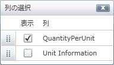
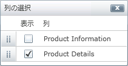

////

|metadata|
{
    "name": "xamgrid-group-column",
    "controlName": ["xamGrid"],
    "tags": ["Grids","Grouping","How Do I"],
    "guid": "4be24fb8-a74b-4fe5-b941-133d799ef564",  
    "buildFlags": [],
    "createdOn": "2016-05-25T18:21:56.2701797Z"
}
|metadata|
////

{XamGridHeader}

= グループ列

GroupColumns を使用すると、複数列をひとつの共通ヘッダーでグループ化できます。これによって、どの列が類似するカテゴリに属するのかを素早く確認できます。基本的に、この機能は子列を水平に整理するだけで、 link:{ApiPlatform}controls.grids.xamgrid{ApiVersion}~infragistics.controls.grids.primitives.groupheadercell.html[GroupHeaderCell] には追加のヘッダーが含まれます。

link:{ApiPlatform}controls.grids.xamgrid{ApiVersion}~infragistics.controls.grids.groupcolumn.html[GroupColumn] は基本の link:{ApiPlatform}controls.grids.xamgrid{ApiVersion}~infragistics.controls.grids.column.html[Column] から派生しますが、基本列の並べ替え、フィルタリング、GroupBy、集計などの機能を実装しません。

GroupColumns は互いに制限なくネストすることができます。

以下の例のコードは GroupColumns 機能を実装する方法を示します。

*XAML の場合:*

----
<ig:XamGrid x:Name="MyDataGrid" 
            ItemsSource="{Binding Source={StaticResource DataUtil}, Path=Products}" 
            AutoGenerateColumns="False">
   <ig:XamGrid.Columns>
      <ig:GroupColumn Key="Product Information">
         <ig:GroupColumn.Columns>
            <ig:TextColumn Key="ProductID"/>
            <ig:TextColumn Key="ProductName"/>
         </ig:GroupColumn.Columns>
      </ig:GroupColumn>
      <ig:GroupColumn Key="Product Details">
         <ig:GroupColumn.Columns>
            <ig:TextColumn Key="QuantityPerUnit"/>
            <ig:GroupColumn Key="Unit Information">
               <ig:GroupColumn.Columns>
                  <ig:TextColumn Key="UnitPrice"/>
                  <ig:TextColumn Key="UnitsInStock"/>
                  <ig:TextColumn Key="UnitsOnOrder"/>
               </ig:GroupColumn.Columns>
            </ig:GroupColumn>
         </ig:GroupColumn.Columns>
      </ig:GroupColumn>
   </ig:XamGrid.Columns>
</ig:XamGrid>
----

*C# の場合:*

----
//TODO: 列を作成します
GroupColumn ProductInformation = new GroupColumn();
ProductInformation.Key = "Product Information";
ProductInformation.Columns.Add(productId);
ProductInformation.Columns.Add(productName);
GroupColumn ProductDetails = new GroupColumn();
ProductDetails.Key = "Product Details";
ProductDetails.Columns.Add(quantityPerUnit);
GroupColumn UnitInformation = new GroupColumn();
UnitInformation.Key = "Unit Information";
UnitInformation.Columns.Add(unitPrice);
UnitInformation.Columns.Add(unitsInStock);
UnitInformation.Columns.Add(unitsOnOrder);
ProductDetails.Columns.Add(UnitInformation);
MyDataGrid.Columns.Add(ProductInformation);
MyDataGrid.Columns.Add(ProductDetails);
----

*Visual Basic の場合:*

----
' TODO: 列を作成します
Dim ProductInformation As New GroupColumn()
ProductInformation.Key = "Product Information"
ProductInformation.Columns.Add(productId)
ProductInformation.Columns.Add(productName)
Dim ProductDetails As New GroupColumn()
ProductDetails.Key = "Product Details"
ProductDetails.Columns.Add(quantityPerUnit)
Dim UnitInformation As New GroupColumn()
UnitInformation.Key = "Unit Information"
UnitInformation.Columns.Add(unitPrice)
UnitInformation.Columns.Add(unitsInStock)
UnitInformation.Columns.Add(unitsOnOrder)
ProductDetails.Columns.Add(UnitInformation)
MyDataGrid.Columns.Add(ProductInformation)
MyDataGrid.Columns.Add(ProductDetails)
----

ifdef::sl,wpf[]
image::images/xamGrid_Group_Column_001.png[]
endif::sl,wpf[]

ifdef::win-rt[]
image::images/RT_xamGrid_Group_Column_001.png[]
endif::win-rt[]

*固定列*

GroupColumns を固定できます。詳細については、 link:xamgrid-fixed-columns.html[固定列]トピックを参照してください。ただし、固定できるのは最上位の列だけです。たとえば、上記のコードに基づき、Product Information および Product Details の GroupColumns のみを固定できます。これは以下のスクリーンショットで示します。

ifdef::sl,wpf[]

endif::sl,wpf[]

*仮想化*

GroupColumns の最上位の列だけを仮想化できます。たとえば、上記のコードに基づき、QuantityPerUnit は、UnitPrice、UnitsInStock および UnitsOnOrder が水平表示から見えなくなる場合に限ってリリースされます。垂直の仮想化は問題なく動作します。詳細については、 link:xamgrid-virtualization.html[仮想化]トピックを参照してください。

*列移動*

GroupColumns 内で列の移動を有効にすることができます。詳細については、 link:xamgrid-column-moving.html[列の移動]トピックを参照してください。ただし、同じグループで列を移動できるだけで、異なるグループに列を移動できません。たとえば、上記のコードに基づき、以下の列を互いに入れ替えることだけが可能です。

* Product Information および Product Details
* ProductID および ProductName
* QuantityPerUnit および Unit Information
* UnitsInStock、UnitsOnOrder および UnitPrice

ifdef::sl,wpf[]
image::images/xamGrid_GroupColumns_ColumnMoving_01.png[]
endif::sl,wpf[]

ifdef::win-rt[]
image::images/RT_xamGrid_GroupColumns_ColumnMoving_01.png[]
endif::win-rt[]

*列の選択*

GroupColumns で列の選択機能を使用できます。詳細については、 link:xamgrid-column-chooser.html[「列の選択」]を参照してください。GroupColumns でこの機能を使用する場合、列の選択は、特定のレベルの列を表示するだけです。たとえば、ColumnLayout を ColumnChooser に移動すると、そのコレクション内のすべての列が直接表示されます。子を持つ列に移動すると、すべての直接の子の列を表示します。

たとえば、上記のコードに基づき、Unit Information グループが非表示の場合、列の選択は以下のスクリーンショットに示すように表示されます。

ifdef::sl,wpf[]

endif::sl,wpf[]

ifdef::win-rt[]
image::images/RT_xamGrid_GroupColumns_ColumnChooser_01.png[]
endif::win-rt[]

Product Information グループが非表示の場合、列の選択は以下のスクリーンショットに示すように表示されます。

ifdef::sl,wpf[]

endif::sl,wpf[]

ifdef::win-rt[]
image::images/RT_xamGrid_GroupColumns_ColumnChooser_02.png[]
endif::win-rt[]

[NOTE]
====
*注:* エンド ユーザーが GroupColumn の最後の表示列を非表示にしようとすると、その特定の列は非表示にならず、代わりに GroupColumn が非表示になります。たとえば、上記のコードに基づき、ProductID を非表示にして、ProductName を非表示にしようとすると、Product Information グループ全体が非表示になります。
====

列チューザーおよび GroupColumn 機能を使用すると、xamGrid コントロールは、列チューザー ダイアログ ウィンドウをプログラムで表示できる方法を提供します。

* link:{ApiPlatform}controls.grids.xamgrid{ApiVersion}~infragistics.controls.grids.xamgrid~showcolumnchooser.html[ShowColumnChooser](Column 列) - パラメーターとして渡される列は、列の選択ダイアログ ウィンドウを表示するために GroupColumn などの子を持つ必要があります。

*列サイズの変更*

GroupColumns 内では、すべての列は InitAuto の初期の幅になります。Star 列は、親 GroupColumns 内でも機能します。

GroupColumn に star 列が含まれていない場合、GroupColumn のサイズを変更すると、右端のサイズ変更可能な列がサイズ変更されます。

たとえば、上記のコードに基づき、ProductInformation GroupColumn をサイズ変更し、ProductID または ProductName のどちらも star サイズでない場合、ProductName 列がサイズ変更されます。ただし、ProductName がサイズ変更可能でない場合、ProductID がサイズ変更されます。

ProductName または ProductID 列をサイズ変更する場合、ProductInformation GroupColumn も子の幅を調整するためにサイズ変更されます。

ProductName および ProductID 列の両方がサイズ変更可能でない場合、ProductInformation GroupColumn のサイズ変更はできなくなります。

*並べ替え、フィルタリング、GroupBy、集計および条件付き書式設定*

GroupColumns はこれらの機能をサポートしません。ただし、GroupColumn の子である DataColumns は、これらの機能をサポートします。

*列のアクセス*

AllColumns プロパティを使用すれば、どのレベルの xamGrid に置かれているかにかかわらず、列を簡単に検索できます。

link:{ApiPlatform}controls.grids.xamgrid{ApiVersion}~infragistics.controls.grids.column~allcolumns.html[AllColumns] プロパティは、Grid および link:{ApiPlatform}controls.grids.xamgrid{ApiVersion}~infragistics.controls.grids.columnbase~columnlayout.html[ColumnLayout] の Columns コレクションに追加されます。Column オブジェクトの AllColumns プロパティにもあります。

上記のプロパティのすべては、 link:{ApiPlatform}controls.grids.xamgrid{ApiVersion}~infragistics.controls.grids.columnbase.html[ColumnBase] の再帰的なリストまたはキーでアクセスできる ReadOnly コレクションの Column オブジェクトを返します。

以下のコードは、xamGrid コントロールのどのレベルに置かれるかにかかわらず、列を検索する方法を示します。

*C# の場合:*

----
Column MyColumn = MyDataGrid.Columns.AllColumns["MyCol"] as Column;
----

*Visual Basic の場合:*

----
Dim MyColumn As Column = CType(MyDataGrid.Columns.AllColumns("MyCol"),Column)
----